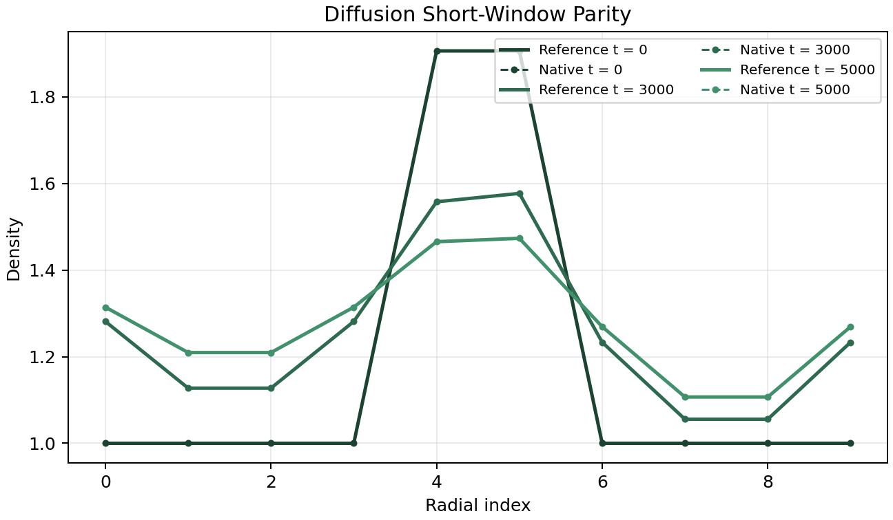
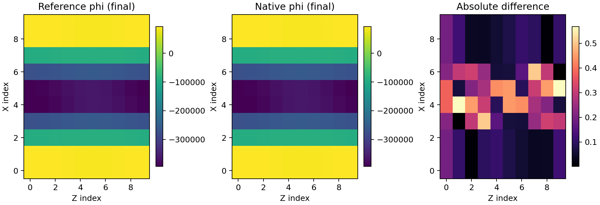
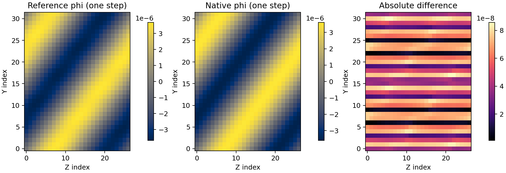
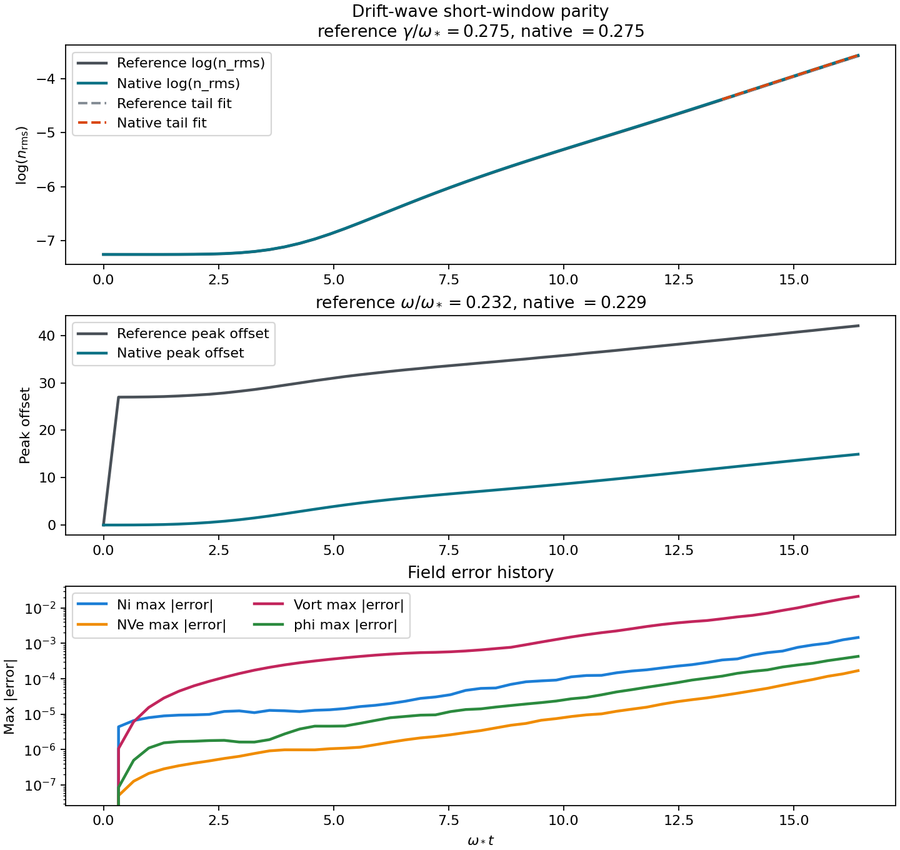
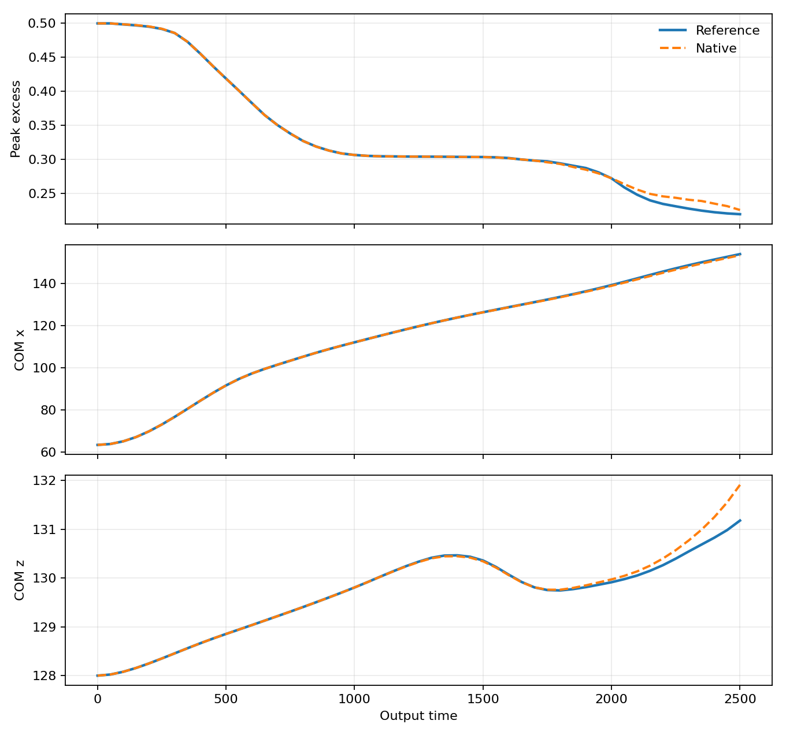
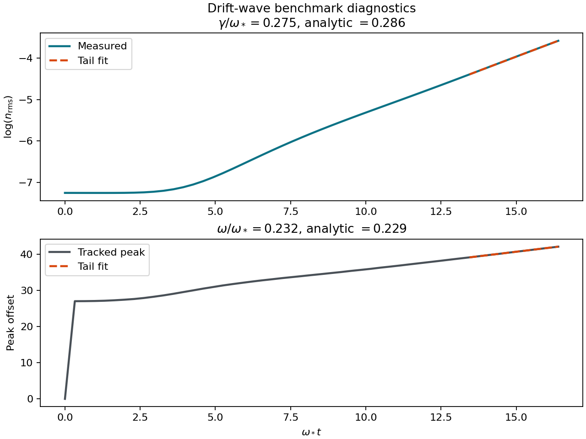
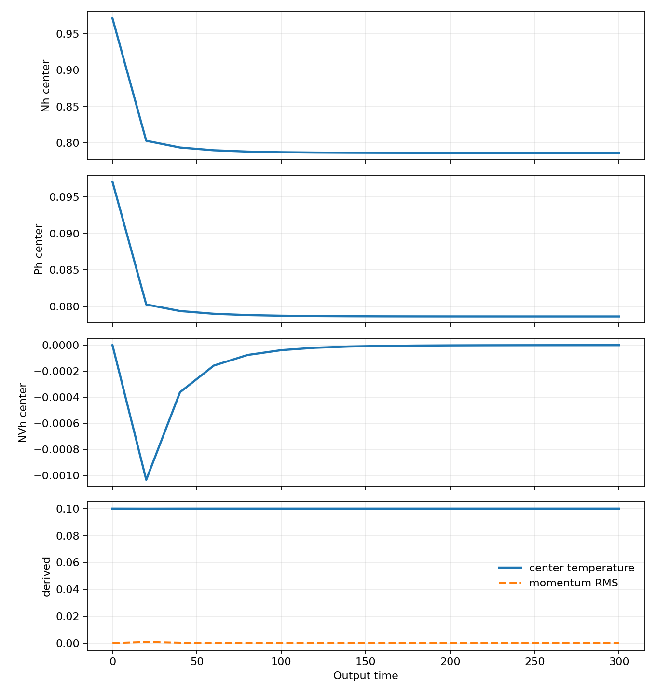

# jax_drb

`jax_drb` is a fresh JAX plasma codebase for edge and scrape-off-layer modeling. The active tree is being built from a clean implementation plan: differentiable solver kernels, CPU/GPU portability, a Python API, and a CLI that can run curated validation cases end to end.

The current validated slices are small on purpose. Each one is locked to committed baselines before the next layer of physics is added:

- density-only `one_rhs`;
- anomalous diffusion `one_step` and `short_window`;
- periodic 1D manufactured fluid `one_rhs`, `one_step`, and `short_window`;
- standalone electrostatic vorticity `one_rhs`, `one_step`, and `short_window`;
- blob2d curvature-driven `one_rhs`, `one_step`, and `short_window`;
- coupled 2D drift-wave `one_rhs`, `one_step`, and `short_window`.

## Validation Snapshots

The figures below come from the committed validation ladder. They compare native `jax_drb` outputs against the stored baseline artifacts used by the regression harness.











The current benchmark diagnostics page also includes a short-window drift-wave validation figure with measured growth/frequency extraction against the analytic dispersion target:



The staged neutral branch now also has a compact short-window benchmark target that locks the reference transient before the native stiff integrator is exposed:



## Running Cases

Editable install:

```bash
pip install -e .[dev,validation]
```

Run a curated native case:

```bash
PYTHONPATH=src python -m jax_drb run-case diffusion_short_window --reference-root /path/to/reference-checkout
```

Run a native TOML input directly, write JSON/NPZ/log/restart artifacts, and then continue from restart. After `pip install -e .[dev,validation]`, both `jax_drb` and `jax-drb` work as console commands:

```bash
jax_drb path/to/input.toml --output-dir /tmp/jax_drb_run
jax_drb path/to/input.toml \
  --output-dir /tmp/jax_drb_run_resume \
  --restart-in /tmp/jax_drb_run/<case>_restart.npz \
  --resume-steps 2
```

The native run path now supports:

- ordered TOML input decks with `[time]`, `[runtime]`, `[runtime.logging]`, `[mesh]`, `[solver]`, `[model]`, `[output]`, `[restart]`, `[species.*]`, and `[fields.*]`;
- runtime precision selection through `[runtime].precision = "float32" | "float64"` or `--precision` on the standalone CLI;
- rich Hermes-style run events plus a final summary, with a plain-text fallback carrying the same metadata;
- portable output artifacts: summary JSON, arrays NPZ, restart NPZ, and verbose run-log JSON.

Inspect the curated ladder:

```bash
PYTHONPATH=src python -m jax_drb reference-cases --reference-root /path/to/reference-checkout
```

Generate the drift-wave short-window parity report and figure:

```bash
PYTHONPATH=src python -m jax_drb compare-drift-wave \
  /path/to/curated/drift_wave/BOUT.inp \
  references/baselines/reference_arrays/drift_wave_short_window.npz \
  /tmp/jax_drb_drift_wave_short_window_native.npz \
  --json-out docs/data/drift_wave_short_window_parity.json \
  --plot-out docs/images/drift_wave_short_window_parity.png
```

Generate the blob2d short-window parity report and figure:

```bash
PYTHONPATH=src python -m jax_drb compare-blob2d \
  references/baselines/reference_metrics/blob2d_short_window_metrics.json \
  /tmp/jax_drb_blob2d_short_window_native.npz \
  --json-out docs/data/blob2d_short_window_parity.json \
  --plot-out docs/images/blob2d_short_window_parity.png
```

Generate a meeting-ready Alfven-wave package with 2D and 3D movies plus publication figures:

```bash
PYTHONPATH=src .venv/bin/python examples/alfven_wave_meeting_demo.py \
  --reference-root /path/to/reference-checkout
```

Regenerate those figures and movies from a saved `.npz` payload without rerunning the case:

```bash
PYTHONPATH=src .venv/bin/python examples/alfven_wave_meeting_demo.py \
  --arrays-in docs/data/alfven_wave_short_window_native.npz \
  --output-root docs
```

Generate a fast Blob2D movie from a saved one-step payload:

```bash
PYTHONPATH=src .venv/bin/python examples/blob2d_meeting_demo.py \
  --arrays-in references/baselines/reference_arrays/blob2d_one_step.npz \
  --output-root docs \
  --skip-parity
```

Run the explicit restart tutorial example with TOML input generation, saved artifacts, restart/resume, precision selection, and Matplotlib outputs:

```bash
PYTHONPATH=src .venv/bin/python examples/restartable_diffusion_tutorial.py
```

Benchmark `float32` vs `float64` on the same restartable diffusion rung:

```bash
PYTHONPATH=src .venv/bin/python examples/diffusion_precision_benchmark.py
```

The committed example benchmark artifacts live in:

- [docs/runtime_precision_benchmark/data/diffusion_precision_analysis.json](/Users/rogerio/local/jax_drb/docs/runtime_precision_benchmark/data/diffusion_precision_analysis.json)
- [docs/runtime_precision_benchmark/images/diffusion_precision_elapsed.png](/Users/rogerio/local/jax_drb/docs/runtime_precision_benchmark/images/diffusion_precision_elapsed.png)

The current QA-checked tutorial output package lives in:

- [docs/data/restartable_diffusion_demo_artifacts](/Users/rogerio/local/jax_drb/docs/data/restartable_diffusion_demo_artifacts)

Generate the compact neutral short-window benchmark report and figure:

```bash
PYTHONPATH=src python -m jax_drb analyze-neutral-mixed \
  references/baselines/reference_arrays/neutral_mixed_short_window.npz \
  --x-index 5 \
  --y-index 3 \
  --z-index 5 \
  --json-out references/baselines/reference_metrics/neutral_mixed_short_window_metrics.json \
  --plot-out docs/images/neutral_mixed_short_window_diagnostics.png
```

Re-run committed reference baselines as a smoke check:

```bash
PYTHONPATH=src python -m jax_drb validate-reference-baselines \
  --reference-root /path/to/reference-checkout \
  --case evolve_density_rhs \
  --case diffusion_one_step \
  --case vorticity_rhs
```

Run the regression suite:

```bash
pytest -q
```

## Docs Map

- Validation gallery: [docs/validation_gallery.md](/Users/rogerio/local/jax_drb/docs/validation_gallery.md)
- Native runtime CLI: [docs/native_runtime_cli.md](/Users/rogerio/local/jax_drb/docs/native_runtime_cli.md)
- Alfven-wave meeting demo: [docs/alfven_wave_meeting_demo.md](/Users/rogerio/local/jax_drb/docs/alfven_wave_meeting_demo.md)
- Blob2D meeting demo: [docs/blob2d_meeting_demo.md](/Users/rogerio/local/jax_drb/docs/blob2d_meeting_demo.md)
- Restartable diffusion tutorial: [docs/restartable_diffusion_tutorial.md](/Users/rogerio/local/jax_drb/docs/restartable_diffusion_tutorial.md)
- Drift-wave benchmark: [docs/drift_wave_benchmark.md](/Users/rogerio/local/jax_drb/docs/drift_wave_benchmark.md)
- Alfven-wave benchmark: [docs/alfven_wave_benchmark.md](/Users/rogerio/local/jax_drb/docs/alfven_wave_benchmark.md)
- Neutral mixed benchmark: [docs/neutral_mixed_benchmark.md](/Users/rogerio/local/jax_drb/docs/neutral_mixed_benchmark.md)
- Parity harness: [docs/parity_harness.md](/Users/rogerio/local/jax_drb/docs/parity_harness.md)
- Parity matrix: [docs/parity_matrix.md](/Users/rogerio/local/jax_drb/docs/parity_matrix.md)
- Implementation inventory: [docs/implementation_inventory.md](/Users/rogerio/local/jax_drb/docs/implementation_inventory.md)
- Full staged roadmap: [PLAN.md](/Users/rogerio/local/jax_drb/PLAN.md)
