# DRBX

[](https://github.com/uwplasma/drbx/actions/workflows/test.yml)
[](https://github.com/uwplasma/drbx/actions/workflows/docs.yml)
[](https://github.com/uwplasma/drbx/actions/workflows/coverage.yml)
[](https://pypi.org/project/drbx/)
[](https://pypi.org/project/drbx/)
[](LICENSE)
[](https://jax.readthedocs.io/)
[](https://drbx.readthedocs.io/)

**DRBX is a JAX-based, end-to-end differentiable drift-reduced Braginskii
(DRB) code for edge and scrape-off-layer (SOL) plasma turbulence** — on both
closed and open field lines, in axisymmetric (tokamak) and non-axisymmetric
(stellarator) geometry via the flux-coordinate-independent (FCI) approach.

Because the whole model is written in JAX, every simulation is `jit`-compiled,
runs on CPU or GPU unchanged, and is differentiable: you can take gradients of
any output (a saturated fluctuation energy, a transport level) with respect to
any input (a density gradient, an adiabaticity, a diffusivity) through the
solver. To our knowledge no other published DRB SOL turbulence code is
differentiable, and none combines differentiability with FCI stellarator
geometry.

Documentation: [drbx.readthedocs.io](https://drbx.readthedocs.io/).

## Stellarator turbulence in three dimensions

Four-field drift-reduced turbulence on a rotating-ellipse stellarator — a torus
whose elliptical cross-section rotates with the toroidal angle. The cutaway
shows the density fluctuations on a flux surface and through the interior;
every frame is a `jit`-compiled, differentiable JAX step:

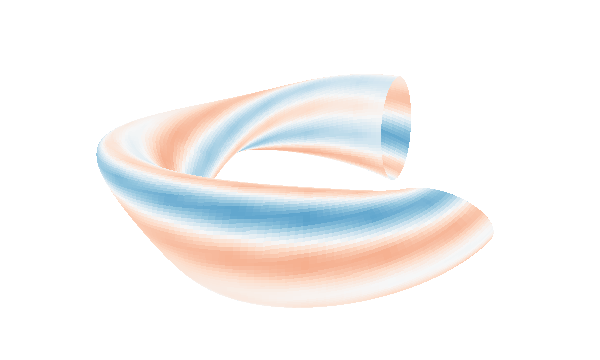

The same geometry supports closed and open field lines: core field lines (blue)
stay on flux surfaces, while beyond a toroidal limiter the scrape-off-layer
field lines (red) end on the limiter plate, where a Bohm sheath drains the
plasma:

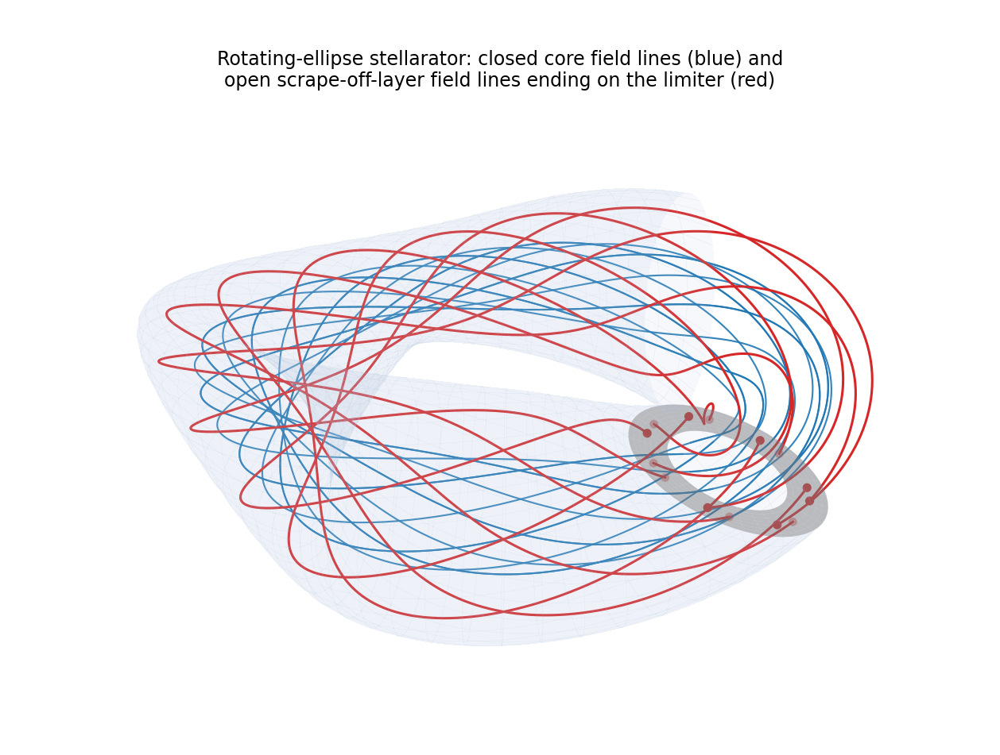

## Install

```bash
pip install drbx          # from PyPI
# or, from source:
git clone https://github.com/uwplasma/drbx && cd drbx && pip install -e .
```

Runtime dependencies are `jax`, `scipy`, `matplotlib`, `netCDF4`, `rich`,
`pillow`, and [`solvax`](https://github.com/uwplasma/SOLVAX). Python 3.10-3.12.

## Quick start

Run a simulation from a TOML deck, or inspect one without running it:

```bash
drbx inspect examples/inputs/restartable_diffusion.toml   # resolve and print the plan
drbx run     examples/inputs/restartable_diffusion.toml   # run and write artifacts
```

From Python, a differentiable turbulence run is a few lines:

```python
import jax.numpy as jnp
import numpy as np
from drbx.native.hasegawa_wakatani import HasegawaWakataniParameters, hw_grid, hw_run

grid = hw_grid(64, 2 * jnp.pi * 8)
params = HasegawaWakataniParameters(adiabaticity=1.0, gradient=1.0)
rng = np.random.default_rng(0)
zeta0 = jnp.fft.fft2(jnp.asarray(1e-2 * rng.standard_normal((64, 64))))
n0 = jnp.fft.fft2(jnp.asarray(1e-2 * rng.standard_normal((64, 64))))
zeta, n = hw_run(zeta0, n0, grid, params, dt=5e-3, steps=500)  # jit-compiled, differentiable
```

Every example below is a flat script: parameters at the top, run, plot.

## Highlights

**Turbulence on closed and open field lines.** The same multi-mode seed on the
rotating-ellipse stellarator, with all field lines closed (top) and with a
limiter opening the outer flux surfaces into a sheath-drained scrape-off layer
(bottom). Four toroidal cross-sections; the mode pattern differs plane by plane
because the flux surfaces rotate:

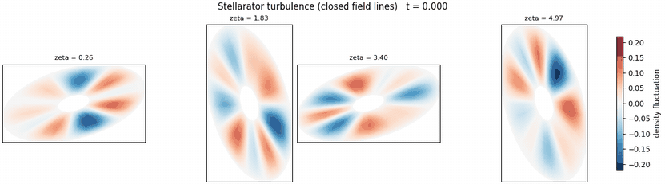

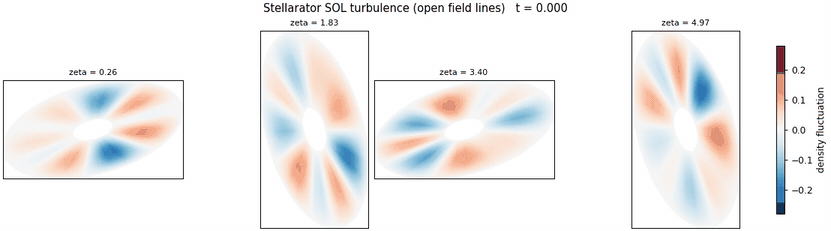

**Island divertor.** A sheared rotational transform with resonant perturbations
forms island chains and a stochastic edge. The open scrape-off layer emerges
from the field itself: multi-transit field-line tracing marks the finite
connection-length region, and the turbulence drains through it:

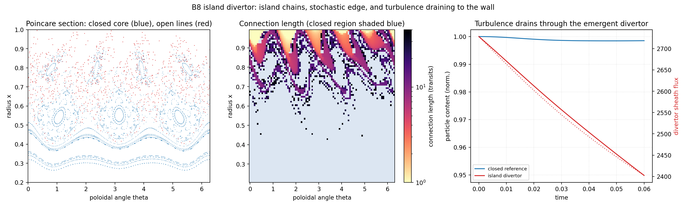

**Imported fields: real coils and VMEC equilibria.** The same closed/open
field-line machinery runs on imported fields: the vacuum Biot-Savart field of
the Landreman-Paul quasi-axisymmetric coil set (via ESSOS) shows nested closed
surfaces inside a chaotic open edge, and a VMEC equilibrium (via vmec_jax)
provides closed surfaces whose traced rotational transform matches the
equilibrium's `iotaf` profile to ~1e-6:

| Coil field (closed core, open edge) | VMEC equilibrium + coil-field SOL |
|---|---|
| 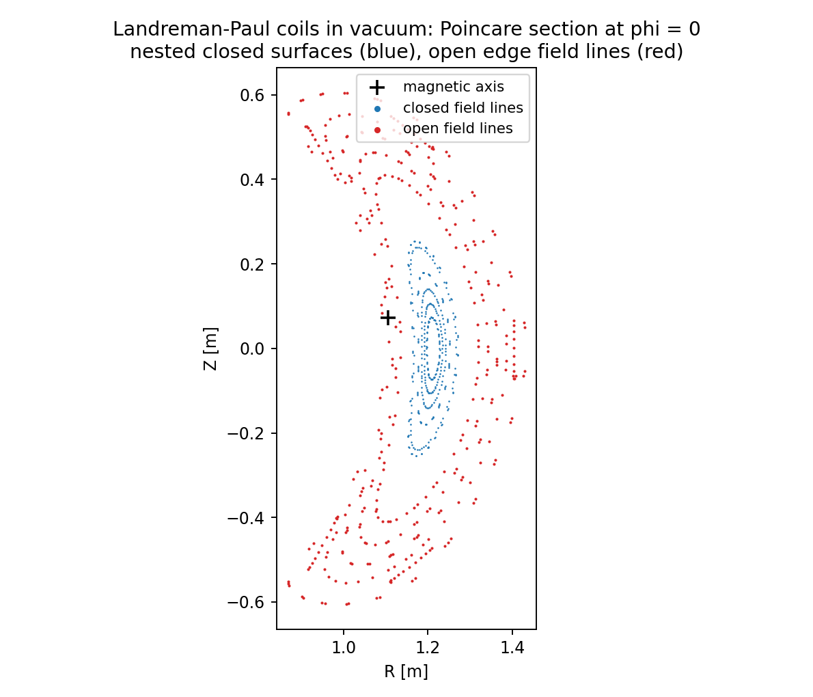 | 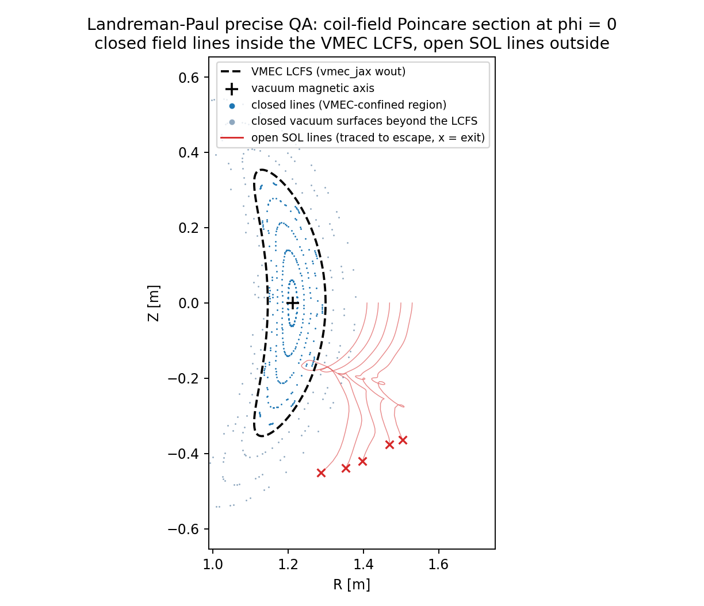 |

**Neutrals and detachment.** The open SOL flux tube reaches the two-point Bohm
steady state; the hermes-3 neutral model (packaged AMJUEL atomic rates, target
recycling) builds the neutral cushion; and with an evolved temperature the SOL
detaches — the target cools through 1 eV and the target ion flux rolls over
(the SD1D benchmark):

| Open SOL flux tube | Recycling SOL with neutrals |
|---|---|
| 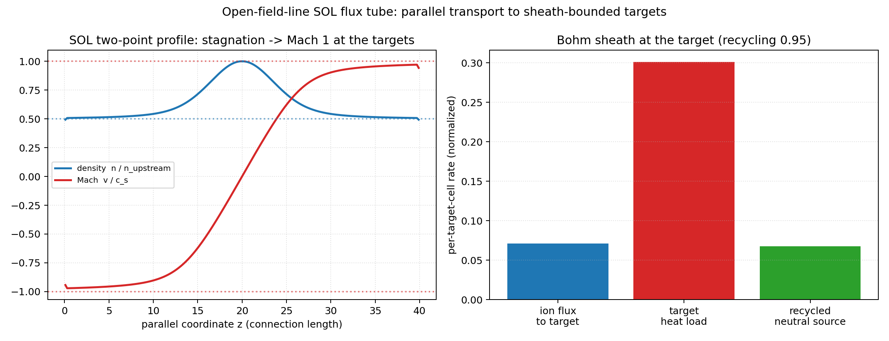 | 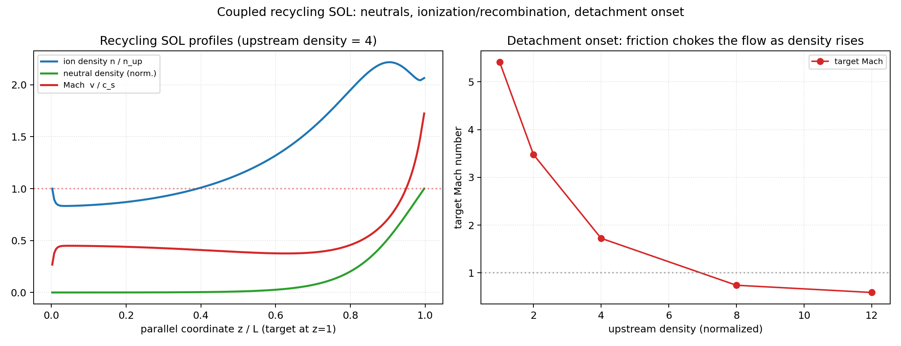 |

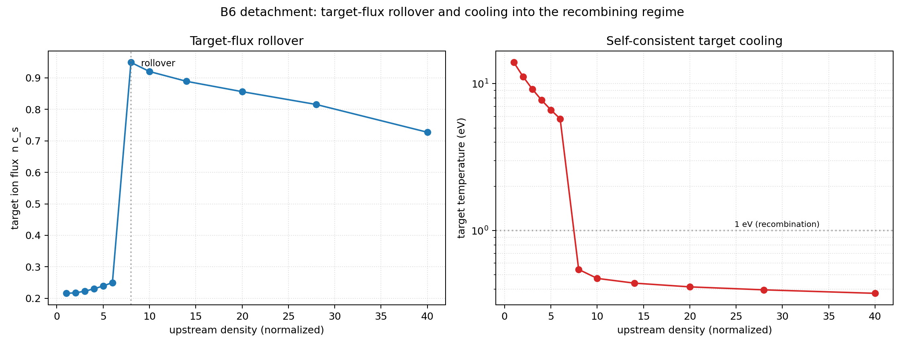

## Gradient-based optimization through the physics

Because the solver is differentiable end to end, control and design problems
become gradient computations. Example: **detachment control** — find the
upstream density that places the divertor target exactly at the 1 eV
detachment threshold (Dudson et al., PPCF 61, 065008; Body et al., NME 41,
101819). The sensitivity `dTe_target/dn_up` is computed by forward-mode
autodiff **through the entire 20,000-step stiff SOL solve**, and a trust-region
Newton iteration walks down the detachment cliff to the threshold:

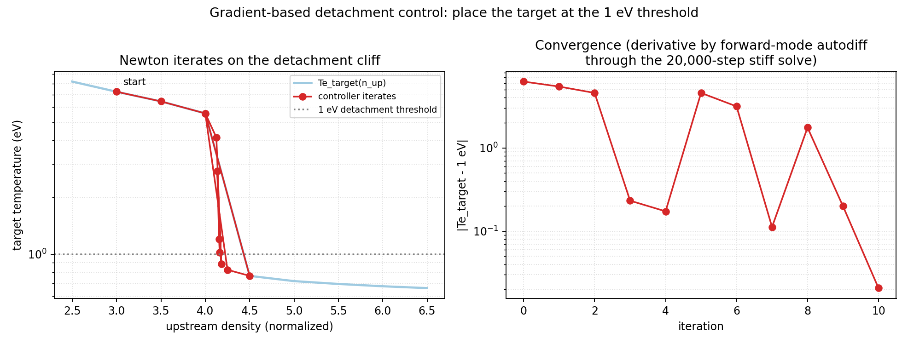

A second example: **turbulence optimization** — find the adiabaticity (the
parallel electron conductivity) at which saturated drift-wave transport drops
to a quarter of its hydrodynamic-regime level, the classic
hydrodynamic-to-adiabatic transition of Hasegawa-Wakatani turbulence (Camargo,
Biskamp & Scott, *Phys. Plasmas* 2, 48 (1995)). A damped Newton iteration on
the adiabaticity, with forward-mode gradients through the saturated turbulence,
converges in 7 iterations; an independent long run verifies a 3.96x flux
reduction against the 4x target. Left column: the initial hydrodynamic state;
right column: the optimized adiabatic state:

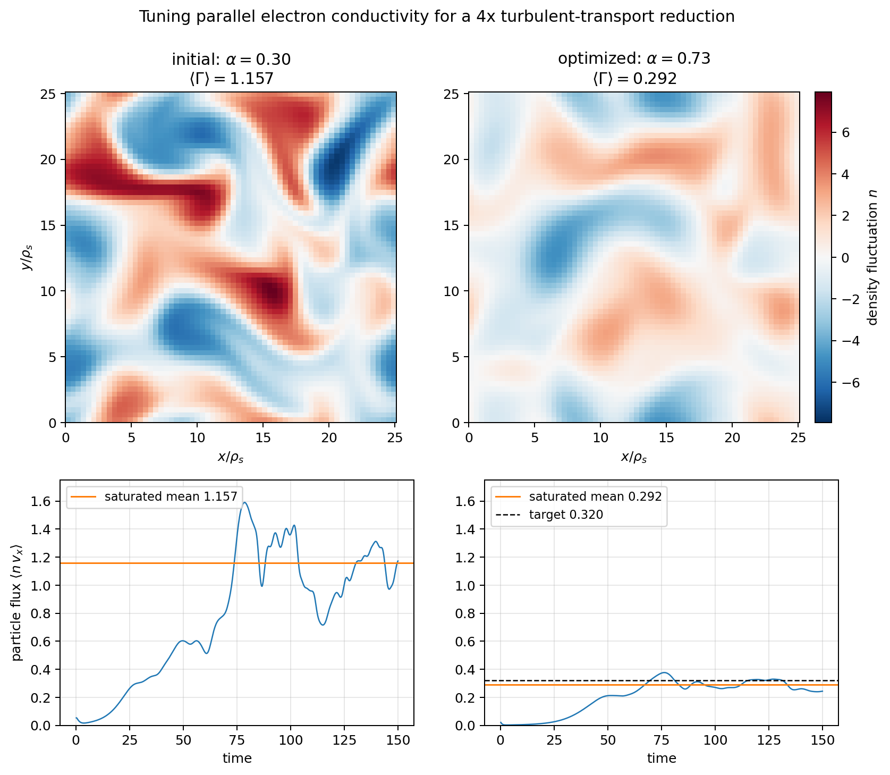

The same machinery recovers a transport-drive parameter by gradient descent
through nonlinear drift-wave turbulence
([inverse design](examples/tokamak/drift_wave_inverse_design.py)), and the
[differentiation-methods example](examples/autodiff/differentiation_methods.py)
measures which method is cheapest (forward mode for a few parameters, ~2x a
forward run; reverse mode for parameter fields; checkpointing when memory-bound).

## Performance and parallel execution

Single-CPU turbulence throughput is about 2 million cell-updates per second in
float64, and one gradient through a 200-step rollout costs 2-3x a forward run.
The full four-field FCI step — four RHS evaluations, each with a GMRES
potential inversion — compiles as a single `jit` program with no host
synchronization inside, which roughly halves the stellarator-turbulence
step time on one CPU
([details](docs/performance_and_differentiability.md)):

| Turbulence performance | Cost of each differentiation method |
|---|---|
|  |  |

The FCI stack runs across devices with `shard_map`: the sharded step is
bit-exact against single-device execution, and on a 36-core host with one core
per shard a 1.05M-cell step reaches a 7.4x speedup at 16 shards; the same step
on one NVIDIA A4000 GPU runs ~96x faster than a single CPU shard
([demo](examples/benchmarks/fci_sharded_strong_scaling.py)):


## Hasegawa-Wakatani benchmark

The standard two-field drift-wave turbulence benchmark: grown from noise
through the linear instability (growth rate verified against the analytic
dispersion relation to ~1e-14) into nonlinear E×B transport. Detailed
verification figures — dispersion scans, MMS convergence orders, and
gradient-vs-finite-difference checks — are in the
[documentation](https://drbx.readthedocs.io/):


## Reproducing the figures and movies

Every figure and movie above is generated by one script in
[`examples/`](examples/), each a flat pedagogical file: all parameters at the
top with comments, explicit model/geometry/boundary-condition setup through the
public API, progress printed while it runs, plot written at the end.

| Figure / movie | Script |
|---|---|
| 3D turbulence cutaway movie + field-line topology | [`examples/stellarator/stellarator_3d_render.py`](examples/stellarator/stellarator_3d_render.py) |
| Closed / open turbulence cross-section movies | [`examples/stellarator/stellarator_turbulence.py`](examples/stellarator/stellarator_turbulence.py) |
| Island divertor (Poincare, connection lengths, drain) | [`examples/stellarator/island_divertor.py`](examples/stellarator/island_divertor.py) |
| Landreman-Paul coil-field Poincare | [`examples/geometry-3D/essos-field-lines/closed_open_vacuum_poincare.py`](examples/geometry-3D/essos-field-lines/closed_open_vacuum_poincare.py) |
| VMEC closed + open field lines | [`examples/geometry-3D/vmec-jax/closed_open_field_lines.py`](examples/geometry-3D/vmec-jax/closed_open_field_lines.py) |
| Open SOL flux tube | [`examples/sol/open_sol_flux_tube.py`](examples/sol/open_sol_flux_tube.py) |
| Recycling SOL with neutrals | [`examples/sol/recycling_sol.py`](examples/sol/recycling_sol.py) |
| Detachment rollover (SD1D benchmark) | [`examples/benchmarks/b6_detachment_rollover.py`](examples/benchmarks/b6_detachment_rollover.py) |
| Detachment control by autodiff | [`examples/autodiff/detachment_control.py`](examples/autodiff/detachment_control.py) |
| Turbulence optimization (two-column) | [`examples/tokamak/hasegawa_wakatani_optimization.py`](examples/tokamak/hasegawa_wakatani_optimization.py) |
| Turbulence performance panels | [`examples/benchmarks/performance_benchmark.py`](examples/benchmarks/performance_benchmark.py) |
| Differentiation-method costs | [`examples/autodiff/differentiation_methods.py`](examples/autodiff/differentiation_methods.py) |
| Strong scaling (CPU shards + GPU) | [`examples/benchmarks/fci_sharded_strong_scaling.py`](examples/benchmarks/fci_sharded_strong_scaling.py) |
| Drift-wave turbulence movie | [`examples/tokamak/drift_wave_turbulence.py`](examples/tokamak/drift_wave_turbulence.py) |

The embedded copies live compressed in `docs/media/`; the scripts regenerate
full-quality versions under `output/`.

## What it does

| Capability | What ships |
|---|---|
| **Turbulence models** | Hasegawa-Wakatani drift-wave (pseudo-spectral, differentiable); FCI 2-field, 4-field interchange (density/vorticity/parallel flows), and electromagnetic drift-reduced stacks with curvature and vorticity/potential closures |
| **Geometry** | Rotating-ellipse stellarator (closed core + optional limiter SOL), island-divertor field (emergent stochastic SOL), shifted-torus helical flux tube, open slab SOL, imported ESSOS coil / VMEC / hybrid equilibria — metrics by autodiff of analytic embeddings |
| **Field-line topology** | Closed and open field lines; FCI traced field-line maps; multi-transit connection-length tracing; Bohm sheath + target recycling closure on open endpoints |
| **Neutrals (hermes-3 model)** | Packaged AMJUEL ionization/recombination + charge-exchange rates (no external database); Galilean-invariant plasma-neutral coupling; recycling SOL and a self-consistent detaching SOL (implicit Spitzer conduction, self-limiting radiation, SD1D rollover) |
| **Linear solver** | `drbx.linear` linearizes any model about an equilibrium; drift-wave, shear-Alfven, and interchange dispersion reproduced to machine precision |
| **Differentiability** | `jit`/`grad`/`vmap` through every model — sensitivity, uncertainty propagation, inverse design, detachment control; forward/reverse/checkpointed methods measured and gated to agree |
| **Parallelism** | Multi-device `shard_map` FCI stepping (bit-exact vs single device) with halo exchange; CPU strong scaling demonstrated, GPU-ready |
| **Solvers** | Structured solves via [`solvax`](https://github.com/uwplasma/SOLVAX) (spectral Fourier-Helmholtz elliptic, tridiagonal, Krylov, preconditioners) |
| **Runtime** | TOML-deck CLI (`drbx inspect` / `run`) and a small Python API; restartable runs; portable JSON/NPZ artifacts |

## Validation

`drbx` is validated against a ladder of literature-anchored benchmarks.
Each rung has a test (or a documented gate) and an example that regenerates
its figure.

Verified today (each with a passing test):

| Case | Anchor | What is checked |
|------|--------|-----------------|
| Method of manufactured solutions | Riva et al., *Phys. Plasmas* 21, 062301 (2014); Dudson et al. 23, 062303 (2016) | operator / 1D-fluid / FCI convergence order → 2 |
| Resistive drift-wave dispersion | Dudson et al., *Comput. Phys. Commun.* 180, 1467 (2009) | growth rate and frequency vs analytic dispersion |
| Shear-Alfvén wave dispersion | Stegmeir et al., *Phys. Plasmas* 26, 052517 (2019) | phase velocity vs analytic (with electron inertia) |
| Interchange / Rayleigh-Taylor | curvature-driven flute dispersion | growth rate vs `√(gκ)·k_y/k` analytic |
| FCI on non-axisymmetric geometry | Shanahan et al., *PPCF* 61, 025007 (2019, BSTING) | parallel-operator MMS; differentiable rollout (grad vs FD 6e-11) |
| Rotating-ellipse (`l = 2`) FCI | Stegmeir et al., *Comput. Phys. Commun.* 198, 139 (2016, GRILLIX) | direct & traced-field-line parallel gradient converge at order 2 on a genuinely non-axisymmetric metric; shape-differentiable; a seeded four-field filament generates interchange vorticity on the rotating surfaces |
| Island-divertor field (B8) | Shanahan et al., *J. Plasma Phys.* 90 (2024, BSTING); GBS island-divertor studies | sheared-iota island chains + stochastic edge; closed core and finite-connection-length open SOL emerge from multi-transit tracing; turbulence drains through the emergent divertor masks |
| Open-field-line SOL flux tube | two-point / Bohm-sheath SOL theory (Stangeby, *The Plasma Boundary of Magnetic Fusion Devices*, 2000) | parallel flow reaches Mach 1 at the targets; target density = half upstream; exact Bohm particle balance and sheath-recycling accounting |
| Neutrals and recycling (hermes-3 model) | hermes-3: Dudson et al., *Comput. Phys. Commun.* 296, 108991 (2024); AMJUEL atomic rates | physically-correct ionization/recombination/CX rates; exact plasma↔neutral particle & momentum conservation; neutrals conserve on the 3D closed rotating ellipse and recycle on the open slab |
| SD1D detachment rollover (B6) | SD1D: Dudson et al., *Plasma Phys. Control. Fusion* 61, 065008 (2019) | self-consistent SOL (evolved temperature, implicit Spitzer conduction, self-limiting radiation): the target cools through 1 eV into the recombining regime and the target ion flux rolls over as upstream density rises; differentiable |
| Differentiable inverse design | — | gradient descent through turbulence recovers a drive parameter |

Planned rungs (seeded-blob inertial scaling and others) are
tracked in [`plan_drbx.md`](plan_drbx.md); benchmark reports live under
[docs/](docs/linear_dispersion_benchmark.md) and
[docs/validation_gallery.md](docs/validation_gallery.md).

## Examples

Flagship simulations, by geometry:

| | Turbulence flagship | Geometry |
|---|---|---|
| **Tokamak** | [drift-wave turbulence](examples/tokamak/drift_wave_turbulence.py) (Hasegawa-Wakatani; linear phase B2-verified, differentiable) + [inverse design](examples/tokamak/drift_wave_inverse_design.py) | periodic flux tube |
| **Stellarator** | [turbulence on closed + open field lines](examples/stellarator/stellarator_turbulence.py) (four-field, limiter SOL, movies) + [3D renders](examples/stellarator/stellarator_3d_render.py) (cutaway turbulence movie, field-line topology) + [island divertor](examples/stellarator/island_divertor.py) (B8: Poincare, connection lengths, emergent open SOL) + [rotating-ellipse FCI](examples/stellarator/rotating_ellipse_fci.py) (parallel-operator convergence) + [seeded filament](examples/stellarator/rotating_ellipse_filament.py) + [differentiable FCI drift-reduced model](examples/stellarator/fci_differentiable.py) | rotating ellipse (closed core + limiter SOL) + shifted-torus helical + imported [ESSOS/VMEC](examples/geometry-3D/) |
| **Coils (vacuum)** | [Landreman-Paul closed + open field lines](examples/geometry-3D/essos-field-lines/closed_open_vacuum_poincare.py) (ESSOS Biot-Savart, Poincare classification) | imported coil field |
| **VMEC equilibria** | [closed field lines from a wout file](examples/geometry-3D/vmec-jax/closed_field_lines.py) (vmec_jax import; traced rotational transform matches the equilibrium `iotaf` profile to ~1e-6) + [closed + open field lines](examples/geometry-3D/vmec-jax/closed_open_field_lines.py) (coil field with the VMEC last closed flux surface overlaid) | imported VMEC equilibrium (Landreman-Paul precise QA) |
| **SOL (open)** | [open SOL flux tube](examples/sol/open_sol_flux_tube.py) (parallel transport to Bohm-sheath targets; two-point steady state) + [recycling SOL](examples/sol/recycling_sol.py) (neutrals, ionization/recombination, detachment onset) | open slab flux tube |

Open-field-line SOL:
[open slab flux tube](examples/sol/open_sol_flux_tube.py) — parallel
transport to Bohm-sheath-bounded targets, relaxing to the classic two-point
steady state (Mach 1 at the targets, target density half the upstream density),
with the FCI sheath/recycling closure on the target plates.

Benchmarks, differentiable, and geometry examples:

- Linear dispersion (B2/B3):
  [examples/benchmarks/linear_dispersion.py](examples/benchmarks/linear_dispersion.py)
  reproduces the drift-wave and shear-Alfvén dispersion relations from the
  linear solver.
- Autodiff: [gradient-based detachment control](examples/autodiff/detachment_control.py)
  (forward-mode sensitivity through the stiff SOL solve, trust-region Newton onto
  the 1 eV threshold), [inverse design through turbulence](examples/tokamak/drift_wave_inverse_design.py)
  (recover a parameter by gradient descent through a nonlinear drift-wave run),
  [choosing the most efficient differentiation method](examples/autodiff/differentiation_methods.py)
  (forward vs reverse vs checkpointed reverse — same gradient, different cost),
  plus [sensitivity](examples/autodiff_diffusion_sensitivity.py),
  [uncertainty](examples/autodiff_diffusion_uncertainty.py), and reduced
  [inverse design](examples/autodiff_diffusion_inverse_design.py).
- Stellarator FCI and imported geometry:
  [examples/geometry-3D/](examples/geometry-3D/).
- Start with [examples/model_selection_guide.py](examples/model_selection_guide.py)
  to choose a model family, dimension, and boundary conditions.

The examples are self-contained — no external plasma code is needed to run
them. Large figures and movies are hosted in GitHub releases so the checkout
stays small.

## Geometry and parallelization

The FCI operator and domain-decomposition stack (`FciGeometry3D`,
`fci_operators`, halo exchange) was contributed by **Aiken Xie** in
[PR #3](https://github.com/uwplasma/drbx/pull/3) and is incorporated here.
Built on it, the drift-reduced two-field step runs across multiple devices with
`shard_map`: the domain is decomposed into halo-exchanged shards and the sharded
RK4 step is **bit-exact** against the single-device step (checked to ~1e-16 for
single-device and forced-four-device runs in
[`tests/test_fci_sharded_2field.py`](tests/test_fci_sharded_2field.py)). On a
36-core Linux host with one core bound per shard, a 1.05M-cell step reaches a
**7.4x speedup at 16 shards**, and one NVIDIA A4000 GPU runs the same step
~96x faster than a single CPU shard
([strong-scaling script](examples/benchmarks/fci_sharded_strong_scaling.py),
[docs](docs/performance_and_differentiability.md)).

## Documentation

- Physics and numerics: [physics_models.md](docs/physics_models.md),
  [equation_to_code_map.md](docs/equation_to_code_map.md),
  [code_structure.md](docs/code_structure.md).
- Performance and differentiability:
  [performance_and_differentiability.md](docs/performance_and_differentiability.md),
  [profiling_runtime.md](docs/profiling_runtime.md).
- Validation: [validation_gallery.md](docs/validation_gallery.md).
- Testing policy: [testing_strategy.md](docs/testing_strategy.md).

## Testing

```bash
pytest -q -m "not slow"                                   # full fast suite
pytest -q -m "not slow" --cov=drbx --cov-branch        # with coverage
```

CI runs the full fast suite on Python 3.10–3.12.

## Releases

Changes are recorded in [CHANGELOG.md](CHANGELOG.md); the current development
series is [docs/release_notes_2_0_0_dev0.md](docs/release_notes_2_0_0_dev0.md).

## Citing

If you use `drbx`, please cite it via [CITATION.cff](CITATION.cff).

## License

MIT — see [LICENSE](LICENSE).
