# jaxdrb

`jaxdrb` is a JAX-native research code for **drift-reduced Braginskii (DRB)** physics in the tokamak edge and scrape-off layer (SOL),
covering **both linear and nonlinear workflows** in a single, end-to-end differentiable codebase.
It combines fast field-line linear stability solvers with validated nonlinear 2D testbeds and FCI/3D scaffolding, while keeping the
numerics reviewer-checkable through conservative gates and literature-aligned benchmarks.

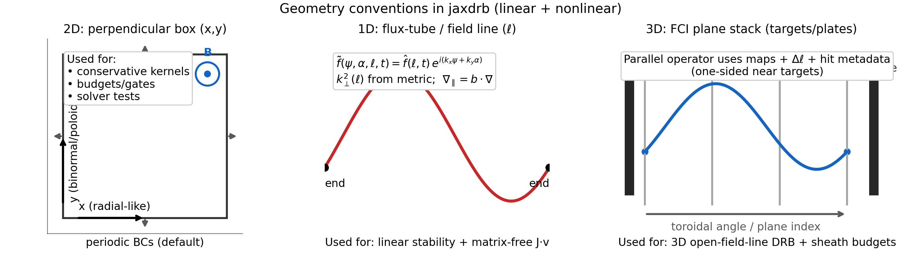

**Coordinate conventions (quick reference)**:

- **1D flux-tube / field-line solvers** evolve profiles along $\ell$ and represent perpendicular structure as
  Fourier modes $\exp\{i k_x\psi + i k_y\alpha\}$ with geometry-provided $k_\perp^2(\ell)$, curvature, and $\nabla_\parallel$.
- **2D nonlinear testbeds** (HW2D/DRB2D) evolve fields on a perpendicular box $(x,y)$ with the guide field out of plane
  (default BCs are periodic in $x$ and $y$).
- **3D FCI milestone operators** evolve fields on a plane stack and construct parallel operators from field-line maps
  (open-field-line segments can hit plates/targets and activate sheath/plate budget channels).

Full explanation (with boundary-condition meaning in each branch): [docs/geometry/conventions.md](docs/geometry/conventions.md).

## What this repository contains

**Linear stability along a field line**

- Computes growth rates/frequencies for drift waves and ballooning-like modes.
- Solves the linearized system via:
  - initial-value time evolution (growth-rate estimation),
  - matrix-free Arnoldi eigenvalue solves (Ritz spectrum) with `J·v` from `jax.linearize`.

**Nonlinear capabilities (2D + preparation for 3D/FCI)**

- HW2D and DRB2D nonlinear systems with conservative gates, energy budgets, and solver comparisons.
- Hot-ion and EM DRB2D branches, curvature-drive benchmarks, and non-Boussinesq polarization gates.
- Neutral coupling, MMS tests, and regression metrics for stability of turbulence runs.
- Minimal 3D slab operators (FCI scaffolding) with conservative and sheath budget tests.

**Geometry is pluggable**

- Analytic slab and **s–α** (tokamak ballooning) benchmarks.
- Circular tokamak geometry (analytic).
- Tabulated geometry from `.npz` (drop-in replacement).
- Optional ESSOS-driven geometries (VMEC / near-axis / Biot–Savart).
- A preparation milestone for **FCI (flux-coordinate independent)** operators (for X-points / islands): see `docs/fci/`.
  - Map file format + builder notes: `docs/fci/maps.md`

**Physics knobs / extensions**

- Cold-ion electrostatic DRB (baseline).
- Hot-ion electrostatic variant (adds `Ti`).
- Electromagnetic extension (adds `psi ~ -A_parallel`).
- Boussinesq and linearized non-Boussinesq polarization closures.
- Open-field-line MPSE/sheath entrance closures (Bohm/Loizu-style), plus optional sheath heat/SEE knobs.
  - The Loizu2012 “full set” includes a matching hot-ion endpoint constraint `∂_|| Ti = 0` when using the hot-ion model.
- Equilibrium-based Braginskii/Spitzer scalings for transport coefficients (optional).

## Status matrix (major physics toggles)

This table is intentionally blunt: checkboxes reflect what is **implemented and CI-tested** in each branch.
For details and links to the relevant modules/tests, see:

- [docs/capabilities.md](docs/capabilities.md)
- [docs/validation.md](docs/validation.md)

| Toggle / feature | Linear (field-line) | Nonlinear 2D | FCI/3D |
| --- | --- | --- | --- |
| MPSE/sheath-entrance closures (Bohm/Loizu; heat/SEE knobs) | [x] | [ ] | [x]† |
| Non‑Boussinesq polarization | [x]‡ | [x] | [x]¶ |
| Hot ions (`Ti`) | [x] | [x] | [x]† |
| Electromagnetic (`psi ~ A_parallel`) | [x] | [x] | [x]† |
| Neutrals (`N` + exchange terms) | [ ] | [x] | [x]† |
| Conservative invariants / budget gates | [x] | [x] | [x]§ |

† FCI/3D currently includes a slab full-branch target/sheath **budget-coupling milestone** with hot-ion/EM/neutrals
toggles; full production sheath closure physics is still tracked in `docs/fci/requirements.md`.  
‡ Linear non‑Boussinesq is currently provided in a linearized/controlled form (see `docs/model/extensions.md`).  
§ FCI/3D conservative gates currently apply to minimal slab milestone operators (see `docs/fci/`).  
¶ FCI/3D non-Boussinesq support is currently a slab milestone with dedicated gates (not yet full-production geometry coverage).  

## Literature-aligned plots (generated by examples)

**Ideal-ballooning / s–α map (Halpern et al. 2013-style workflow)**  
`examples/06_literature_tokamak_sol/halpern2013_salpha_ideal_ballooning_map.py`


**SOL-width proxy workflow (ISTTOK / Jorge et al. 2016-style)**  
`examples/06_literature_tokamak_sol/jorge2016_isttok_linear_workflow.py`


**Instability regime map (Mosetto et al. 2012 calibrated 4-regime workflow)**  
`examples/06_literature_tokamak_sol/mosetto2012_regime_map.py`

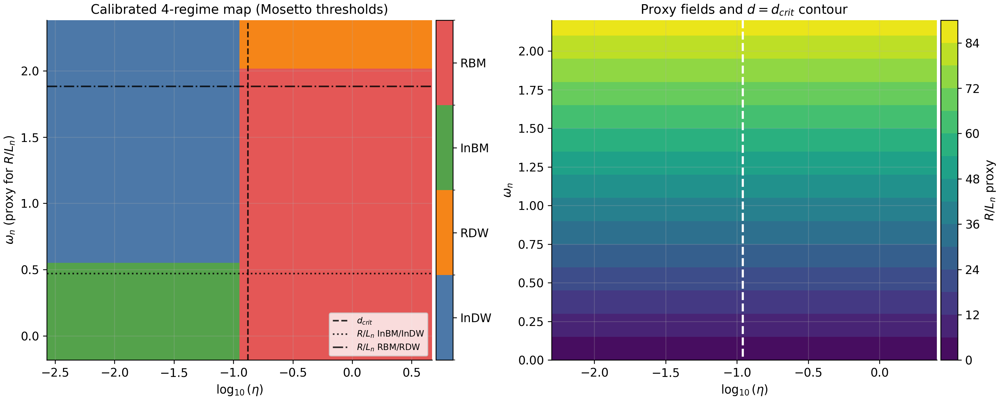

Optional slower comparison with the solver-ablation classifier:
`python examples/06_literature_tokamak_sol/mosetto2012_regime_map.py --classifier both`

**Full MPSE/sheath boundary condition set (Loizu 2012, hot-ion model)**  
`examples/03_sheath_mpse/loizu2012_full_hot_ion_mpse_bc.py`

## Nonlinear movies (HW2D, DRB2D, FCI/DRB3D)

`jaxdrb` includes fast nonlinear milestones used to validate conservative advection kernels,
Poisson solves, and time stepping. The movies below are generated by the example scripts and
are meant to be short and reproducible. See the nonlinear docs for details and parameters:
[docs/nonlinear/index.md](docs/nonlinear/index.md).

| HW2D turbulence | DRB2D (cold-ion) | DRB2D (hot-ion) |
| --- | --- | --- |
| 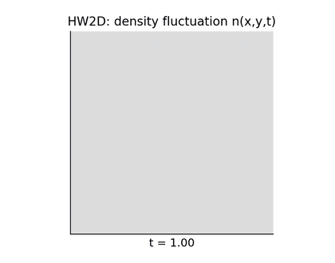 | 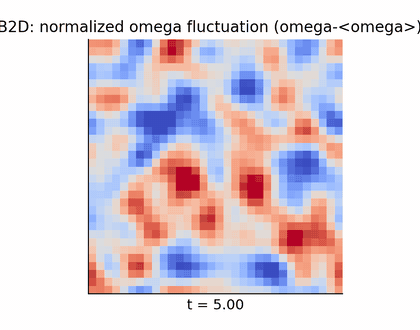 | 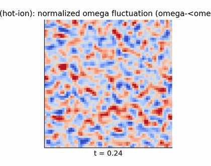 |

| FCI/DRB3D (periodic milestone) | FCI/DRB3D (target/sheath milestone) |
| --- | --- |
| 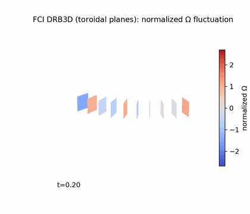 | 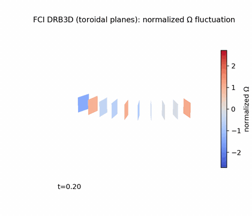 |

The DRB2D movie defaults include weak hyperdiffusion and a small zonal-vorticity drag to avoid
long-time collapse into a purely banded/zonal state on coarse grids. These are numerical control
knobs and should be reported explicitly when used.

To regenerate the README movies locally:

```bash
python examples/assets/scripts/make_readme_movie_assets.py
```

## FCI/3D milestone diagnostics

`jaxdrb` now includes a 3D FCI slab milestone branch with:

- target-aware parallel derivative (Appendix-B style B/C/X handling),
- ESSOS toroidal-plane map builder with target-intersection metadata,
- full 5-field DRB milestone operator (`n, \Omega, v_{\parallel e}, v_{\parallel i}, T_e`) with split API,
- full-branch target/sheath budget channels on the DRB3D slab branch with hot-ion/EM/neutrals toggles,
- FD/FV perpendicular wall-BC scaffolding and turbulence-statistics regression gates.

Example script:

```bash
python examples/09_fci/fci_drb3d_full_operator_wallbc_stats.py --out out_fci_drb3d_full
```

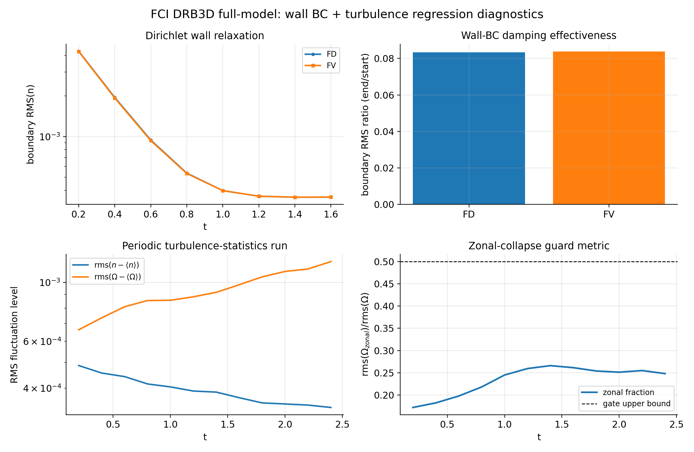

Full-branch target/sheath budget coupling with multiphysics toggles:

```bash
python examples/09_fci/fci_drb3d_full_multiphysics_sheath.py --out out_fci_drb3d_full_multiphysics
```

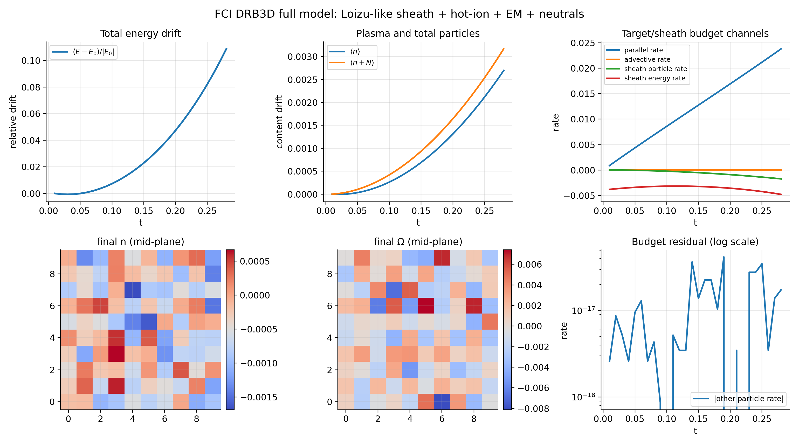

ESSOS Biot-Savart local edge/SOL patch workflow (LandremanPaulQA coils):

```bash
python examples/09_fci/fci_drb3d_full_essos_biotsavart.py --out out_fci_essos_biotsavart
```

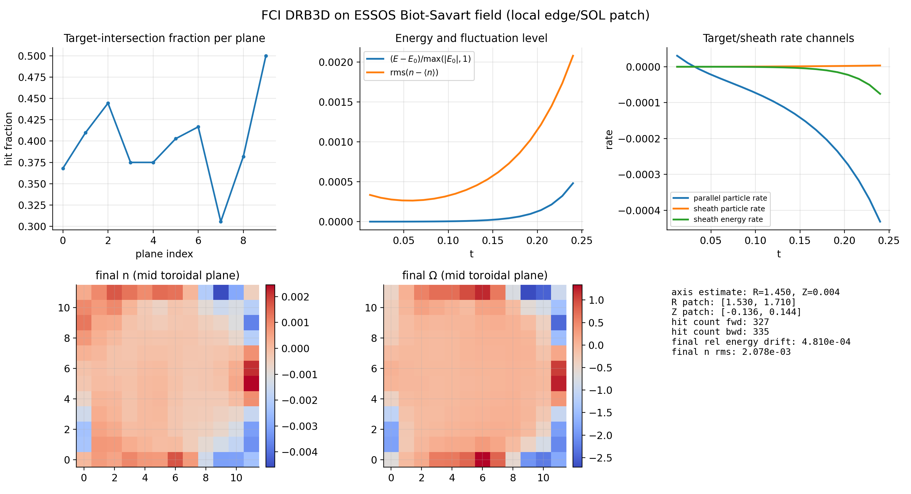

**DRB2D linear-phase benchmark (linearized vs linear solver)**

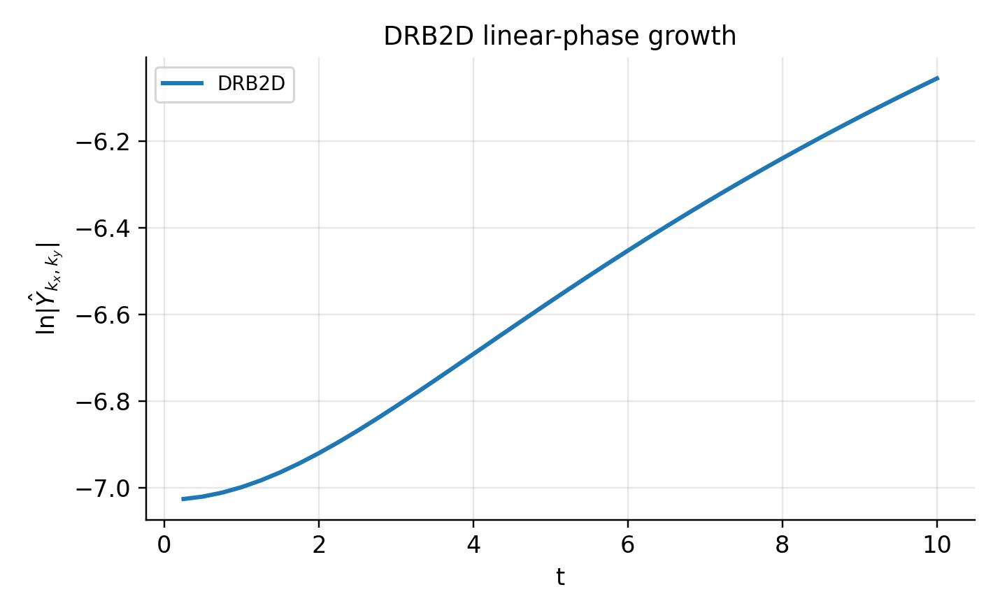

**DRB2D linear-phase benchmarks (hot-ion + EM)**

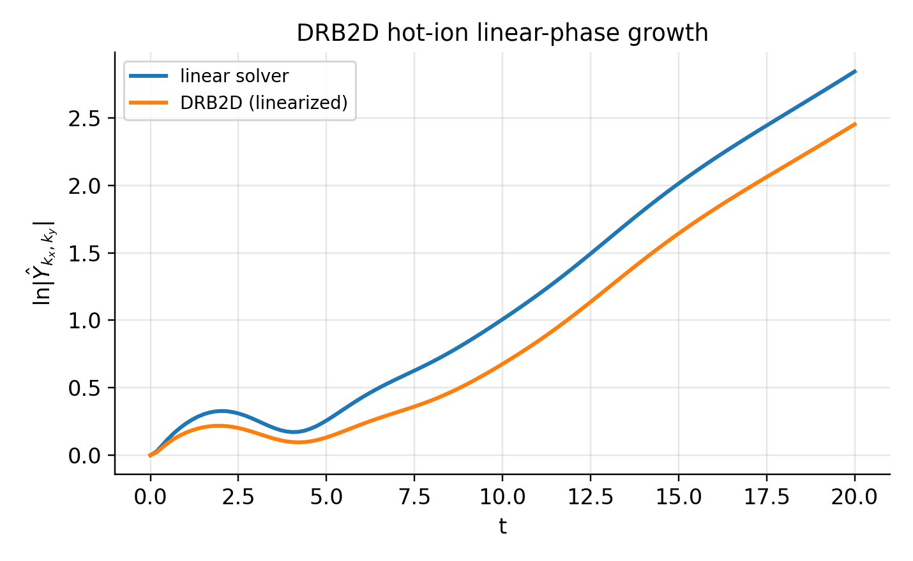
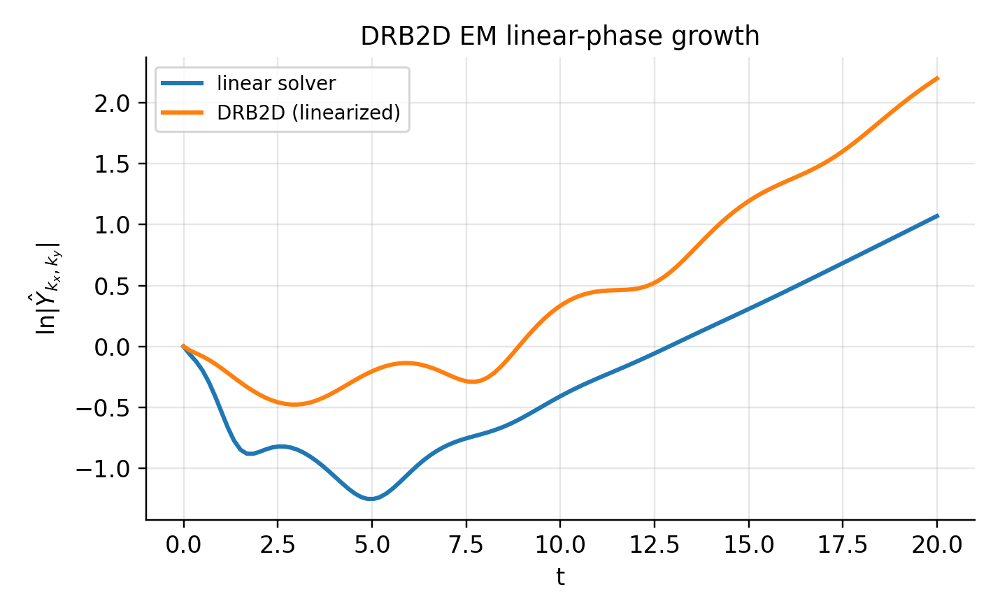

**DRB2D energy-budget closure (curvature + drives)**

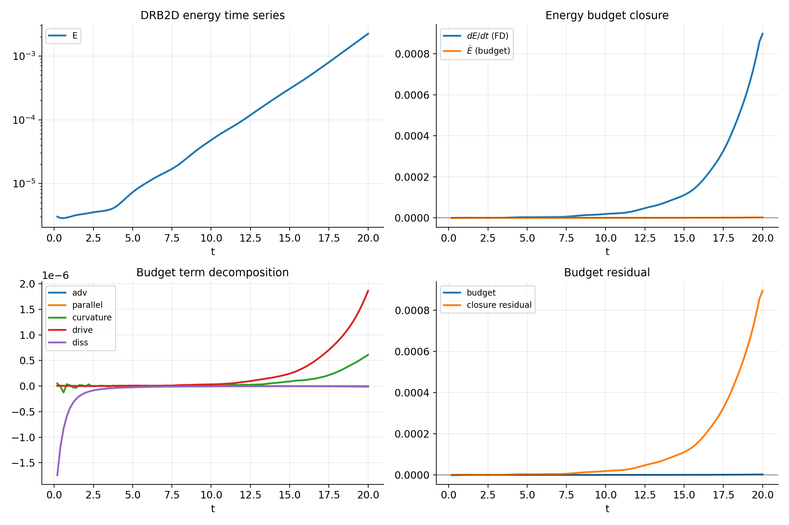

**DRB2D energy budgets (hot-ion + EM)**

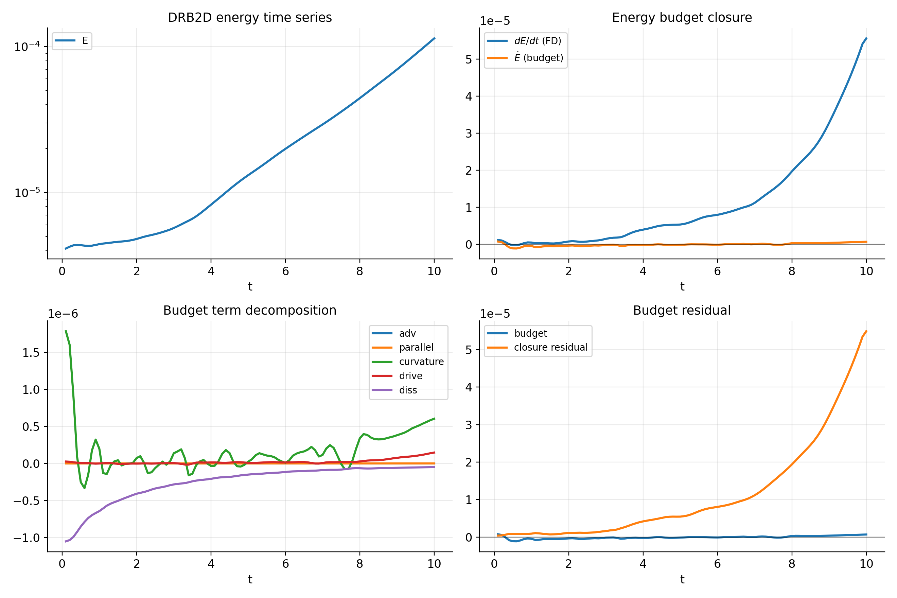
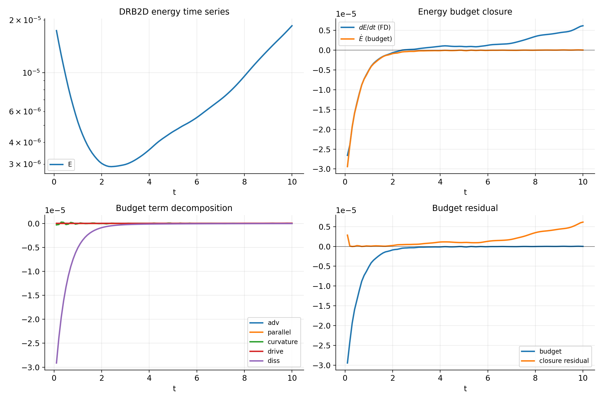

**DRB2D curvature-drive benchmark (proxy threshold)**

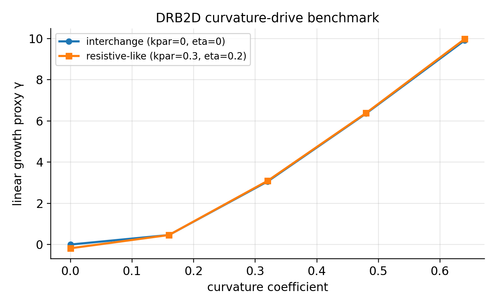
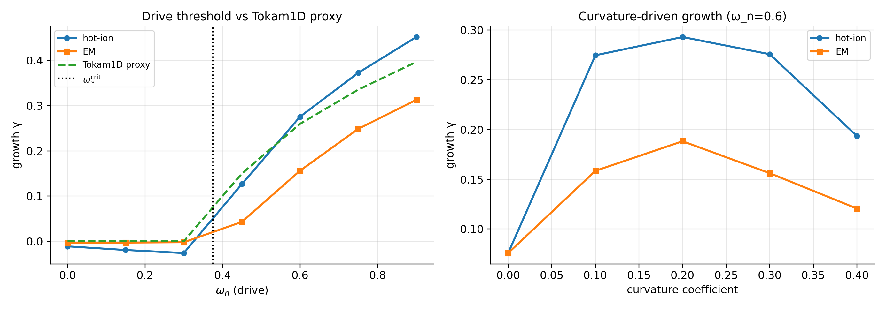

**Diffrax solver comparison (DRB2D)**

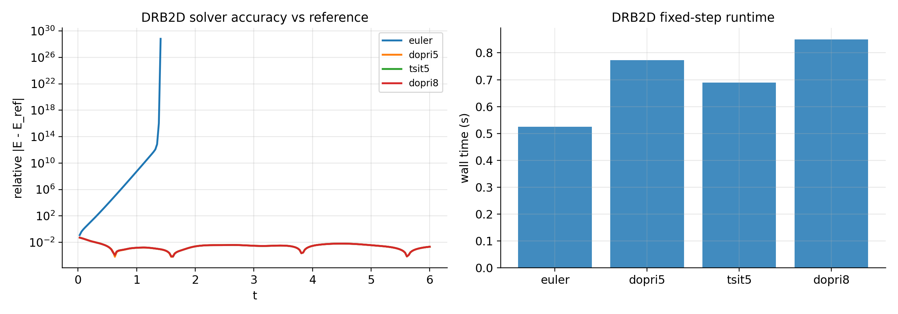

See [docs/nonlinear/performance.md](docs/nonlinear/performance.md) for solver guidance and
preconditioner benchmarks.

## Quickstart

Install editable:

```bash
python -m pip install -e .
```

Run a small linear scan (slab geometry):

```bash
jaxdrb-scan --geom slab --ky-min 0.05 --ky-max 1.0 --nky 32 --out out_slab
```

Run a Cyclone-like s–α scan (tokamak ballooning benchmark):

```bash
jaxdrb-scan --geom salpha --q 1.4 --shat 0.796 --epsilon 0.18 --alpha 0.0 --ky-min 0.05 --ky-max 1.0 --nky 32 --out out_cyclone
```

Make a short nonlinear movie (GIF):

```bash
python examples/08_nonlinear_hw2d/hw2d_movie.py --out out_hw2d_movie
```

Make a short nonlinear DRB2D movie (GIF):

```bash
python examples/08_nonlinear_drb2d/drb2d_movie.py --out out_drb2d_movie
```

## Model at a glance (linear flux-tube form)

The baseline DRB model evolves (in normalized units) the fields:

- `y = (n, Omega, vpar_e, vpar_i, Te)`

and obtains the electrostatic potential from a polarization closure.

In the flux-tube / ballooning representation, perturbations are taken as:

- `f~(psi, alpha, l, t) = f^(l,t) * exp(i*kx*psi + i*ky*alpha)`

so perpendicular operators reduce to geometry-provided coefficients such as `k_perp^2(l)`. In the Boussinesq limit:

- `Omega(l) = -k_perp^2(l) * phi(l)`

The geometry provider supplies (at minimum) `k_perp^2(l)`, the parallel derivative `∇_|| = b·∇`, and a curvature operator `C(·)`.

Rendered equations and normalization details: `docs/model/equations.md` and `docs/model/normalization.md`.

## What “s–α geometry” means (and why it’s useful)

In tokamak ballooning theory, the s–α model captures how:

- **magnetic shear** `shat = (r/q) dq/dr` tilts field lines and tends to stabilize ballooning structure,
- the **ballooning parameter** `alpha` (proportional to the pressure gradient) drives ideal ballooning instability.

In `jaxdrb`, `--geom salpha` lets you scan $\gamma(k_y)$ and map $\gamma(\hat{s},\alpha)$ using the same solver workflow you use for other geometries.

## Why JAX (and what it enables here)

`jaxdrb` uses JAX as the array engine so that:

- matrix-free linearization (`J·v`) uses automatic differentiation (`jax.linearize` / `jax.jvp`),
- scans over $(k_x,k_y)$ and parameter knobs can be vectorized (`vmap`) and compiled (`jit`),
- parts of the workflow remain **end-to-end differentiable**, enabling gradient-based studies.

Example: optimizing a proxy “most unstable” $k_y$ with autodiff:

```bash
python examples/05_jax_autodiff/autodiff_optimize_ky_star.py
```

## Relationship to other edge/SOL codes

Codes such as **GBS/GDB**, **BOUT++**, **Hermes-3**, and **GRILLIX** target large-scale nonlinear SOL turbulence simulations
in increasingly realistic diverted geometries.

`jaxdrb` is complementary:

- it emphasizes **fast linear workflows**, rapid geometry swapping, and *differentiable* matrix-free solvers,
- it includes verification milestones (HW2D, FCI operator tests, Poisson solver tests) to keep the numerics auditable,
- it is designed to be easy to read and modify for targeted studies, method development, and solver experimentation.

## Verification, validation, and performance

- Verification and benchmark scripts live in `examples/10_verification/`.
- The documentation has a dedicated validation page with references and reproduced figures: `docs/validation.md`.
- A micro-benchmark for HW2D stepping lives in `benchmarks/bench_hw2d_step.py`.
- A hard conservative gate for the periodic cold-ion DRB branch is included in:
  - `tests/test_drb_nonlinear_conservative_gate.py`
  - `examples/10_verification/drb_cold_ion_conservative_gate.py`
- A strict operator-level conservative gate (`dy=rhs(y)` invariant-rate residuals) is included in:
  - `tests/test_drb_operator_rates.py`
  - `benchmarks/check_drb_conservative_gate.py` (wired in CI)

## Roadmap to full 3D multiphysics DRB

`jaxdrb` already covers linear field-line solvers and nonlinear 2D DRB testbeds, but a **fully nonlinear 3D,
energy-conserving, multiphysics DRB solver** (sheath + closures + hot ions + EM + stellarator/X‑point) is an
explicit roadmap item. The status, milestones, and remaining steps are tracked here:

- [docs/roadmap.md](docs/roadmap.md)
  - `examples/10_verification/drb_cold_ion_operator_gate.py`
- [docs/fci/requirements.md](docs/fci/requirements.md) (FCI/3D requirements + target benchmark gates)
- [docs/fci/maps.md](docs/fci/maps.md) (FCI map file format + target-aware ∂|| milestone)
- Operator splitting milestone (`RHS = conservative + source + dissipative`) is included in:
  - `src/jaxdrb/models/cold_ion_drb.py` (`rhs_nonlinear_decomposed`)
  - `tests/test_drb_operator_split.py`
  - `examples/10_verification/drb_operator_split_diagnostics.py`

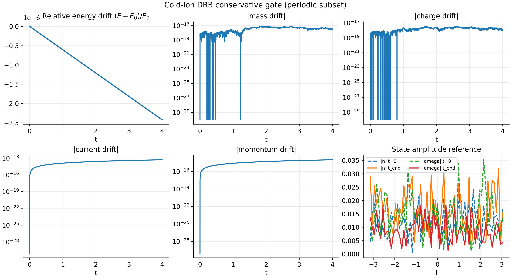
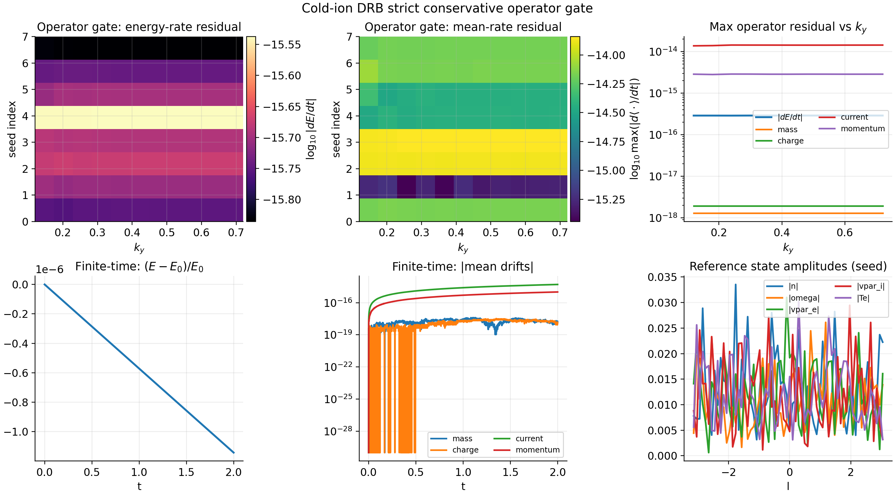
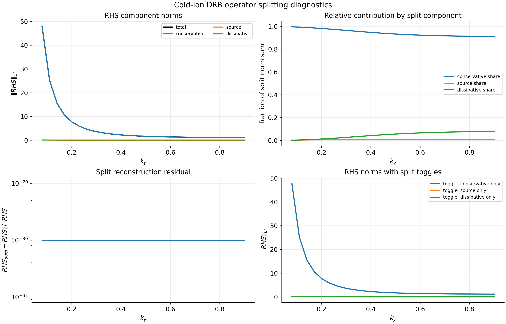

The operator gate checks *instantaneous* invariant rates from the cold-ion field-line RHS, while the
split diagnostics verify the conservative/source/dissipative decomposition used to prepare a fully
conservative nonlinear DRB operator.

## Documentation

Online docs (Read the Docs): https://jax-drb.readthedocs.io/

Build locally:

```bash
python -m pip install -e ".[docs]"
mkdocs serve
```

## Install options (extras)

```bash
python -m pip install -e ".[dev]"    # ruff/black/pytest
python -m pip install -e ".[docs]"   # mkdocs + mkdocstrings
python -m pip install -e ".[essos]"  # ESSOS geometry workflows (VMEC/near-axis/Biot-Savart)
```

## Development

Run tests and formatting:

```bash
make test
make lint
```
