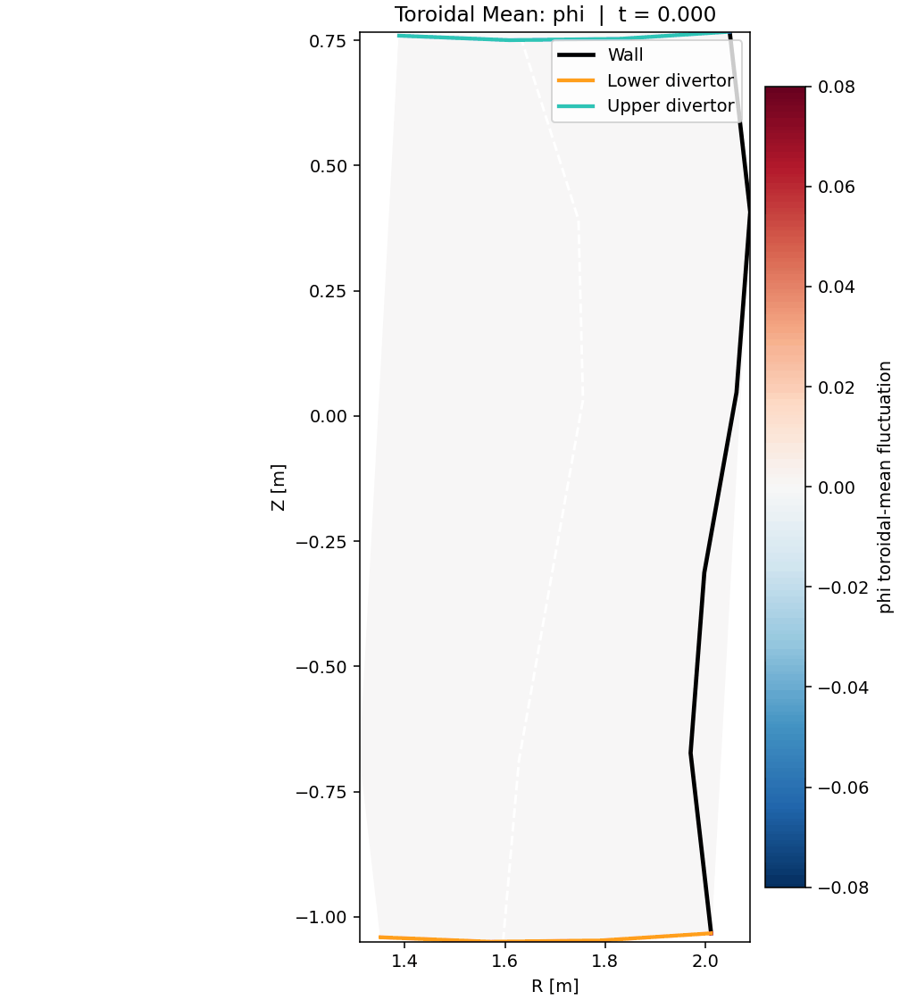

# jax_drb

`jax_drb` is a JAX-native edge and scrape-off-layer plasma code for drift-reduced Braginskii, electrostatic turbulence, neutral transport, and curated tokamak geometry workflows.

The project is being shipped around a strong-subset research claim:

- a documented standalone CLI and Python API
- restartable native runs with rich terminal output
- portable result artifacts for analysis and visualization
- explicit capability tiers for every promoted workflow
- curated validation against external benchmark runs, analytic limits, and physics diagnostics




## Install

Editable install:

```bash
pip install -e .[dev,integrators,models,validation]
```

Minimal runtime install:

```bash
pip install -e .
```

## Quick Start

Run a native TOML deck:

```bash
jax_drb path/to/input.toml
```

The bare form is equivalent to:

```bash
jax_drb run path/to/input.toml
```

Choose precision explicitly:

```bash
jax_drb path/to/input.toml --precision float32
```

Resume from a saved restart bundle:

```bash
jax_drb path/to/input.toml \
  --output-dir output/restarted_case \
  --restart-in output/base_case/my_case_restart.npz \
  --resume-steps 2
```

Inspect a deck without running it:

```bash
jax_drb inspect path/to/input.toml
```

## Python API

The simplest programmatic entry points are:

```python
from pathlib import Path

from jax_drb.cli import main
from jax_drb.native import run_curated_case, run_input_case

# Deck-driven standalone run
main(["run", "examples/inputs/restartable_diffusion.toml", "--quiet"])

# Curated validation case
result = run_curated_case("tokamak_isothermal_one_step", reference_root=Path("/path/to/reference-suite"))
print(result.payload["capability_tier"])
print(sorted(result.variables))

# Native Python driver with staged verbose events
driver_result = run_input_case(
    "examples/inputs/restartable_diffusion.toml",
    case_name="diffusion_driver",
    parity_mode="run",
    verbose=True,
)
print(driver_result.time_points[-1])
```

## Input Model

`jax_drb` supports organized TOML decks with the following top-level sections:

- `[time]`
- `[runtime]`
- `[runtime.logging]`
- `[mesh]`
- `[solver]`
- `[model]`
- `[output]`
- `[restart]`
- `[species.<name>]`
- `[fields.<name>]`

Example:

```toml
[time]
nout = 2
timestep = 0.1

[runtime]
precision = "float64"

[runtime.logging]
verbosity = "detailed"
verbose = true
quiet = false

[mesh]
nx = 32
ny = 1
nz = 1
dx = 0.03125

[solver]
type = "native"

[model]
components = ["h"]

[species.h]
type = ["evolve_density", "evolve_pressure", "anomalous_diffusion"]

[fields.Nh]
function = { expr = "1 + 0.2 * exp(-((x-0.5)^2)/0.01)" }

[fields.Ph]
function = { expr = "0.1" }

[output]
directory = "output/my_case"
write_summary = true
write_arrays = true
write_restart = true
write_log = true
```

## Output Artifacts

Promoted native runs write:

- summary JSON
- arrays NPZ
- restart NPZ
- verbose run-log JSON

The run log stores:

- capability tier
- runtime precision and backend
- mesh, solver, and time configuration
- ordered event stream
- event count and stage inventory
- restart provenance
- output artifact locations
- variable min/max/mean/delta summaries

For terminal logging, `jax_drb` now supports both a boolean switch and an explicit level:

- `[runtime.logging].verbose = true` enables detailed staged terminal events
- `[runtime.logging].verbose = false` keeps the concise summary path
- `[runtime.logging].verbosity = "summary"` or `"detailed"` pins the level explicitly
- `[runtime.logging].quiet = true` suppresses terminal output entirely
- `jax_drb input.toml --verbose` forces detailed CLI output for a one-off run

Detailed mode is meant to keep long runs from looking hung. The CLI now reports:

- configuration and restart loading
- run launch and completion
- recycling transient interval progress on the native recycling lanes
- artifact resolution and per-artifact writes

The saved run-log JSON mirrors that same stream through `events`, `event_count`, and `event_stages`, so workflow scripts can reconstruct what happened without scraping terminal output.

The same runtime section can also pin the native recycling one-step transient solver when you are sweeping the open-field transient blocker:

```toml
[runtime]
recycling_transient_solver_mode = "adaptive_bdf"
```

Allowed values are `continuation`, `bdf`, `adaptive_be`, and `adaptive_bdf`. This override is intended for bounded solver studies and publication diagnostics, not as a hidden case-specific patch.

## Capability Tiers

Every curated validation case is labeled explicitly:

- `native_exact`: fully native and clean enough to anchor a public claim
- `native_operational`: native and useful, but still carrying bounded residuals
- `scaffolded_reference_backed`: replay or cached-reference assisted, useful for diagnostics but not counted as native closure

The active release strategy is to promote a smaller number of end-to-end native lanes into `native_exact` before widening the matrix further.

That policy is also why the current open-field recycling work is focused on transient closure rather than on adding more rungs: the first output interval on the native continuation controller now uses a small startup warmup (`4 x 6.25` sparse implicit substeps across the first `25` time units), which materially tightens the short-step blocker on both the single-species and D/T open-field recycling lanes. Those lanes are still documented honestly as in-progress until the full transient backbone is clean, but the startup controller is no longer the weak point it was a few checkpoints ago.

In practice, that means the open-field one-step recycling lanes now clear a tighter exact-grade recycling gate: `recycling_1d_one_step` and `recycling_dthe_one_step` both stay below a scaled one-step diff band of `5e-2` against their committed baselines, and the one-step runner no longer relies on a synthesized final-state template for non-active cells. The longer open-field recycling windows remain `native_operational`, but the first-output open-field lane is now strong enough to count as `native_exact` on its promoted compare surface.

The same promotion logic now closes the integrated 2D recycling transient family too. `integrated_2d_recycling_one_step`, `integrated_2d_recycling_short_window`, and `integrated_2d_recycling_medium_window` all clear an exact-grade mixed gate: non-negligible fields stay inside a scaled diff band while the effectively silent neutral momentum channel is held to a tiny absolute band. The transient no longer replays dump-backed density, pressure, or momentum source fields and no longer preserves dump target state during the transient or diagnostic replay.

The direct multispecies tokamak recycling one-step lane is now promoted on the same mixed-band rule. `tokamak_recycling_dthe_one_step` clears a `5e-2` scaled band on the non-negligible ion/electron fields while the near-zero neutral channels stay inside a small absolute band, and the active solve is routed through its own direct-tokamak runner entry rather than the integrated 2D dispatch path.

Those promoted 2D gates are now regression-locked behind a bounded parity slice too: set `JAX_DRB_RUN_RECYCLING_2D_PARITY=1` to run the exact-grade integrated/direct recycling parity checks without turning on the whole heavy ladder.

The first 3D tokamak kickoff is now more than a movie stub. The TCV-X21 scaffold package publishes a structured deck report, a benchmark validation contract, a shared observable report, and a staged profile bundle alongside the preview geometry/movie bundle, so the 3D lane already exposes manifest metadata, compare variables, time controls, solver settings, mesh metadata, declared component layout, FHRP/LFS-LP/HFS-LP profile families, and the planned benchmark gates before the first native 3D solver promotion.

That said, TCV-X21 is treated as the first benchmark adapter, not as the whole 3D architecture. The 3D program is being organized around reusable mesh, metric, diagnostics, movie, and selected-field parity primitives so the same infrastructure can be used for other geometry families, including traced-field-line and stellarator-style meshes. The current geometry direction is tracked in [geometry_roadmap.md](docs/geometry_roadmap.md). The shared 3D diagnostics layer now owns the profile-report, profile-NPZ, and publication-plot path used by the current scaffold package, so future geometry adapters do not need to duplicate that logic.

The first non-diverted second adapter is now in-tree too: a traced-field-line geometry scaffold that writes a metric report, compact metric arrays, a shared observable report, reusable line diagnostics, an automatically selected plane-summary bundle and GIF, and a validation contract on the same public artifact model. The slice/movie path now chooses the most informative radial, toroidal, or poloidal plane family for the staged metric field instead of hardwiring a tokamak-style view. That keeps the 3D program honest by pressure-testing the geometry and diagnostics layer beyond a single tokamak benchmark family.

That second geometry family now also has its first reduced parity gate: a traced-field-line selected-field package that compares a compact metric-field surface, publishes `max|Δ|`, RMS, and relative-L2 errors, and writes the result through the same shared observable schema as the other 3D adapters.

## What To Run First

If you want a tutorial-style standalone workflow:

- [restartable_diffusion_tutorial.py](docs/restartable_diffusion_tutorial.md)

If you want meeting-ready figures and movies:

- [alfven_wave_meeting_demo.md](docs/alfven_wave_meeting_demo.md)
- [blob2d_meeting_demo.md](docs/blob2d_meeting_demo.md)
- [diverted_tokamak_movie_demo.md](docs/diverted_tokamak_movie_demo.md)
- [tokamak_tcv_x21_scaffold_demo.md](docs/tokamak_tcv_x21_scaffold_demo.md)
- [tokamak_tcv_x21_selected_field_demo.md](docs/tokamak_tcv_x21_selected_field_demo.md)
- [tokamak_tcv_x21_validation_methodology.md](docs/tokamak_tcv_x21_validation_methodology.md)
- [traced_field_line_scaffold_demo.md](docs/traced_field_line_scaffold_demo.md)
- [traced_field_line_selected_field_demo.md](docs/traced_field_line_selected_field_demo.md)

If you want the current validation gallery:

- [validation_gallery.md](docs/validation_gallery.md)

If you want the reviewer-facing validation contract:

- [research_grade_validation_matrix.md](docs/research_grade_validation_matrix.md)

If you want the physics and source-code map:

- [physics_models.md](docs/physics_models.md)

If you want the current performance and differentiability status:

- [performance_and_differentiability.md](docs/performance_and_differentiability.md)
- [autodiff_and_scaling_examples.md](docs/autodiff_and_scaling_examples.md)

If you want current research directions and benchmark targets:

- [research_directions.md](docs/research_directions.md)
- [geometry_roadmap.md](docs/geometry_roadmap.md)

## Current Research Connections

The active roadmap is tied to current edge/SOL validation themes:

- seeded-blob and filament dynamics motivated by TORPEX-style validation and multi-code comparisons
- diverted L-mode validation campaigns in the spirit of TCV-X21
- detachment-scaling studies for open-field and divertor credibility
- impurity, radiation, and X-point physics as staged follow-on workflows

The current research-facing roadmap is documented here:

- [research_directions.md](docs/research_directions.md)

## Autodiff And Scaling Examples

The current publication-oriented differentiable examples are:

- [examples/autodiff_diffusion_sensitivity_demo.py](examples/autodiff_diffusion_sensitivity_demo.py)
- [examples/autodiff_diffusion_inverse_design_demo.py](examples/autodiff_diffusion_inverse_design_demo.py)
- [examples/strong_scaling_diffusion_demo.py](examples/strong_scaling_diffusion_demo.py)

They generate the current committed artifacts:

- sensitivity figure: [docs/data/autodiff_diffusion_sensitivity_artifacts/images/autodiff_diffusion_sensitivity.png](docs/data/autodiff_diffusion_sensitivity_artifacts/images/autodiff_diffusion_sensitivity.png)
- inverse-design figure: [docs/data/autodiff_diffusion_inverse_design_artifacts/images/autodiff_diffusion_inverse_design.png](docs/data/autodiff_diffusion_inverse_design_artifacts/images/autodiff_diffusion_inverse_design.png)
- strong-scaling figure: [docs/data/strong_scaling_diffusion_artifacts/images/strong_scaling_diffusion.png](docs/data/strong_scaling_diffusion_artifacts/images/strong_scaling_diffusion.png)

These examples follow the same differentiable-simulation surfaces commonly used in projects such as [JAX-FEM](https://github.com/deepmodeling/jax-fem), [JAX-MD](https://github.com/jax-md/jax-md), and the JAX parallel map model documented in [JAX `pmap`](https://docs.jax.dev/en/latest/_autosummary/jax.pmap.html): parameter sensitivities, inverse parameter recovery, and fixed-workload scaling on a gradient-enabled kernel.

## Documentation Map

- Runtime and deck guide: [native_runtime_cli.md](docs/native_runtime_cli.md)
- Validation gallery: [validation_gallery.md](docs/validation_gallery.md)
- Diverted tokamak movie demo: [diverted_tokamak_movie_demo.md](docs/diverted_tokamak_movie_demo.md)
- TCV-X21 tokamak scaffold demo: [tokamak_tcv_x21_scaffold_demo.md](docs/tokamak_tcv_x21_scaffold_demo.md)
- Physics models and source map: [physics_models.md](docs/physics_models.md)
- Performance and differentiability: [performance_and_differentiability.md](docs/performance_and_differentiability.md)
- Autodiff and scaling examples: [autodiff_and_scaling_examples.md](docs/autodiff_and_scaling_examples.md)
- Research roadmap and links: [research_directions.md](docs/research_directions.md)
- Reviewer-facing validation matrix: [research_grade_validation_matrix.md](docs/research_grade_validation_matrix.md)
- Active implementation status: [PLAN.md](PLAN.md)

## Notes On Validation

`jax_drb` keeps external benchmark comparisons separate from the standalone user workflow:

- standalone users should start from TOML decks, restart bundles, and the plotting/movie examples
- benchmark comparisons are maintained as curated validation workflows and documented in the docs
- public evidence should be anchored in promoted `native_exact` or clearly labeled `native_operational` workflows

## Tests

Run the fast research-grade gate first:

```bash
python scripts/run_fast_research_checks.py
```

This gate runs curated operator/runtime/MMS/recycling slices with a hard 5-minute timeout per slice. Longer transient-solver tests are marked `slow` and excluded from the default recycling slice, so the gate stays useful for day-to-day research iteration. Coverage is opt-in with `--with-coverage`; the default fast loop prioritizes bounded wall time. If a slice exceeds the timeout, it is terminated and the run fails immediately instead of leaving a long background pytest process alive.

For reviewer-facing manufactured-solution convergence evidence, run:

```bash
python scripts/run_fluid_1d_mms_convergence.py --output docs/data/fluid_1d_mms_convergence.json
```

That script produces a small JSON report with refinement errors and observed order on the native 1D fluid MMS lane. It is intentionally separate from the default fast gate so convergence evidence stays reproducible without slowing the everyday iteration loop.

Run the full test suite when you intentionally want the broader surface:

```bash
pytest -q
```

Run coverage on the curated fast gate:

```bash
python scripts/run_fast_research_checks.py --with-coverage
```
