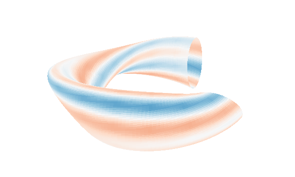
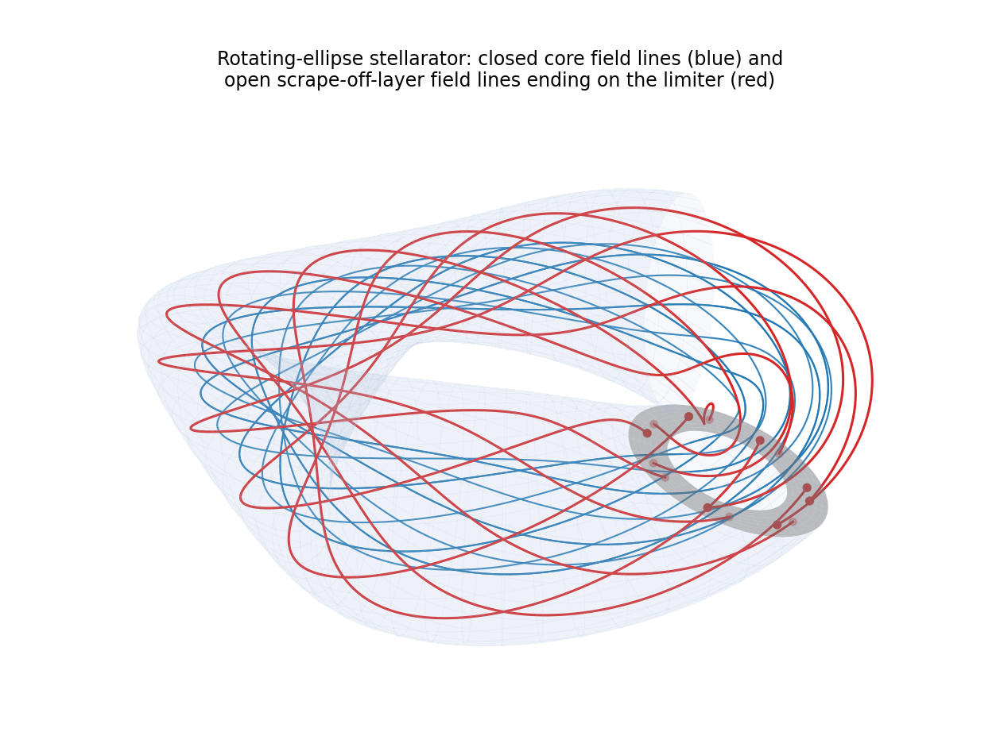
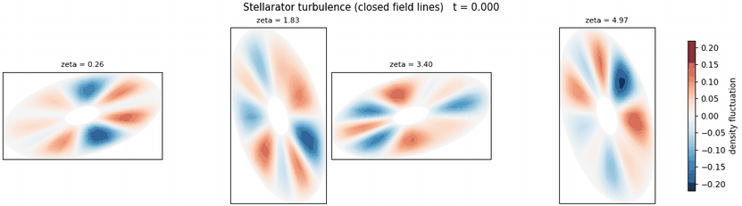
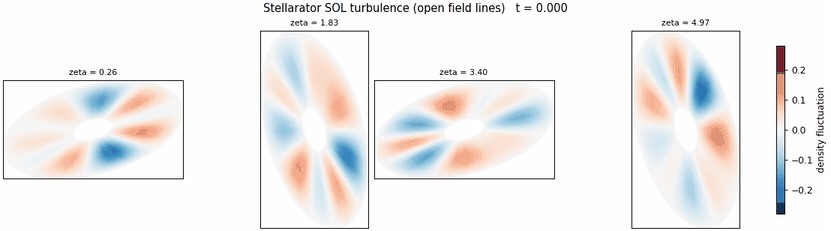
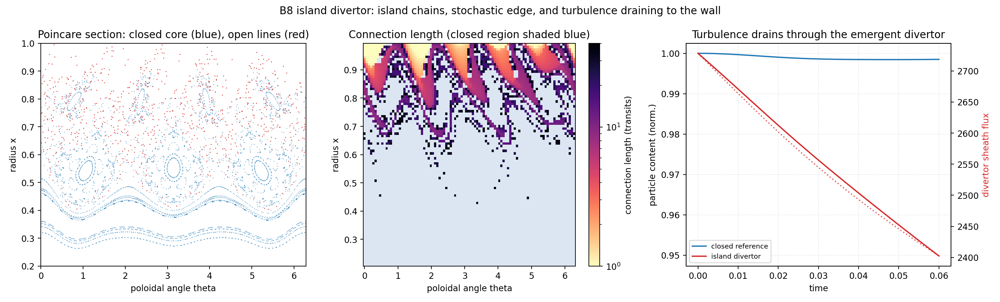
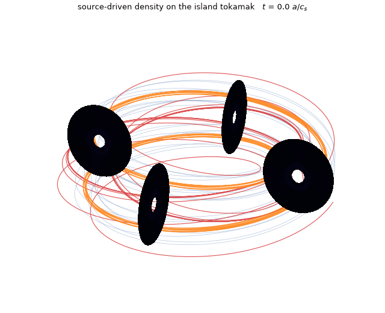

# DRBX

[](https://github.com/uwplasma/drbx/actions/workflows/test.yml)
[](https://github.com/uwplasma/drbx/actions/workflows/docs.yml)
[](https://github.com/uwplasma/drbx/actions/workflows/coverage.yml)
[](https://pypi.org/project/drbx/)
[](https://pypi.org/project/drbx/)
[](LICENSE)
[](https://jax.readthedocs.io/)
[](https://drbx.readthedocs.io/)

**DRBX is a JAX-based, end-to-end differentiable drift-reduced Braginskii
(DRB) code for edge and scrape-off-layer (SOL) plasma turbulence** — on both
closed and open field lines, in axisymmetric (tokamak) and non-axisymmetric
(stellarator) geometry via the flux-coordinate-independent (FCI) approach.

Because the whole model is written in JAX, every simulation is `jit`-compiled,
runs on CPU or GPU unchanged, and is differentiable: you can take gradients of
any output (a saturated fluctuation energy, a transport level) with respect to
any input (a density gradient, an adiabaticity, a diffusivity) through the
solver. To our knowledge no other published DRB SOL turbulence code is
differentiable, and none combines differentiability with FCI stellarator
geometry.

Documentation: [drbx.readthedocs.io](https://drbx.readthedocs.io/en/latest/).

## Stellarator turbulence in three dimensions

Four-field drift-reduced turbulence on a rotating-ellipse stellarator — a torus
whose elliptical cross-section rotates with the toroidal angle. The cutaway
shows the density fluctuations on a flux surface and through the interior;
every frame is a `jit`-compiled, differentiable JAX step:



*Reproduce with [`examples/stellarator/stellarator_3d_render.py`](examples/stellarator/stellarator_3d_render.py).*

The same geometry supports closed and open field lines: core field lines (blue)
stay on flux surfaces, while beyond a toroidal limiter the scrape-off-layer
field lines (red) end on the limiter plate, where a Bohm sheath drains the
plasma:



*Reproduce with [`examples/stellarator/stellarator_3d_render.py`](examples/stellarator/stellarator_3d_render.py).*

## Install

```bash
pip install drbx          # from PyPI
# or, from source:
git clone https://github.com/uwplasma/drbx && cd drbx && pip install -e .
```

Runtime dependencies are `jax`, `scipy`, `matplotlib`, `netCDF4`, `rich`,
`pillow`, and [`solvax`](https://github.com/uwplasma/SOLVAX). Python 3.10-3.12.

## Quick start

Run a simulation from a TOML deck, or inspect one without running it:

```bash
drbx inspect examples/inputs/restartable_diffusion.toml   # resolve and print the plan
drbx run     examples/inputs/restartable_diffusion.toml   # run and write artifacts
```

From Python, a differentiable turbulence run is a few lines:

```python
import jax.numpy as jnp
import numpy as np
from drbx.native.hasegawa_wakatani import HasegawaWakataniParameters, hw_grid, hw_run

grid = hw_grid(64, 2 * jnp.pi * 8)
params = HasegawaWakataniParameters(adiabaticity=1.0, gradient=1.0)
rng = np.random.default_rng(0)
zeta0 = jnp.fft.fft2(jnp.asarray(1e-2 * rng.standard_normal((64, 64))))
n0 = jnp.fft.fft2(jnp.asarray(1e-2 * rng.standard_normal((64, 64))))
zeta, n = hw_run(zeta0, n0, grid, params, dt=5e-3, steps=500)  # jit-compiled, differentiable
```

Every example below is a flat script: parameters at the top, run, plot.

## Highlights

**Turbulence on closed and open field lines.** The same multi-mode seed on the
rotating-ellipse stellarator, with all field lines closed (top) and with a
limiter opening the outer flux surfaces into a sheath-drained scrape-off layer
(bottom). Four toroidal cross-sections; the mode pattern differs plane by plane
because the flux surfaces rotate:





*Reproduce with [`examples/stellarator/stellarator_turbulence.py`](examples/stellarator/stellarator_turbulence.py).*

**Island divertor.** A sheared rotational transform with resonant perturbations
forms island chains and a stochastic edge. The open scrape-off layer emerges
from the field itself: multi-transit field-line tracing marks the finite
connection-length region, and the turbulence drains through it:



*Reproduce with [`examples/stellarator/island_divertor.py`](examples/stellarator/island_divertor.py).*

**Tokamak with an internal island chain.** A `(2, 1)` resonance at the
`q = 2` surface opens an island chain; the four-field model then evolves the
density flux-driven — source shell in, wall buffer out, nothing clamped. The
traced islands match the pendulum width `W = 4 sqrt(eps/(m |iota'|))` to ~1%,
and in the turbulence-dominated regime the mean profile flattens across
the chain (gradient ratio 0.83), the classic island signature. Top row:
the 3-D state inside the transparent plasma boundary, the `q` profile, and
the Poincare section at fixed toroidal angle; bottom row: the evolving mean
profile, turbulent radial particle flux, and time traces. Production
`48x96x32` runs take ~1 h on one 16 GB GPU (the whole step is a single XLA
program):




*Reproduce with [`examples/island_tokamak_profiles.py`](examples/island_tokamak_profiles.py);
figures/movies via [`examples/island_tokamak_figure.py`](examples/island_tokamak_figure.py).
Full write-up (verification, literature table, knobs): [docs/island_tokamak.md](docs/island_tokamak.md).*
| **Linear solver** | `drbx.linear` linearizes any model about an equilibrium; drift-wave, shear-Alfven, and interchange dispersion reproduced to machine precision |
| **Differentiability** | `jit`/`grad`/`vmap` through every model — sensitivity, uncertainty propagation, inverse design, detachment control; forward/reverse/checkpointed methods measured and gated to agree |
| **Parallelism** | Multi-device `shard_map` FCI stepping (bit-exact vs single device) with halo exchange; CPU strong scaling demonstrated, GPU-ready |
| **Solvers** | Structured solves via [`solvax`](https://github.com/uwplasma/SOLVAX) (spectral Fourier-Helmholtz elliptic, tridiagonal, Krylov, preconditioners) |
| **Runtime** | TOML-deck CLI (`drbx inspect` / `run`) and a small Python API; restartable runs; portable JSON/NPZ artifacts |

## Validation

`drbx` is validated against a ladder of literature-anchored benchmarks.
Each rung has a test (or a documented gate) and an example that regenerates
its figure.

Verified today (each with a passing test):

| Case | Anchor | What is checked |
|------|--------|-----------------|
| Method of manufactured solutions | Riva et al., *Phys. Plasmas* 21, 062301 (2014); Dudson et al. 23, 062303 (2016) | operator / 1D-fluid / FCI convergence order → 2 |
| Resistive drift-wave dispersion | Dudson et al., *Comput. Phys. Commun.* 180, 1467 (2009) | growth rate and frequency vs analytic dispersion |
| Shear-Alfvén wave dispersion | Stegmeir et al., *Phys. Plasmas* 26, 052517 (2019) | phase velocity vs analytic (with electron inertia) |
| Interchange / Rayleigh-Taylor | curvature-driven flute dispersion | growth rate vs `√(gκ)·k_y/k` analytic |
| FCI on non-axisymmetric geometry | Shanahan et al., *PPCF* 61, 025007 (2019, BSTING) | parallel-operator MMS; differentiable rollout (grad vs FD 6e-11) |
| Rotating-ellipse (`l = 2`) FCI | Stegmeir et al., *Comput. Phys. Commun.* 198, 139 (2016, GRILLIX) | direct & traced-field-line parallel gradient converge at order 2 on a genuinely non-axisymmetric metric; shape-differentiable; a seeded four-field filament generates interchange vorticity on the rotating surfaces |
| Island-divertor field (B8) | Shanahan et al., *J. Plasma Phys.* 90 (2024, BSTING); GBS island-divertor studies | sheared-iota island chains + stochastic edge; closed core and finite-connection-length open SOL emerge from multi-transit tracing; turbulence drains through the emergent divertor masks |
| Open-field-line SOL flux tube | two-point / Bohm-sheath SOL theory (Stangeby, *The Plasma Boundary of Magnetic Fusion Devices*, 2000) | parallel flow reaches Mach 1 at the targets; target density = half upstream; exact Bohm particle balance and sheath-recycling accounting |
| Neutrals and recycling (hermes-3 model) | hermes-3: Dudson et al., *Comput. Phys. Commun.* 296, 108991 (2024); AMJUEL atomic rates | physically-correct ionization/recombination/CX rates; exact plasma↔neutral particle & momentum conservation; neutrals conserve on the 3D closed rotating ellipse and recycle on the open slab |
| SD1D detachment rollover (B6) | SD1D: Dudson et al., *Plasma Phys. Control. Fusion* 61, 065008 (2019) | self-consistent SOL (evolved temperature, implicit Spitzer conduction, self-limiting radiation): the target cools through 1 eV into the recombining regime and the target ion flux rolls over as upstream density rises; differentiable |
| Differentiable inverse design | — | gradient descent through turbulence recovers a drive parameter |

Planned rungs (seeded-blob inertial scaling and others) are
tracked in the project planning notes; benchmark reports live under
[docs/](docs/linear_dispersion_benchmark.md) and
[docs/validation_gallery.md](docs/validation_gallery.md).

## Examples

Flagship simulations, by geometry:

| | Turbulence flagship | Geometry |
|---|---|---|
| **Tokamak** | [drift-wave turbulence](examples/tokamak/drift_wave_turbulence.py) (Hasegawa-Wakatani; linear phase B2-verified, differentiable) + [inverse design](examples/tokamak/drift_wave_inverse_design.py) | periodic flux tube |
| **Stellarator** | [turbulence on closed + open field lines](examples/stellarator/stellarator_turbulence.py) (four-field, limiter SOL, movies) + [Landreman-Paul turbulence](examples/stellarator/landreman_paul_turbulence.py) (four-field on the imported LP VMEC equilibrium, closed core + sheath-drained SOL) + [3D renders](examples/stellarator/stellarator_3d_render.py) (cutaway turbulence movie, field-line topology) + [island divertor](examples/stellarator/island_divertor.py) (B8: Poincare, connection lengths, emergent open SOL) + [rotating-ellipse FCI](examples/stellarator/rotating_ellipse_fci.py) (parallel-operator convergence) + [seeded filament](examples/stellarator/rotating_ellipse_filament.py) + [differentiable FCI drift-reduced model](examples/stellarator/fci_differentiable.py) | rotating ellipse (closed core + limiter SOL) + shifted-torus helical + imported [ESSOS/VMEC](examples/geometry-3D/) |
| **Coils (vacuum)** | [Landreman-Paul closed + open field lines](examples/geometry-3D/essos-field-lines/closed_open_vacuum_poincare.py) (ESSOS Biot-Savart, Poincare classification) | imported coil field |
| **VMEC equilibria** | [closed field lines from a wout file](examples/geometry-3D/vmex/closed_field_lines.py) (VMEX import; traced rotational transform matches the equilibrium `iotaf` profile to ~1e-6) + [closed + open field lines](examples/geometry-3D/vmex/closed_open_field_lines.py) (coil field with the VMEC last closed flux surface overlaid) | imported VMEC equilibrium (Landreman-Paul precise QA) |
| **SOL (open)** | [open SOL flux tube](examples/sol/open_sol_flux_tube.py) (parallel transport to Bohm-sheath targets; two-point steady state) + [recycling SOL](examples/sol/recycling_sol.py) (neutrals, ionization/recombination, detachment onset) | open slab flux tube |

Open-field-line SOL:
[open slab flux tube](examples/sol/open_sol_flux_tube.py) — parallel
transport to Bohm-sheath-bounded targets, relaxing to the classic two-point
steady state (Mach 1 at the targets, target density half the upstream density),
with the FCI sheath/recycling closure on the target plates.

Benchmarks, differentiable, and geometry examples:

- Linear dispersion (B2/B3):
  [examples/benchmarks/linear_dispersion.py](examples/benchmarks/linear_dispersion.py)
  reproduces the drift-wave and shear-Alfvén dispersion relations from the
  linear solver.
- Autodiff: [gradient-based detachment control](examples/autodiff/detachment_control.py)
  (forward-mode sensitivity through the stiff SOL solve, trust-region Newton onto
  the 1 eV threshold), [inverse design through turbulence](examples/tokamak/drift_wave_inverse_design.py)
  (recover a parameter by gradient descent through a nonlinear drift-wave run),
  [choosing the most efficient differentiation method](examples/autodiff/differentiation_methods.py)
  (forward vs reverse vs checkpointed reverse — same gradient, different cost),
  plus [sensitivity](examples/autodiff_diffusion_sensitivity.py),
  [uncertainty](examples/autodiff_diffusion_uncertainty.py), and reduced
  [inverse design](examples/autodiff_diffusion_inverse_design.py).
- Stellarator FCI and imported geometry:
  [examples/geometry-3D/](examples/geometry-3D/).
- Start with [examples/model_selection_guide.py](examples/model_selection_guide.py)
  to choose a model family, dimension, and boundary conditions.

The examples are self-contained — no external plasma code is needed to run
them. Large figures and movies are hosted in GitHub releases so the checkout
stays small.

## Geometry and parallelization

The FCI operator and domain-decomposition stack (`FciGeometry3D`,
`fci_operators`, halo exchange) was contributed by **Aiken Xie** in
[PR #3](https://github.com/uwplasma/drbx/pull/3) and is incorporated here.
Built on it, the drift-reduced two-field step runs across multiple devices with
`shard_map`: the domain is decomposed into halo-exchanged shards and the sharded
RK4 step is **bit-exact** against the single-device step (checked to ~1e-16 for
single-device and forced-four-device runs in
[`tests/test_fci_sharded_2field.py`](tests/test_fci_sharded_2field.py)). On a
36-core Linux host with one core bound per shard, a 1.05M-cell step reaches a
**4.5x speedup at 16 shards** (1.18 s → 0.27 s), and one NVIDIA A4000 GPU runs
the same step **~21x faster than a single CPU shard** (checksums identical)
([strong-scaling script](examples/benchmarks/fci_sharded_strong_scaling.py),
[docs](docs/performance_and_differentiability.md)).

## Documentation

- Physics and numerics: [physics_models.md](docs/physics_models.md),
  [equation_to_code_map.md](docs/equation_to_code_map.md),
  [code_structure.md](docs/code_structure.md).
- Performance and differentiability:
  [performance_and_differentiability.md](docs/performance_and_differentiability.md),
  [profiling_runtime.md](docs/profiling_runtime.md).
- Validation: [validation_gallery.md](docs/validation_gallery.md).
- Testing policy: [testing_strategy.md](docs/testing_strategy.md).

## Testing

```bash
pytest -q -m "not slow"                                   # full fast suite
pytest -q -m "not slow" --cov=drbx --cov-branch        # with coverage
```

CI runs the full fast suite on Python 3.10–3.12.

## Releases

The current development series is described in
[docs/release_notes_2_0_0.md](docs/release_notes_2_0_0.md).

## Citing

If you use DRBX in published work, please cite this repository
(https://github.com/uwplasma/DRBX).

## License

MIT — see [LICENSE](LICENSE).
