# DRBX

[](https://github.com/uwplasma/drbx/actions/workflows/test.yml)
[](https://github.com/uwplasma/drbx/actions/workflows/docs.yml)
[](https://github.com/uwplasma/drbx/actions/workflows/coverage.yml)
[](https://pypi.org/project/drbx/)
[](https://pypi.org/project/drbx/)
[](LICENSE)
[](https://jax.readthedocs.io/)
[](https://drbx.readthedocs.io/)

DRBX is a JAX code for drift-reduced Braginskii (DRB) fluid simulations of
edge and scrape-off-layer (SOL) plasma turbulence. It runs on closed and open
field lines, in axisymmetric (tokamak) and non-axisymmetric (stellarator)
geometry, using the flux-coordinate-independent (FCI) approach for parallel
operators. Every model is written in JAX, so each step is `jit`-compiled and
differentiable: gradients of any output (a saturated fluctuation energy, a
target temperature, a transport level) with respect to any input (a gradient
drive, an adiabaticity, a diffusivity, a geometry parameter) are taken through
the solver.

- **Turbulence models:** Hasegawa-Wakatani, two- and four-field drift-reduced models, electromagnetic terms.
- **Geometry:** FCI on rotating-ellipse and shifted-torus stellarators, island divertors, imported ESSOS coil fields and VMEC (VMEX) equilibria.
- **Boundary physics:** open field lines with Bohm-type sheath closures, fluid neutrals with AMJUEL rates, recycling and detachment.
- **Gradients:** forward, reverse and checkpointed reverse mode, gated to agree; sensitivity, uncertainty, inverse design and control.
- **Runtime:** TOML-deck CLI, small Python API, restartable runs, multi-device `shard_map` stepping.

Documentation: [drbx.readthedocs.io](https://drbx.readthedocs.io/en/latest/).

## Install

```bash
pip install drbx          # from PyPI
# or, from source:
git clone https://github.com/uwplasma/drbx && cd drbx && pip install -e .
```

Runtime dependencies are `jax`, `scipy`, `matplotlib`, `netCDF4`, `rich`,
`pillow`, and [`solvax`](https://github.com/uwplasma/SOLVAX). Python 3.10-3.12.

## Quick start

```bash
drbx inspect examples/inputs/restartable_diffusion.toml   # resolve and print the plan
drbx run     examples/inputs/restartable_diffusion.toml   # run and write artifacts
```

From Python, a differentiable turbulence run is a few lines:

```python
import jax.numpy as jnp
import numpy as np
from drbx.native.hasegawa_wakatani import HasegawaWakataniParameters, hw_grid, hw_run

grid = hw_grid(64, 2 * jnp.pi * 8)
params = HasegawaWakataniParameters(adiabaticity=1.0, gradient=1.0)
rng = np.random.default_rng(0)
zeta0 = jnp.fft.fft2(jnp.asarray(1e-2 * rng.standard_normal((64, 64))))
n0 = jnp.fft.fft2(jnp.asarray(1e-2 * rng.standard_normal((64, 64))))
zeta, n = hw_run(zeta0, n0, grid, params, dt=5e-3, steps=500)  # jit-compiled, differentiable
```

Every example is a flat script: parameters at the top, run, plot. Start with
[`examples/model_selection_guide.py`](examples/model_selection_guide.py) to
choose a model family, dimension and boundary conditions.

## Stellarator turbulence in three dimensions

Four-field drift-reduced turbulence on a rotating-ellipse stellarator, a torus
whose elliptical cross-section rotates with the toroidal angle. The cutaway
shows density fluctuations on a flux surface and through the interior.

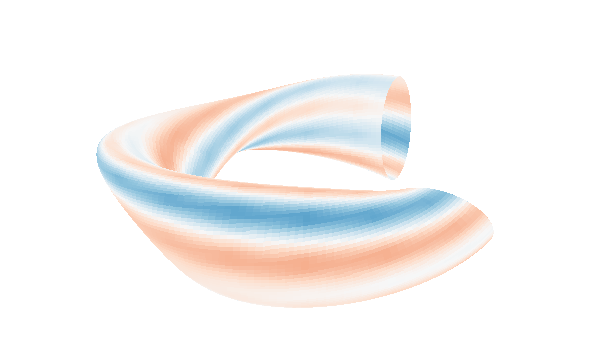

*[`examples/stellarator/stellarator_3d_render.py`](examples/stellarator/stellarator_3d_render.py)*

## Closed and open field lines

The same geometry supports a closed core and an open SOL. Beyond a toroidal
limiter the field lines (red) end on the limiter plate, where a Bohm sheath
drains the plasma; core field lines (blue) stay on flux surfaces. The movies
run the same multi-mode seed with all field lines closed and with the limiter
SOL, on four toroidal cross-sections.

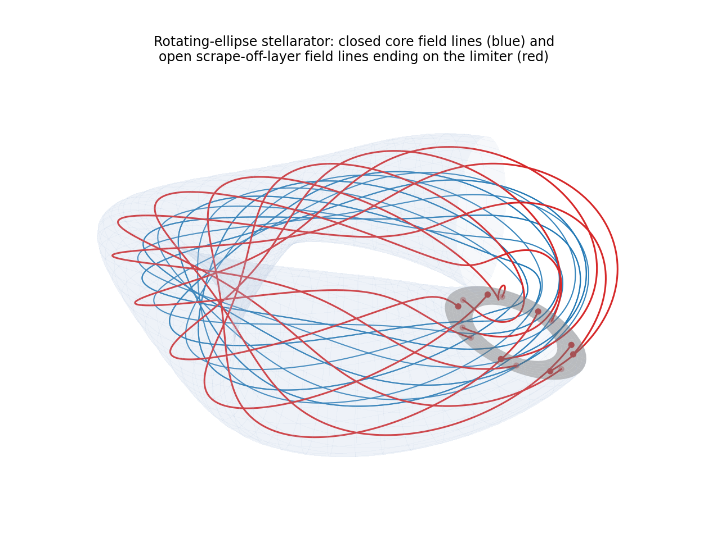

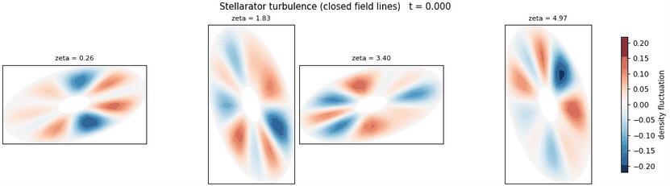

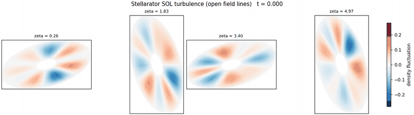

*[`examples/stellarator/stellarator_turbulence.py`](examples/stellarator/stellarator_turbulence.py)*

## Imported stellarator equilibria

Field lines and turbulence run on imported geometry. The Landreman-Paul
precise-QA configuration is read from ESSOS coils (Biot-Savart, Poincare
classification of closed and open lines) or from a VMEC `wout` file through
VMEX, where the traced rotational transform matches the equilibrium `iotaf`
profile to about 1e-6. Four-field turbulence then runs on the imported field
with a closed core and a sheath-drained SOL.

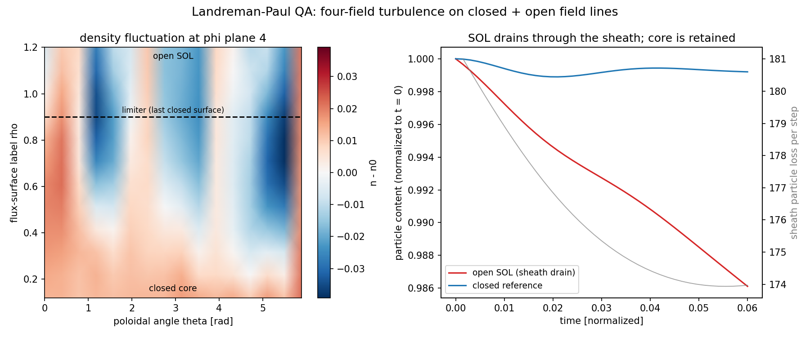

*[`examples/stellarator/landreman_paul_turbulence.py`](examples/stellarator/landreman_paul_turbulence.py),
[`examples/geometry-3D/essos-field-lines/closed_open_vacuum_poincare.py`](examples/geometry-3D/essos-field-lines/closed_open_vacuum_poincare.py),
[`examples/geometry-3D/vmex/closed_field_lines.py`](examples/geometry-3D/vmex/closed_field_lines.py),
[`examples/geometry-3D/vmex/closed_open_field_lines.py`](examples/geometry-3D/vmex/closed_open_field_lines.py)*

## Island divertor

A sheared rotational transform with resonant perturbations forms island chains
and a stochastic edge. The open SOL is not imposed: multi-transit field-line
tracing marks the finite connection-length region, and the turbulence drains
through it.

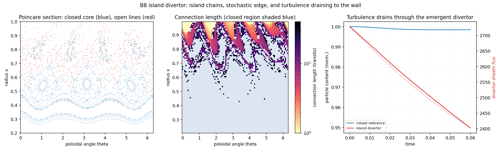

*[`examples/stellarator/island_divertor.py`](examples/stellarator/island_divertor.py)*

## FCI parallel operators

Parallel derivatives are computed by field-line tracing and interpolation on a
grid that need not be field aligned. On the genuinely non-axisymmetric
rotating-ellipse metric, both the direct and traced-field-line parallel
gradients converge at second order, and the operator is differentiable with
respect to the shape.

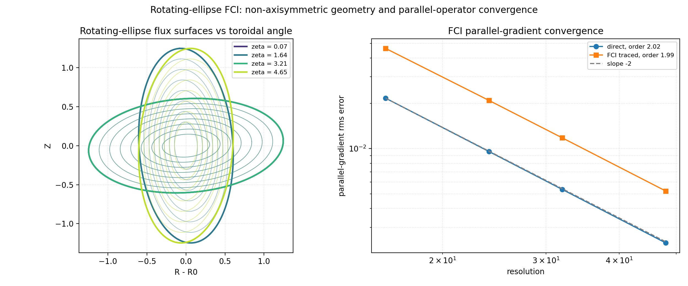

*[`examples/stellarator/rotating_ellipse_fci.py`](examples/stellarator/rotating_ellipse_fci.py),
[`examples/stellarator/fci_differentiable.py`](examples/stellarator/fci_differentiable.py)*

## Sheath-bounded SOL, neutrals and detachment

On open field lines, parallel transport to Bohm-sheath targets relaxes to the
two-point steady state (Mach 1 at the targets, target density half the
upstream value). Fluid neutrals with AMJUEL ionization, recombination and
charge-exchange rates conserve particles and momentum exactly against the
plasma, and their energy transfers conserve thermal plus kinetic energy. With
evolved temperature, implicit Spitzer conduction and radiation, the reduced 1D
model cools its target through 1 eV as upstream density rises.

*Status:* this reduced detachment model is **not yet qualified**. Its rollover
is not grid-converged (the highest-density case detaches at 120 cells but not
at 240 or 480), and its upstream boundary differs from SD1D. A model matched to
the SD1D equations and checked against the published SD1D dataset is in
progress; until then, treat the figure below as a qualitative illustration.

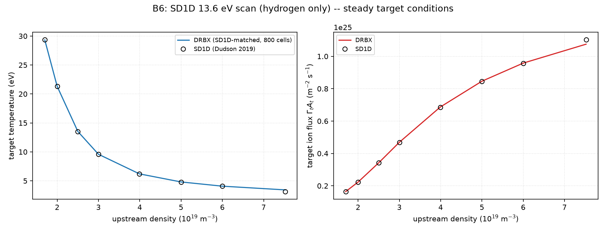

*[`examples/sol/open_sol_flux_tube.py`](examples/sol/open_sol_flux_tube.py),
[`examples/sol/recycling_sol.py`](examples/sol/recycling_sol.py),
[`examples/benchmarks/b6_detachment_rollover.py`](examples/benchmarks/b6_detachment_rollover.py)*

## Differentiable design and control

Because the solve is differentiable, gradients drive design loops. Forward-mode
sensitivity through the stiff SOL solve feeds a trust-region Newton iteration
that holds the target at the 1 eV detachment threshold; gradient descent through
a nonlinear drift-wave run recovers a drive parameter.

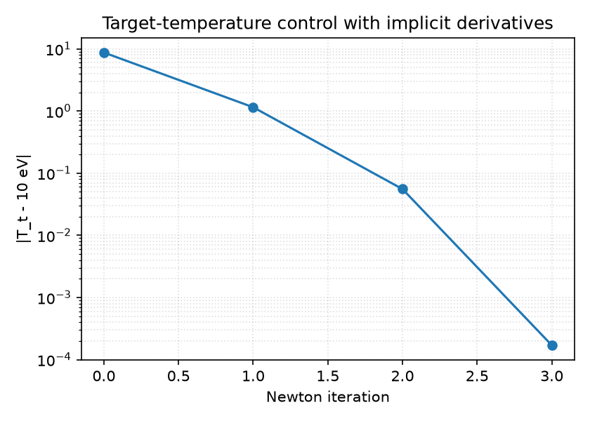

Forward, reverse and checkpointed reverse mode give the same gradient at
different cost; the example measures which is cheapest for a given problem.

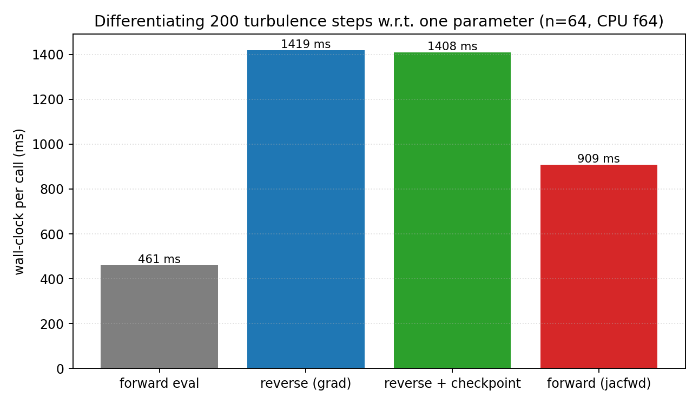

*[`examples/autodiff/detachment_control.py`](examples/autodiff/detachment_control.py),
[`examples/autodiff/differentiation_methods.py`](examples/autodiff/differentiation_methods.py),
[`examples/tokamak/drift_wave_inverse_design.py`](examples/tokamak/drift_wave_inverse_design.py),
plus [sensitivity](examples/autodiff_diffusion_sensitivity.py),
[uncertainty](examples/autodiff_diffusion_uncertainty.py) and
[inverse design](examples/autodiff_diffusion_inverse_design.py) on a reduced model.*

## Linear verification

`drbx.linear` linearizes any model about an equilibrium. Drift-wave,
shear-Alfven and interchange dispersion relations are reproduced against their
analytic forms.

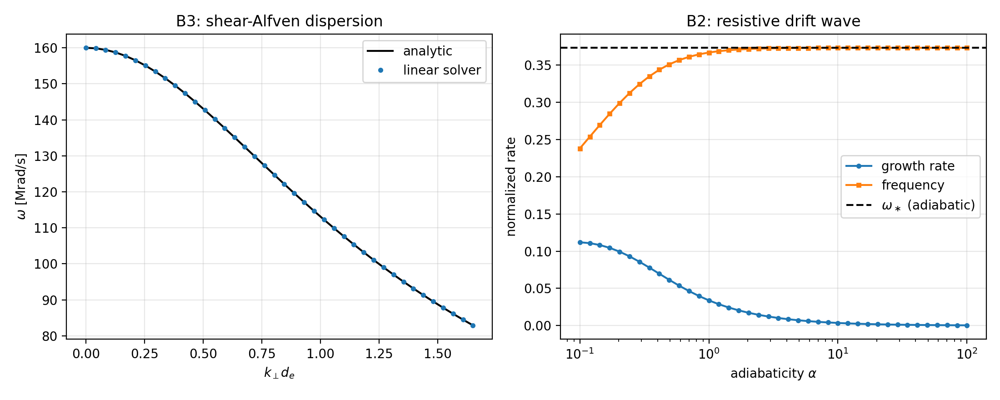

*[`examples/benchmarks/linear_dispersion.py`](examples/benchmarks/linear_dispersion.py),
[`examples/benchmarks/linear_drb_survey.py`](examples/benchmarks/linear_drb_survey.py)*

## Parallel performance

The FCI operator and domain-decomposition stack (`FciGeometry3D`,
`fci_operators`, halo exchange) was contributed by **Aiken Xie** in
[PR #3](https://github.com/uwplasma/drbx/pull/3). The drift-reduced two-field
step runs across devices with `shard_map` and is bit-exact against the
single-device step ([`tests/test_fci_sharded_2field.py`](tests/test_fci_sharded_2field.py)).
On a 36-core Linux host a 1.05M-cell step reaches a 4.5x speedup at 16 shards
(1.18 s to 0.27 s), and one NVIDIA A4000 GPU runs the same step about 21x faster
than a single CPU shard, with identical checksums
([docs](docs/performance_and_differentiability.md)). GPU runs are measured
by hand; CI tests CPU only.

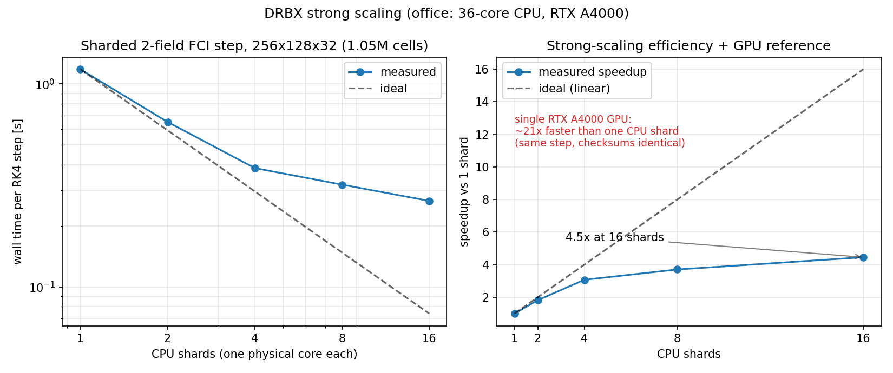

*[`examples/benchmarks/fci_sharded_strong_scaling.py`](examples/benchmarks/fci_sharded_strong_scaling.py)*

## Comparison with other edge and SOL codes

✅ supported, 🟡 partial or reduced, ❌ not supported, ❔ not verified from a public source.
For DRBX, ✅ means the feature is on `main` and covered by tests.

| Feature | DRBX | BOUT++ / Hermes-3 | GRILLIX | GBS | SOLPS-ITER | EMC3-EIRENE | SOLEDGE3X |
|---|---|---|---|---|---|---|---|
| 3D turbulence | ✅ | ✅ [1b] | ✅ [3] | ✅ [5] | ❌ [7] | ❌ [8] | ✅ [9] |
| Stellarator / non-axisymmetric geometry | ✅ | 🟡 [2] | 🟡 [3] | ✅ [6] | ❌ [7] | ✅ [8] | ❔ |
| FCI | ✅ | 🟡 [2] | ✅ [3] | ❔ | ❌ [7] | ❌ [8] | ❔ |
| Open + closed field lines | ✅ | ✅ [1] | ✅ [3] | ✅ [5] | ✅ [7] | ✅ [8] | ✅ [9] |
| Fluid neutrals | 🟡 [a] | ✅ [1] | ✅ [4] | ❔ | ❔ | ❌ [8] | ❔ |
| Kinetic neutrals (EIRENE) | ❌ | ❔ | ❔ | 🟡 [5] | ✅ [7] | ✅ [8] | ✅ [9] |
| Sheath boundary conditions | 🟡 [b] | ✅ [1] | ✅ [3] | ✅ [5] | ✅ [7] | ✅ [8] | ✅ [9] |
| Implicit time integration | 🟡 [c] | ✅ [1] | ✅ [10] | ❔ | ❔ | ❔ | ❔ |
| GPU support | 🟡 [d] | ❔ | ❌ [10] | 🟡 [5] | ❔ | ❔ | ❔ |
| Automatic differentiation / gradients | ✅ | ❔ | ❔ | ❔ | ❔ | ❔ | ❔ |
| Python / TOML interface | ✅ | 🟡 [1] | ❔ | ❔ | ❔ | ❔ | ❔ |
| Open source | ✅ | ✅ [1] | ❔ | ❔ | ❔ | ❔ | ❔ |

<details>
<summary>Notes and evidence</summary>

DRBX notes:
- [a] Reduced fluid/diffusive neutral models with AMJUEL rates (`tests/test_native_recycling_sol.py`, `tests/test_fci_neutrals_3d.py`, `tests/test_neutral_energy_conservation.py`); no kinetic neutrals.
- [b] Bohm-type reduced sheath closures on targets and limiters (`tests/test_open_field_line_sol.py`).
- [c] Implicit Spitzer conduction in the 1D detachment model (`tests/test_native_detachment_sol.py`); the 3D turbulence steps are explicit.
- [d] Runs on GPU through JAX and was measured by hand on an A4000; GPU is not exercised in CI.

Other codes (❔ means no public source was checked for that cell; it is not a claim that the feature is absent):
1. Hermes-3: Dudson et al., Comput. Phys. Commun. 296, 108991 (2024), [arXiv:2303.12131](https://arxiv.org/abs/2303.12131): CVODE, backward-Euler (PETSc) and IMEX-BDF2 time integration (sec. 2.1); fluid deuterium atoms coupled by reactions; Bohm–Chodura sheath boundaries; BOUT++ input files with Python post-processing; GPL-3 at [github.com/boutproject/hermes-3](https://github.com/boutproject/hermes-3). Kinetic neutrals, FCI and GPU are not discussed in that paper.
   1b. 3D turbulence: Dudson et al., TCV-X21 validation, [arXiv:2506.12180](https://arxiv.org/abs/2506.12180) (neutrals omitted there).
2. FCI and stellarator turbulence have been run in BOUT++ (BSTING: Shanahan, Dudson & Hill, PPCF 61, 025007 (2019), rotating ellipse and W7-X grids, no sheath boundaries in those runs); not established for Hermes-3 itself.
3. GRILLIX: Stegmeir et al., [GRILLIX: a 3D turbulence code based on the FCI approach](https://pure.mpg.de/rest/items/item_2537240_5/component/file_2570380/content), and [advanced divertor configurations](https://arxiv.org/abs/1908.05398); FCI is described as compatible with stellarator geometry, published applications are tokamaks.
4. GRILLIX fluid neutrals: [Self-consistent plasma-neutrals fluid modeling, PPCF (2025)](https://iopscience.iop.org/article/10.1088/1361-6587/add8ba).
5. GBS: Giacomin et al., J. Comput. Phys. (2022), [arXiv:2112.03573](https://arxiv.org/abs/2112.03573); self-consistent kinetic neutral model (GBS's own, not EIRENE); GPU port stated as planned.
6. GBS stellarators: [Global fluid simulation of plasma turbulence in stellarators with GBS, Nucl. Fusion (2024)](https://iopscience.iop.org/article/10.1088/1741-4326/ad4ef5); [TJ-K validation](https://arxiv.org/abs/2304.00758).
7. SOLPS-ITER: Wiesen et al., J. Nucl. Mater. 463, 480 (2015); [Bonnin et al., Plasma Fusion Res. 11, 1403102 (2016)](https://www.jstage.jst.go.jp/article/pfr/11/0/11_1403102/_article): B2.5 2D axisymmetric fluid transport coupled to EIRENE.
8. EMC3-EIRENE: [FusionWiki](https://wiki.fusion.ciemat.es/wiki/EMC3-EIRENE), [W7-X modelling, arXiv:2201.06341](https://arxiv.org/abs/2201.06341): 3D Monte Carlo fluid transport with anomalous diffusion and kinetic EIRENE neutrals; HSX application: Boeyaert et al., Nucl. Mater. Energy 42, 101874 (2025).
10. GRILLIX numerics: Zholobenko et al., Contrib. Plasma Phys. 59 (2019) with its 2020 corrigendum (semi-implicit time stepping with GMRES); Zholobenko, PhD thesis (TU München), GPU support listed as future work.
9. SOLEDGE3X: Bufferand et al., [Nucl. Fusion 61, 116052 (2021)](https://iopscience.iop.org/article/10.1088/1741-4326/ac2873): 2D transport or 3D turbulence, coupled to EIRENE, up to the first wall.

</details>

## Validation

Each benchmark has a test and an example that regenerates its figure:

| Case | Anchor | What is checked |
|------|--------|-----------------|
| Method of manufactured solutions | Riva et al., *Phys. Plasmas* 21, 062301 (2014); Dudson et al. 23, 062303 (2016) | operator / 1D-fluid / FCI convergence order 2 |
| Resistive drift-wave dispersion | Dudson et al., *Comput. Phys. Commun.* 180, 1467 (2009) | growth rate and frequency vs analytic |
| Shear-Alfven wave dispersion | Stegmeir et al., *Phys. Plasmas* 26, 052517 (2019) | phase velocity vs analytic (with electron inertia) |
| Interchange / Rayleigh-Taylor | curvature-driven flute dispersion | growth rate vs `sqrt(g kappa) k_y/k` |
| FCI on non-axisymmetric geometry | Shanahan et al., *PPCF* 61, 025007 (2019) | parallel-operator MMS; grad vs finite difference 6e-11 |
| Rotating-ellipse FCI | Stegmeir et al., *Comput. Phys. Commun.* 198, 139 (2016) | second-order parallel gradient; shape-differentiable; seeded filament |
| Island-divertor field | Shanahan et al., *J. Plasma Phys.* 90 (2024) | island chains, stochastic edge, emergent open SOL |
| Open-field-line SOL | Stangeby, *The Plasma Boundary of Magnetic Fusion Devices* (2000) | Mach 1 at targets; target density half upstream; Bohm particle balance |
| Neutrals and recycling | Dudson et al., *Comput. Phys. Commun.* 296, 108991 (2024); AMJUEL | exact plasma-neutral particle and momentum conservation |
| Detachment rollover | Dudson et al., *PPCF* 61, 065008 (2019) | qualitative only: target cools through 1 eV; rollover not grid-converged (SD1D-matched comparison in progress) |

More in [docs/validation_gallery.md](docs/validation_gallery.md).

## Documentation

- Physics and numerics: [physics_models.md](docs/physics_models.md),
  [equation_to_code_map.md](docs/equation_to_code_map.md),
  [code_structure.md](docs/code_structure.md).
- Performance and differentiability:
  [performance_and_differentiability.md](docs/performance_and_differentiability.md),
  [profiling_runtime.md](docs/profiling_runtime.md).
- Testing policy: [testing_strategy.md](docs/testing_strategy.md).
- Release notes: [release_notes_2_0_0.md](docs/release_notes_2_0_0.md).

## Testing

```bash
pytest -q -m "not slow"                                   # fast suite
pytest -q -m "not slow" --cov=drbx --cov-branch           # with coverage
```

CI runs the fast suite on Python 3.10-3.12 (CPU).

## Tokamak with an internal island chain

A `(2, 1)` resonance at the `q = 2` surface opens an island chain; the
four-field model evolves the density flux-driven (source shell in, wall buffer
out, nothing clamped). The traced islands match the pendulum width
`W = 4 sqrt(eps/(m |iota'|))` to about 1%, and in the turbulence-dominated
regime the mean profile flattens across the chain (gradient ratio 0.83). Top
row: the 3D state, the `q` profile and the Poincare section; bottom row: the
evolving mean profile, turbulent radial particle flux and time traces.
Production `48x96x32` runs take about 1 h on one 16 GB GPU.

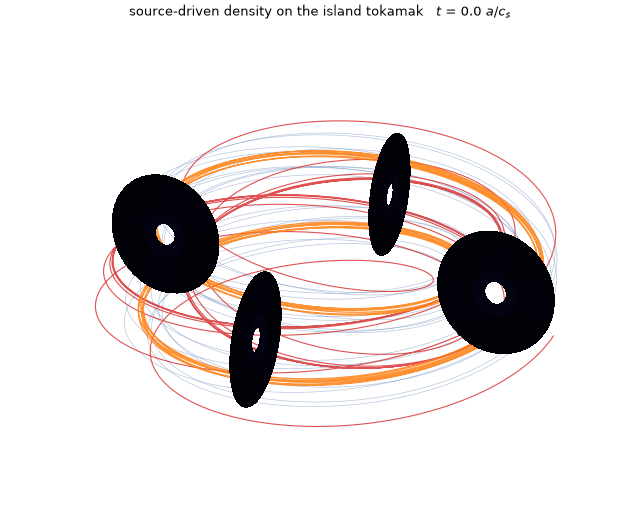

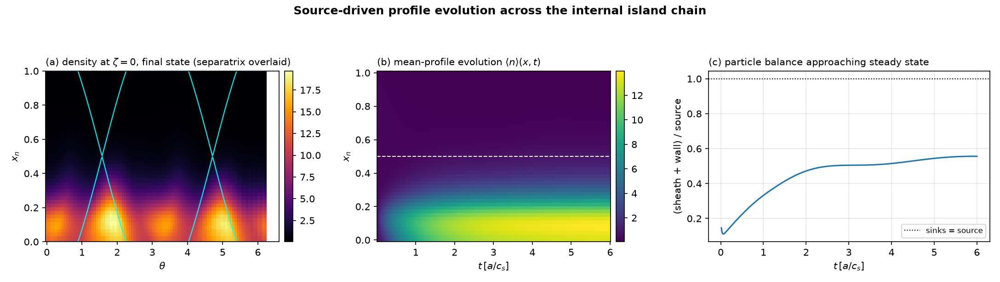

*[`examples/island_tokamak_profiles.py`](examples/island_tokamak_profiles.py);
figures via [`examples/island_tokamak_figure.py`](examples/island_tokamak_figure.py);
write-up in [docs/island_tokamak.md](docs/island_tokamak.md).*

## Citing

If you use DRBX in published work, please cite this repository
(https://github.com/uwplasma/DRBX).

## License

MIT, see [LICENSE](LICENSE).
