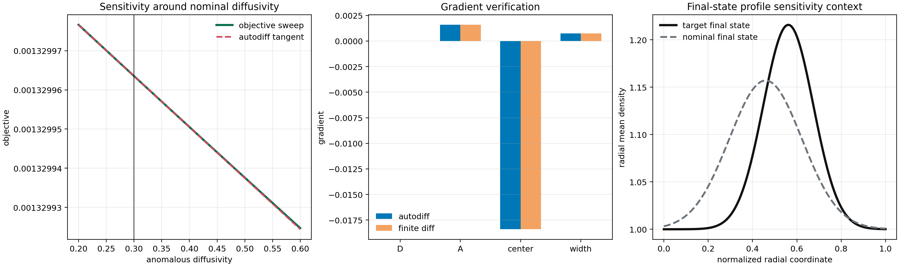
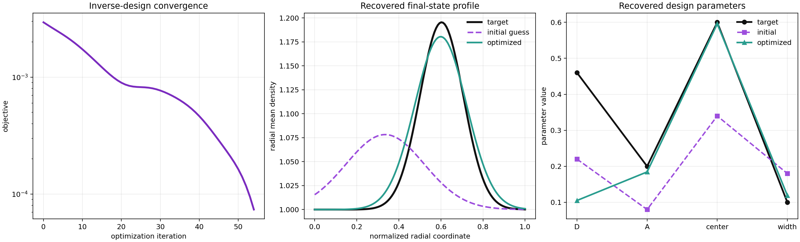
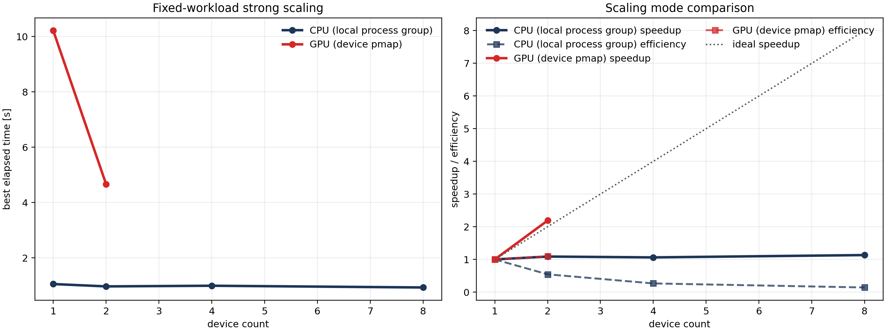

# Autodiff And Scaling Examples

This page records the current focused differentiable examples and the current fixed-workload scaling artifact on the strongest compact native diffusion lane.

## Why These Examples

Differentiable PDE and differentiable simulation workflows usually show three things first:

- direct sensitivity of a scalar objective to physical parameters
- uncertainty propagation from uncertain inputs to scalar and field quantities of interest
- inverse recovery of hidden parameters from a target state
- fixed-workload scaling of the gradient-enabled kernel

That is the surface used here too. It is the same general pattern used by projects such as [JAX-FEM](https://github.com/deepmodeling/jax-fem), [JAX-MD](https://github.com/jax-md/jax-md), and the device-parallel mapping model documented in [JAX `pmap`](https://docs.jax.dev/en/latest/_autosummary/jax.pmap.html).

## Scripts

- [examples/autodiff_diffusion_sensitivity_demo.py](../examples/autodiff_diffusion_sensitivity_demo.py)
- [examples/autodiff_diffusion_uncertainty_demo.py](../examples/autodiff_diffusion_uncertainty_demo.py)
- [examples/autodiff_diffusion_inverse_design_demo.py](../examples/autodiff_diffusion_inverse_design_demo.py)
- [examples/strong_scaling_diffusion_demo.py](../examples/strong_scaling_diffusion_demo.py)
- shared helper module: [src/jax_drb/validation/autodiff_diffusion.py](../src/jax_drb/validation/autodiff_diffusion.py)
- uncertainty helper module: [src/jax_drb/validation/autodiff_diffusion_uncertainty.py](../src/jax_drb/validation/autodiff_diffusion_uncertainty.py)

## Sensitivity Analysis

Run:

```bash
PYTHONPATH=src .venv/bin/python examples/autodiff_diffusion_sensitivity_demo.py
```

Outputs:

- analysis JSON: [docs/data/autodiff_diffusion_sensitivity_artifacts/data/autodiff_diffusion_sensitivity_analysis.json](data/autodiff_diffusion_sensitivity_artifacts/data/autodiff_diffusion_sensitivity_analysis.json)
- figure: [docs/data/autodiff_diffusion_sensitivity_artifacts/images/autodiff_diffusion_sensitivity.png](data/autodiff_diffusion_sensitivity_artifacts/images/autodiff_diffusion_sensitivity.png)



Current committed result:

- autodiff and finite-difference gradients agree closely on all four design parameters
- the center parameter is the dominant sensitivity on this setup
- the diffusivity tangent matches the explicit sweep in the local neighborhood

## Uncertainty Quantification

Run:

```bash
PYTHONPATH=src .venv/bin/python examples/autodiff_diffusion_uncertainty_demo.py
```

Outputs:

- analysis JSON: [docs/data/autodiff_diffusion_uncertainty_artifacts/data/autodiff_diffusion_uncertainty_analysis.json](data/autodiff_diffusion_uncertainty_artifacts/data/autodiff_diffusion_uncertainty_analysis.json)
- arrays NPZ: [docs/data/autodiff_diffusion_uncertainty_artifacts/data/autodiff_diffusion_uncertainty_arrays.npz](data/autodiff_diffusion_uncertainty_artifacts/data/autodiff_diffusion_uncertainty_arrays.npz)
- figure: [docs/data/autodiff_diffusion_uncertainty_artifacts/images/autodiff_diffusion_uncertainty.png](data/autodiff_diffusion_uncertainty_artifacts/images/autodiff_diffusion_uncertainty.png)


Current committed result:

- the scalar quantity of interest uses the final active-domain density variance on the same compact native diffusion lane;
- the field quantity of interest uses the radial mean of the final active-domain density;
- first-order autodiff covariance pushforward and vectorized Monte Carlo stay close on both the scalar QoI and the profile uncertainty band;
- this gives the differentiable lane a standard UQ example rather than stopping at gradients and inverse design only.

## Inverse Design

Run:

```bash
PYTHONPATH=src .venv/bin/python examples/autodiff_diffusion_inverse_design_demo.py
```

Outputs:

- analysis JSON: [docs/data/autodiff_diffusion_inverse_design_artifacts/data/autodiff_diffusion_inverse_design_analysis.json](data/autodiff_diffusion_inverse_design_artifacts/data/autodiff_diffusion_inverse_design_analysis.json)
- figure: [docs/data/autodiff_diffusion_inverse_design_artifacts/images/autodiff_diffusion_inverse_design.png](data/autodiff_diffusion_inverse_design_artifacts/images/autodiff_diffusion_inverse_design.png)



Current committed result:

- the objective drops from about `2.95e-3` to about `5.52e-5`
- the optimized final-state profile nearly overlays the target profile
- the optimized design parameters recover the dominant target structure cleanly

## Strong Scaling

Run locally on CPU only:

```bash
PYTHONPATH=src .venv/bin/python examples/strong_scaling_diffusion_demo.py \
  --skip-gpu \
  --cpu-device-counts 1,2,4,8
```

Run the committed CPU+GPU benchmark:

```bash
PYTHONPATH=src .venv/bin/python examples/strong_scaling_diffusion_demo.py \
  --cpu-device-counts 1,2,4,8 \
  --gpu-device-counts 1,2 \
  --remote-host office
```

Outputs:

- analysis JSON: [docs/data/strong_scaling_diffusion_artifacts/data/strong_scaling_diffusion_analysis.json](data/strong_scaling_diffusion_artifacts/data/strong_scaling_diffusion_analysis.json)
- figure: [docs/data/strong_scaling_diffusion_artifacts/images/strong_scaling_diffusion.png](data/strong_scaling_diffusion_artifacts/images/strong_scaling_diffusion.png)



Current committed result:

- local CPU process-parallel reference: about `1.13x` speedup from `1 -> 8` workers on the fixed workload
- remote GPU device-parallel reference: about `2.19x` speedup from `1 -> 2` GPUs on the same fixed workload

Interpretation:

- the GPU curve is the main performance claim on this artifact
- the CPU curve is a local single-node reference and should be framed that way in write-up text
- both curves are measured on a differentiable objective, not just a forward solve

## Notes On Method

- the objective is evaluated on the compact native diffusion lane because it is already JAX-native and differentiable end to end
- the CPU benchmark uses one JAX worker process per local worker to avoid oversubscribing host threads
- the GPU benchmark uses `pmap` on the remote two-GPU machine
- the total workload is held fixed, so the figure is a strong-scaling plot rather than a throughput plot

## Follow-On Work

The next higher-value differentiable examples should be:

- vorticity or drift-wave sensitivity/UQ of a scalar QoI
- an inverse-design example with boundary/source controls rather than only initial-condition controls
- memory and compilation-cache measurements alongside the current timing plot
- the first promoted differentiable recycling/open-field transient lane once the native transient backbone is closed
