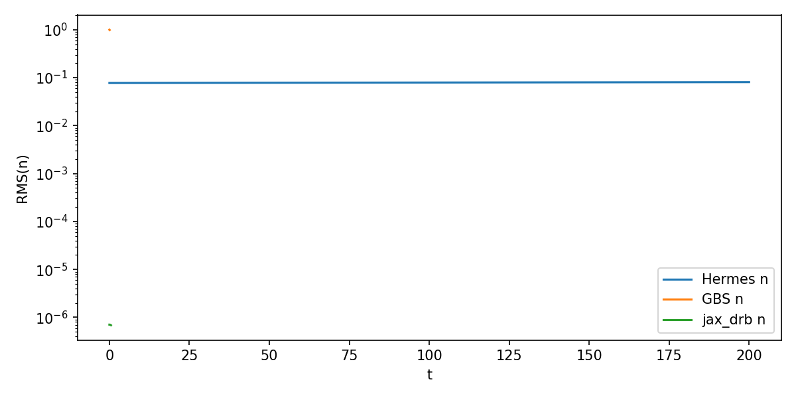
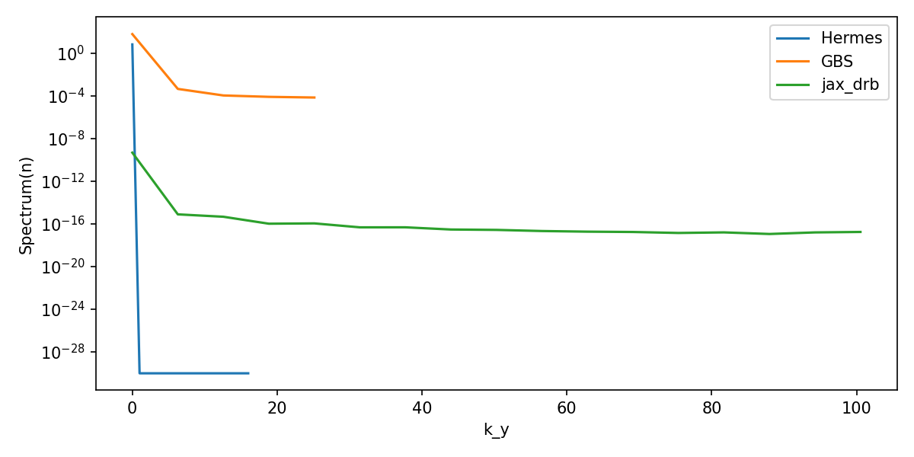
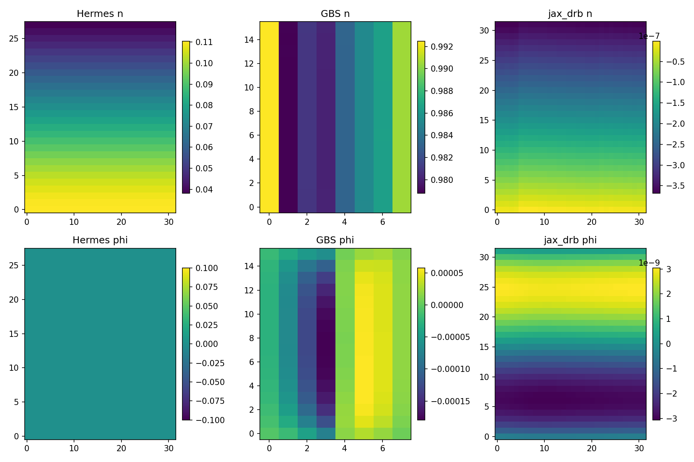
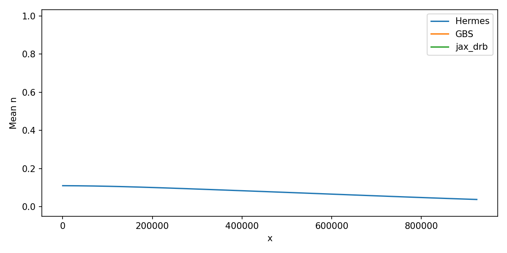
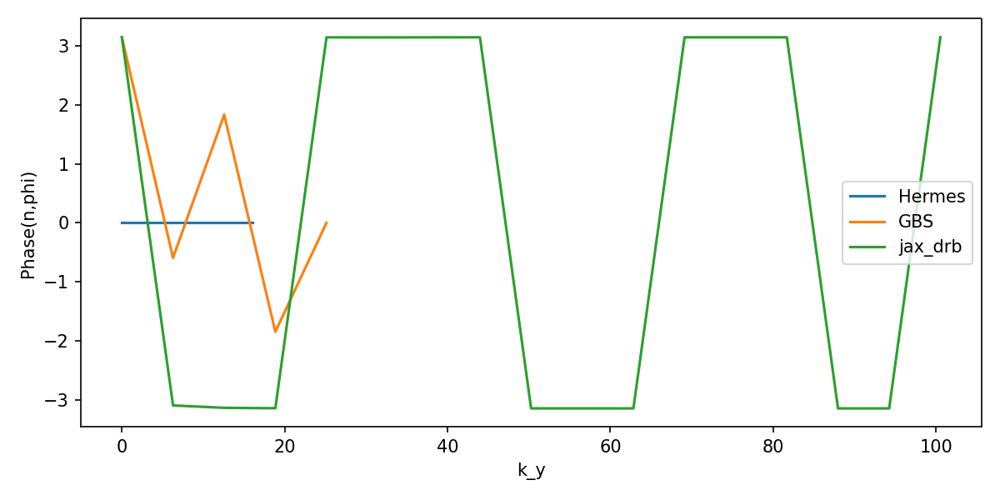
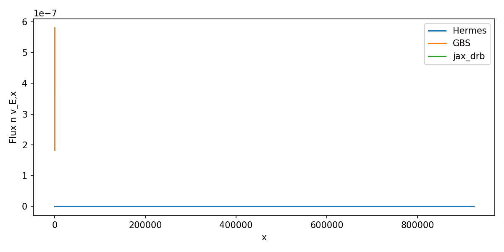
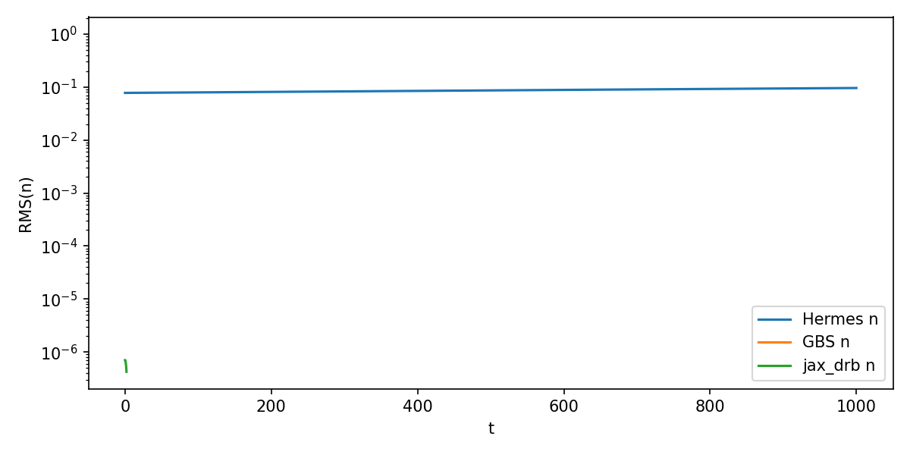
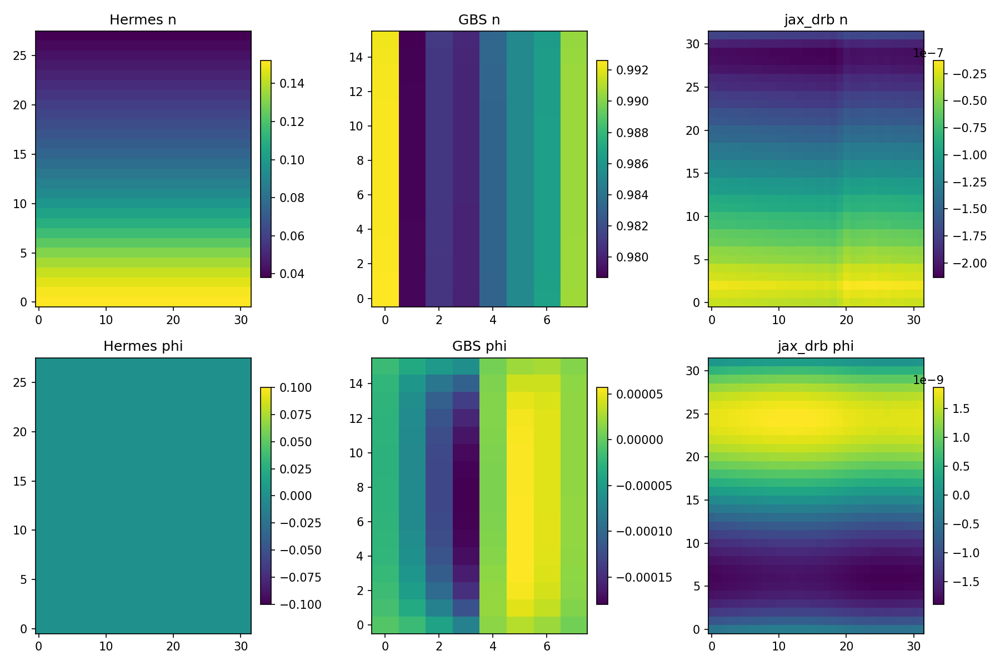
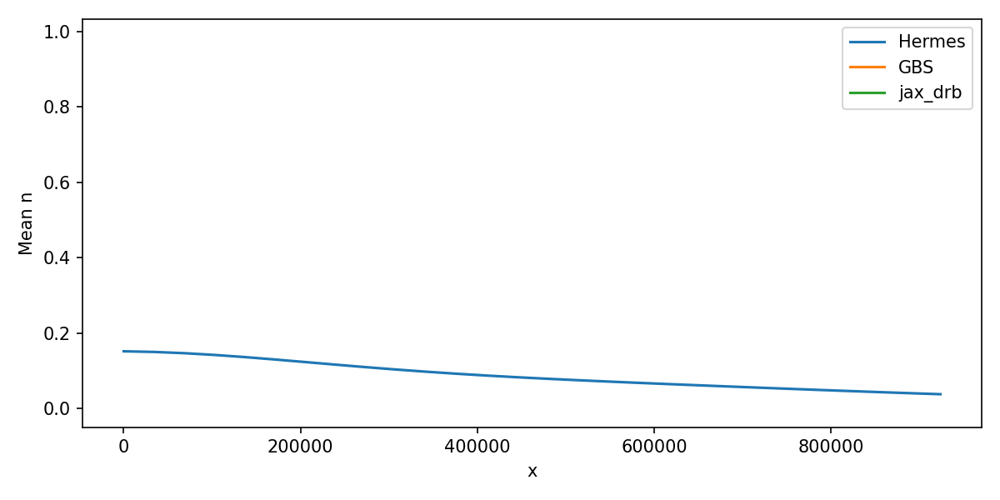
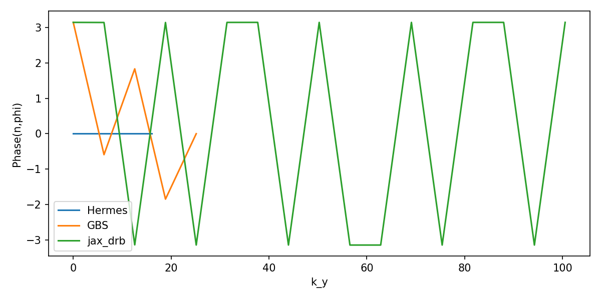

# Full s-alpha Benchmark (Hermes-3 vs GBS vs jax_drb)

This benchmark aligns a minimal s-alpha configuration across Hermes-3, GBS, and jax_drb
and compares common diagnostics (linear growth and early nonlinear saturation).

**Primary goals**
- Compare geometry-driven curvature and parallel factors across codes.
- Compare time evolution of a common field (density-like) in linear and nonlinear phases.
- Compare spectra and snapshots at comparable times.

---

## Model Alignment

**Hermes-3**
- Model: isothermal electrons + quasineutral ions + vorticity.
- Components: `e`, `d+`, `sound_speed`, `vorticity`, `sheath_boundary`, Braginskii collisions/heat exchange.
- Field used for benchmark: `Ne` (electron density).

**GBS**
- Model option: `SOL_es_mshear`.
- Fields written: `theta` (log density), `temperature` (log Te), `omega`, `strmf`, `vpare`, `vpari`.
- Field used for benchmark: `Ne = exp(theta)` and `phi = strmf`.

**jax_drb**
- Unified DRB system with curvature drive.
- Fields used for benchmark: `n` (density), `phi` (from Poisson solve), `omega`, `Te` (isothermal in this minimal setup).

**Key differences**
- Hermes/GBS both solve specialized reduced models; jax_drb solves the unified DRB system.
- Time integration schemes differ (Hermes: CVODE BDF; GBS: RK4; jax_drb: explicit RK4 for benchmarking).
- Normalization conventions differ; outputs are compared in normalized units.
 - GBS uses log variables for `theta` and `temperature`, which are exponentiated before diagnostics.

---

## Equation / Term Alignment (Minimal s‑alpha Case)

The table below maps each code’s minimal configuration to common DRB terms.
This is the *explicit* term alignment used in the current benchmark (no proxies).

| Feature / Term | Hermes‑3 (2303.12131v2) | GBS (Ricci 2012; SOL_es_mshear) | jax_drb (conserving_drb) | Notes |
|---|---|---|---|---|
| Evolved n | `Ne` (evolve_density) | `theta = log(n)` | `n` | GBS log variable exponentiated for diagnostics |
| Evolved vorticity | `omega` | `omega` | `omega` | Poisson solve for `phi` in all cases |
| Evolved v∥e, v∥i | yes (e, d+) | yes (`vpare`, `vpari`) | yes (`vpar_e`, `vpar_i`) | |
| Evolved Te | isothermal (constant) | `temperature = log(Te)` | `Te` (isothermal setup) | Hermes `Te` is not time‑evolved here |
| Phi (`φ`) | from vorticity component | `strmf` | from Poisson solve | Hermes output `phi` is zero in this run (see Results) |
| Electrostatic | yes | yes | yes | EM terms off |
| Hot ions | no | no (τ=0) | no | |
| Neutrals | no | no | no | |
| Non‑Boussinesq | no | optional (`nlpol`) off | no | |
| Curvature drive | metric curvature | s‑alpha curvature | logB s‑alpha curvature | See Ricci 2012; Halpern 2013 |
| Parallel streaming | yes | yes | yes | Field‑aligned |
| Sources | density source on | none explicit | none | Hermes has explicit `Ne` source in BOUT.inp |
| Dissipation | vorticity/phi dissipation | diff_* = 1e‑2 | Dn/DOmega/DTe = 0 | Significant mismatch |
| Nonlinearity (linear case) | nonlinear (default) | `esnonlinear=.false.` | `nonlinear_on=false` | Hermes is not linearized here |
| BC (x/y) | Neumann + phi relax | Neumann/Dirichlet mix | periodic | Major mismatch |

**References (local PDFs)**
- Hermes‑3 model: `/Users/rogerio/local/tests/drb_literature/2303.12131v2.pdf`
- GBS s‑alpha / geometry: `/Users/rogerio/local/tests/drb_literature/Ricci_2012_Plasma_Phys._Control._Fusion_54_124047.pdf`
- Ballooning / s‑alpha context: `/Users/rogerio/local/tests/drb_literature/Halpern_2013_Nucl._Fusion_53_122001.pdf`
- Conserving DRB system: `/Users/rogerio/local/tests/drb_literature/conserving_drb.pdf`

---

## Geometry Alignment

- Hermes: `salpha.nc` generated by `generate_salpha_grid.py`.
- GBS: s-alpha shaping parameters (`eps`, `q0`, `shat`, `alpha`) in input file.
- jax_drb: `axisymmetric_analytic` with `model = "salpha"`.

Geometry comparisons use the canonical mapping defined in
`/Users/rogerio/local/jax_drb/docs/geometry_compare.md`.

---

## Numerics

- Hermes: CVODE (BDF, Newton + GMRES) via BOUT++.
- GBS: explicit RK4.
- jax_drb: explicit RK4 (benchmark-only driver in `benchmarks/run_jaxdrb_sim.py`).

All runs use small grids for alignment and quick iteration.

---

## How to Run

Full benchmark runner (Hermes + GBS + jax_drb):

```
python /Users/rogerio/local/jax_drb/benchmarks/run_full_benchmark.py \
  --output-dir benchmarks/full_benchmark \
  --mpi --mpi-n 1
```

Key input files:
- Hermes linear: `/Users/rogerio/local/jax_drb/benchmarks/cases/hermes_salpha_linear/BOUT.inp`
- Hermes nonlinear: `/Users/rogerio/local/jax_drb/benchmarks/cases/hermes_salpha_nonlinear/BOUT.inp`
- GBS linear: `/Users/rogerio/local/jax_drb/benchmarks/cases/gbs_salpha/in_linear`
- GBS nonlinear: `/Users/rogerio/local/jax_drb/benchmarks/cases/gbs_salpha/in_nonlinear`
- jax_drb linear: `/Users/rogerio/local/jax_drb/benchmarks/cases/jaxdrb/salpha_linear.toml`
- jax_drb nonlinear: `/Users/rogerio/local/jax_drb/benchmarks/cases/jaxdrb/salpha_nonlinear.toml`

Diagnostics are generated by:
- `/Users/rogerio/local/jax_drb/benchmarks/analysis/benchmark_report.py`

---

## Diagnostics (Computed)

1. RMS time series for `n` and `phi`.
2. Linear growth rates (log-slope of early-time RMS).
3. k_y spectra for `n` and `phi` (final snapshot).
4. Frequency PSD of `n` at a midplane point.
5. Cross-phase and coherence between `n` and `phi` vs k_y.
6. Particle flux profile (⟨n v_E,x⟩ vs x).
7. Mean profiles (⟨n⟩ over y,z).
8. Side-by-side snapshots for `n` and `phi`.

---

## Current Mismatches (Why the Codes Do Not Agree Yet)

1. **Hermes density source on; GBS/jax_drb no source.** This drives a different mean profile and alters growth/saturation.
2. **Dissipation levels differ:** GBS has `diff_* = 1e-2`, Hermes has vorticity/phi dissipation on, jax_drb has Dn/DOmega/DTe = 0.
3. **Boundary conditions differ:** Hermes (Neumann + phi relax), GBS (Neumann/Dirichlet mix), jax_drb (periodic).
4. **Linearization mismatch:** Hermes is nonlinear by default; GBS/jax_drb are explicitly linearized in the linear run.
5. **Hermes `phi` output is identically zero in this run**, so cross‑phase/flux diagnostics are not comparable yet.

These are all fixable, but must be aligned before comparing quantitative growth rates.

---

## Results (Linear)













---

## Results (Nonlinear)











---

## References (Local PDFs)
- [Ricci 2012, PPCF (GBS geometry and s-alpha)](/Users/rogerio/local/tests/drb_literature/Ricci_2012_Plasma_Phys._Control._Fusion_54_124047.pdf)
- [Halpern 2013, Nuclear Fusion (ballooning / s-alpha context)](/Users/rogerio/local/tests/drb_literature/Halpern_2013_Nucl._Fusion_53_122001.pdf)
- [Hermes-3 paper 2303.12131v2](/Users/rogerio/local/tests/drb_literature/2303.12131v2.pdf)
