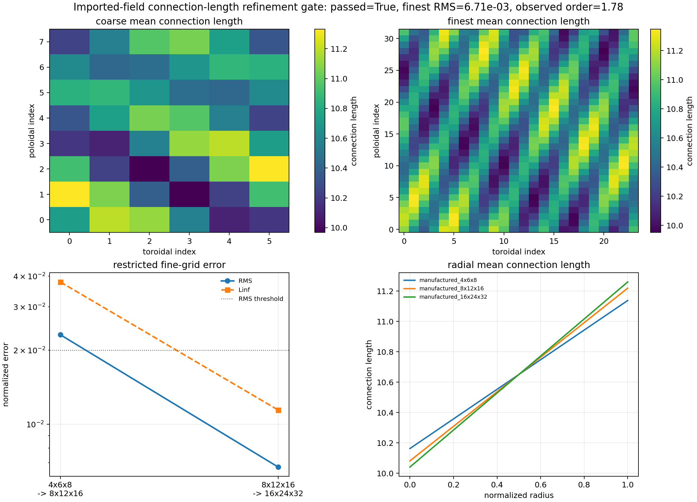

# ESSOS Imported FCI Validation

This page documents the first downstream use of externally traced
Landreman-Paul QA field lines inside `jax_drb` FCI operators. ESSOS supplies
the coil-field evaluation and adaptive trajectories. `jax_drb` converts those
trajectories into fixed-shape plane-to-plane maps, builds a lightweight
VMEC-shaped metric for the imported logical grid, and then evaluates JAX-native
sheath/recycling and neutral reaction-diffusion closures on those maps.

The published FCI validation figures and arrays are restored by
`python scripts/fetch_example_artifacts.py --skip-baselines`. The regeneration
script follows the same top-level-parameter style as the SIMSOPT examples:
edit `MAP_SOURCES_TO_RUN`, `DRY_RUN`, `WRITE_DRY_RUN_ARTIFACTS`, grid size, and
optional external input paths at the top of
`examples/geometry-3D/essos-field-lines/imported_fci_campaign.py`, then run the
file. Regenerating the import from the external coil geometry is a developer
workflow and requires the geometry source checkout:

```bash
PYTHONPATH=src .venv/bin/python \
  examples/geometry-3D/essos-field-lines/imported_fci_campaign.py
```

By default the script performs a safe dry run for `coil`. Set
`MAP_SOURCES_TO_RUN = ("coil", "vmec", "hybrid")` to regenerate the published
`coil`, `vmec`, and `hybrid` artifact directories in one run. Set
`MAP_SOURCES_TO_RUN = ("hybrid",)`, `OUTPUT_ROOT = Path("tmp/hybrid")`, and
`CASE_LABEL = "custom"` for a custom single-map artifact root.

The multi-grid connection-length refinement machinery also has a clean-clone
example that does not require the external geometry checkout:

```bash
PYTHONPATH=src .venv/bin/python \
  examples/geometry-3D/essos-field-lines/imported_connection_length_refinement_demo.py
```

That script runs a manufactured non-axisymmetric nested-grid gate and writes a
JSON/NPZ/PNG package under
`docs/data/essos_imported_connection_length_refinement_artifacts/`. Live
`coil`, `vmec`, or `hybrid` connection-length arrays can be generated by
setting `LIVE_IMPORT = True` in the same script or by calling
`create_live_essos_imported_connection_length_refinement_package(...)`. Live
runs compare non-collocated grids by interpolating the fine level at the coarse
radial, toroidal, and poloidal coordinates. For closed VMEC maps, set
`CONNECTION_QUANTITY = "parallel_step_per_toroidal_radian"` because the raw
adjacent-plane step length scales with the selected toroidal spacing.
For definitions of one-sided, target-to-target, and effective parallel
connection length, and for the exact code paths used by each geometry source,
see [Connection Length](connection_length.md).

The first live June 15, 2026 checks are intentionally retained as negative
promotion evidence. A `hybrid` run on `(3, 4, 6) -> (6, 8, 12)` returned
normalized RMS `0.43` and \(L_\infty\) `1.10`; a finer
`(4, 6, 8) -> (8, 12, 16)` hybrid run returned RMS `0.49` and
\(L_\infty\) `2.75`; a VMEC control returned RMS `0.65` and
\(L_\infty\) `0.78`. These values are not publication-grade convergence
evidence. They show that the live path runs, but raw adjacent-plane length is
not always a grid-invariant quantity. A follow-up coordinate-aware VMEC control
using `parallel_step_per_toroidal_radian` passes on `(3, 4, 6) -> (6, 8, 12)`
with normalized RMS `0.136` and \(L_\infty\) `0.199`. The remaining live
promotion blocker is the open-field `coil`/`hybrid` quantity: those arrays mix
target-exit lengths with adjacent-plane fallback lengths, so the next gate must
separate target-to-target connection length from adjacent-map step length before
imported-field turbulence movies are used as validation evidence.



Set `WRITE_DRY_RUN_ARTIFACTS = True` to write a self-contained JSON contract
under the resolved artifact root; that contract records the live artifact
paths, grid/refinement settings, required report fields, required NPZ array
keys, and the connection-length/refinement/consumed-map diagnostic schema
without reading the coil JSON or VMEC wout file. Set `COIL_JSON_PATH`,
`VMEC_WOUT_PATH`, or `ESSOS_ROOT` when the external checkout is not located at
the default path used by the importer. `MAP_SOURCES_TO_RUN` accepts three
imported-map semantics:

- `coil` traces the external Biot-Savart coil field to adjacent toroidal
  planes and keeps the resulting open-field endpoint masks.
- `vmec` evaluates a VMEC-coordinate field-line map from
  \(d\theta/d\phi=B^\theta/B^\phi\), preserving closed flux surfaces and
  disabling target endpoint masks.
- `hybrid` uses the VMEC-coordinate map locations but keeps the coil-derived
  endpoint masks, connection-length proxy, and \(|B|\) modulation. This is the
  intended bridge for open-field SOL closure tests while the VMEC map supplies
  smooth non-axisymmetric interpolation coordinates.

The script chooses source-specific defaults, so `MAP_SOURCES_TO_RUN = ("vmec",)`
writes `docs/data/essos_imported_fci_vmec_artifacts/` and
`MAP_SOURCES_TO_RUN = ("hybrid",)` writes
`docs/data/essos_imported_fci_hybrid_artifacts/` unless `OUTPUT_ROOT` or
`CASE_LABEL` is set for a custom single-source run.

## Geometry Import

The imported grid is a scaled VMEC Landreman-Paul QA flux-surface shell
centered on the magnetic axis reported by the external Biot-Savart field
object. The VMEC Fourier boundary is read from
`wout_LandremanPaul2021_QA_reactorScale_lowres.nc`, then rescaled and
translated onto the ESSOS coil-field coordinate system so that the rendered
surface has the QA non-axisymmetric cross-section while the traced field lines
remain in the coordinate system used by the coil JSON. The stellarator-symmetric
surface evaluation uses

\[
R(s,\theta,\phi)=\sum_{mn} R_{mn}(s)\cos(m\theta-n\phi),\qquad
Z(s,\theta,\phi)=\sum_{mn} Z_{mn}(s)\sin(m\theta-n\phi),
\]

Forward and backward coil trajectories are traced from every seed. For each
seed, the adapter interpolates the external trajectory to the adjacent toroidal
planes \(\phi\pm\Delta\phi\), projects the endpoint onto the nearest structured
VMEC-shaped target plane, and marks a boundary if the endpoint leaves the
resolved shell or lands on a radial edge. For VMEC-coordinate maps the adapter
instead integrates

\[
\frac{d\theta}{d\phi} = \frac{B^\theta(s,\theta,\phi)}{B^\phi(s,\theta,\phi)}
\]

with a fixed-step RK4 rule over one toroidal-plane spacing and stores the
resulting poloidal interpolation coordinate at fixed \(s\). Boundary map
indices are stored as finite placeholders and the boundary mask carries the
physics meaning; this keeps the JAX interpolation kernels shape-stable and
safe under `jit`, `vmap`, `jvp`, and future implicit residual promotion.

The metric is computed from the Cartesian embedding
\(\mathbf{x}(\rho,\phi,\theta)\). The covariant basis vectors are finite
differences of the scaled VMEC surface coordinates, \(g_{ij} =
\partial_i\mathbf{x}\cdot\partial_j\mathbf{x}\), \(J=\sqrt{\det g_{ij}}\), and
the contravariant metric is the matrix inverse of \(g_{ij}\). This keeps the
closure accounting on the same non-axisymmetric surface used for visualization.

## Physics Gates

The sheath/recycling gate applies a normalized Bohm target flux to every
forward or backward field-line endpoint,

\[
\Gamma_i = N_i\sqrt{(T_e+T_i)/m_i},
\]

reconstructs the electron particle flux from zero-current balance, and checks
that recycled particle and neutral-energy sources exactly close their global
accounting identities. The neutral gate then evaluates FCI parallel diffusion,
perpendicular metric diffusion, ionisation, recombination, and charge exchange
on the same imported maps. The report records endpoint fractions, magnetic
field modulation, connection-length statistics, target heat-load contrast,
particle balance residuals, current residuals, and neutral momentum balance.
The imported-map diagnostics now separately report connection-length finite and
nonnegative fractions, radial connection-length means, grid/refinement metadata,
single-grid connection-length resolution diagnostics, map-coordinate
displacement proxies, and a consumed-map check requiring the sheath endpoint
count to match the forward-plus-backward FCI boundary masks. The resolution
diagnostics record normalized neighbor jumps, per-axis 95th-percentile jumps,
an underresolved-face fraction, and an advisory pass flag. They catch obviously
grid-scale connection-length roughness before a live imported run is promoted,
but they are not a replacement for a multi-grid refinement campaign.
For that promotion step,
`build_essos_imported_connection_length_refinement_diagnostics` compares
nested connection-length grids either after conservative block restriction or,
when live coordinate payloads are supplied, by interpolating the fine grid at
the coarse logical coordinates. The report records normalized RMS,
95th-percentile, and \(L_\infty\) errors for every coarse/fine pair plus the
observed order when three or more levels are supplied. The self-contained
`imported_connection_length_refinement_demo.py` campaign exercises that exact
report and plotting path with manufactured nested grids, so CI can protect the
refinement logic even without the external field-line runtime. Imported-field
turbulence movies should not be used as publication evidence until the same
multi-grid connection-length gate passes on the live `coil`, `vmec`, or
`hybrid` map source used by the movie.
For `vmec` maps the consumed-map count must be zero; for `coil` and `hybrid`
maps it must be nonzero and exactly consumed by the sheath/recycling masks.

## Current Artifacts


The first figure shows the default `coil` artifact: imported VMEC-shaped QA
cross-section, endpoint map structure, connection-length proxy, sheath
heat-load response, neutral ionisation response, and radial diagnostics. The
`vmec` artifact is the closed-field surface-preservation control; it has zero
target endpoint fraction and zero target heat load while still exercising
metric diffusion and neutral source accounting on the VMEC-coordinate map. The
`hybrid` artifact uses the VMEC-coordinate map positions but keeps the
coil-derived endpoint masks, connection-length proxy, and \(|B|\), making it
the preferred open-field SOL bridge. All three routes pass and feed the same
JAX-native closure kernels used by the synthetic non-axisymmetric validation
suite.

The next imported-map gate is documented in
[ESSOS imported PyTree/JVP validation](essos_imported_pytree_validation.md).
It drives the fixed-layout drift-reduced Braginskii PyTree RHS, `jax.jvp`, and
`jax.vmap` checks from the same external field-line map construction.

## Artifact Files

- `docs/data/essos_imported_fci_artifacts/data/essos_imported_fci_campaign.json`
- `docs/data/essos_imported_fci_artifacts/data/essos_imported_fci_campaign.npz`
- `docs/data/essos_imported_fci_artifacts/images/essos_imported_fci_campaign.png`
- `docs/data/essos_imported_fci_vmec_artifacts/data/essos_imported_fci_vmec_campaign.json`
- `docs/data/essos_imported_fci_vmec_artifacts/data/essos_imported_fci_vmec_campaign.npz`
- `docs/data/essos_imported_fci_vmec_artifacts/images/essos_imported_fci_vmec_campaign.png`
- `docs/data/essos_imported_fci_hybrid_artifacts/data/essos_imported_fci_hybrid_campaign.json`
- `docs/data/essos_imported_fci_hybrid_artifacts/data/essos_imported_fci_hybrid_campaign.npz`
- `docs/data/essos_imported_fci_hybrid_artifacts/images/essos_imported_fci_hybrid_campaign.png`
- `docs/data/essos_imported_connection_length_refinement_artifacts/data/essos_imported_connection_length_refinement.json`
- `docs/data/essos_imported_connection_length_refinement_artifacts/data/essos_imported_connection_length_refinement.npz`
- `docs/data/essos_imported_connection_length_refinement_artifacts/images/essos_imported_connection_length_refinement.png`
