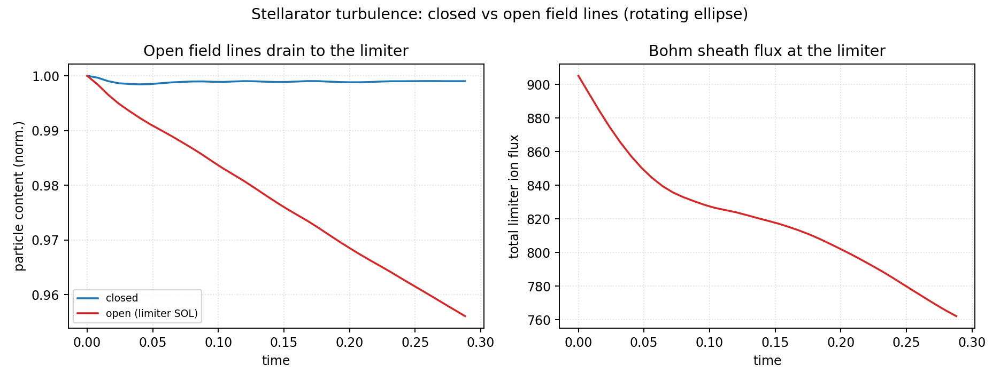
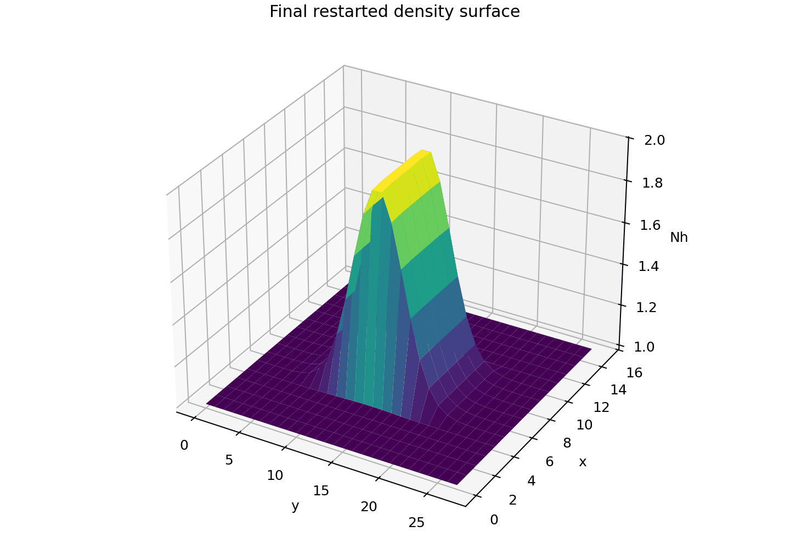

# Examples And Artifact Map

Every example is a **flat pedagogical script** with the same anatomy: imports,
a PARAMETERS block near the top (every physics and numerics choice in one
place, commented), explicit setup, a run loop with progress prints, then
plotting and a JSON/NPZ summary. Edit the constants, run the file, inspect the
output directory — the SIMSOPT-style workflow. The narrative walkthroughs in
the [Tutorials](tutorial_hasegawa_wakatani.md) section explain the flagship
scripts line by line.

Run any example from the repository root with:

```bash
PYTHONPATH=src python examples/<group>/<name>.py
```

For a capability-by-capability map that links every major feature to its
inputs, outputs, source modules, tests, and documentation page, see
[Feature Reference](feature_reference.md).

## Tokamak (closed field lines)

| Example | What it teaches |
| --- | --- |
| [`examples/tokamak/drift_wave_turbulence.py`](../examples/tokamak/drift_wave_turbulence.py) | Hasegawa-Wakatani turbulence from noise: instability growth, outward particle flux, vorticity movie. [Tutorial](tutorial_hasegawa_wakatani.md). |
| [`examples/tokamak/drift_wave_inverse_design.py`](../examples/tokamak/drift_wave_inverse_design.py) | Autodiff *through* the turbulence: transport sensitivities vs finite differences, gradient-descent recovery of the drive. |


## Open-field-line SOL and neutrals

| Example | What it teaches |
| --- | --- |
| [`examples/sol/open_sol_flux_tube.py`](../examples/sol/open_sol_flux_tube.py) | Open slab flux tube with Bohm sheath targets; relaxation to the two-point steady state; sheath/recycling accounting. [Tutorial](tutorial_open_sol.md). |
| [`examples/sol/recycling_sol.py`](../examples/sol/recycling_sol.py) | Coupled plasma + recycled neutral with AMJUEL rates; neutral cushion; detachment-onset density scan. |


## Stellarator (3D FCI, closed and open)

| Example | What it teaches |
| --- | --- |
| [`examples/stellarator/rotating_ellipse_fci.py`](../examples/stellarator/rotating_ellipse_fci.py) | Rotating-ellipse geometry with autodiff metric; second-order FCI parallel-operator convergence. [Tutorial](tutorial_stellarator_fci.md). |
| [`examples/stellarator/stellarator_turbulence.py`](../examples/stellarator/stellarator_turbulence.py) | 4-field interchange turbulence, closed vs limiter-open, with cross-section movies and sheath drainage. |
| [`examples/stellarator/island_divertor.py`](../examples/stellarator/island_divertor.py) | Resonant island chain and an emergent stochastic SOL. |
| [`examples/stellarator/rotating_ellipse_filament.py`](../examples/stellarator/rotating_ellipse_filament.py) | Blob/filament dynamics on the rotating ellipse. |
| [`examples/stellarator/stellarator_3d_render.py`](../examples/stellarator/stellarator_3d_render.py) | 3D rendering of turbulence on traced flux surfaces. |
| [`examples/stellarator/fci_differentiable.py`](../examples/stellarator/fci_differentiable.py) | Gradients through the FCI geometry and reduced dynamics ([details](stellarator_fci_differentiable.md)). |



## Benchmarks

| Example | What it teaches |
| --- | --- |
| [`examples/benchmarks/linear_dispersion.py`](../examples/benchmarks/linear_dispersion.py) | Drift-wave, shear-Alfven, and interchange dispersion vs analytic relations ([page](linear_dispersion_benchmark.md)). |
| [`examples/benchmarks/linear_drb_survey.py`](../examples/benchmarks/linear_drb_survey.py) | Parameter survey of the linearized-DRB regimes (hydrodynamic/adiabatic drift waves, Alfven, interchange). |
| [`examples/benchmarks/b6_detachment_rollover.py`](../examples/benchmarks/b6_detachment_rollover.py) | SD1D detachment benchmark: target-flux rollover and sub-1-eV target cooling. [Tutorial](tutorial_open_sol.md). |
| [`examples/benchmarks/performance_benchmark.py`](../examples/benchmarks/performance_benchmark.py) | Turbulence throughput and gradient-cost measurements ([page](performance_and_differentiability.md)). |
| [`examples/benchmarks/fci_sharded_strong_scaling.py`](../examples/benchmarks/fci_sharded_strong_scaling.py) | Multi-device `shard_map` strong scaling with per-shard core binding. |


## Autodiff

| Example | What it teaches |
| --- | --- |
| [`examples/autodiff/differentiation_methods.py`](../examples/autodiff/differentiation_methods.py) | Forward vs reverse vs checkpointed gradients on the same turbulence rollout, with measured costs. |
| [`examples/autodiff/detachment_control.py`](../examples/autodiff/detachment_control.py) | Newton control of the detachment front using forward-mode sensitivities through the stiff SOL solve. |
| [`examples/autodiff_diffusion_sensitivity.py`](../examples/autodiff_diffusion_sensitivity.py) | `jax.grad` sensitivity against finite differences on the compact diffusion lane. |
| [`examples/autodiff_diffusion_uncertainty.py`](../examples/autodiff_diffusion_uncertainty.py) | Covariance pushforward vs vectorized Monte Carlo. |
| [`examples/autodiff_diffusion_inverse_design.py`](../examples/autodiff_diffusion_inverse_design.py) | Gradient-based inverse-design loop. |
| [`examples/strong_scaling_diffusion.py`](../examples/strong_scaling_diffusion.py) | Fixed-work CPU/GPU process-group scaling on a differentiable objective. |


## Native runtime (TOML decks)

| Example | What it teaches |
| --- | --- |
| [`examples/inputs/restartable_diffusion.toml`](../examples/inputs/restartable_diffusion.toml) | Small native TOML deck with restartable output. |
| [`examples/restartable_diffusion_tutorial.py`](../examples/restartable_diffusion_tutorial.py) | End-to-end run, restart, NPZ reading, and plotting workflow ([tutorial](restartable_diffusion_tutorial.md)). |
| [`examples/diffusion_precision_benchmark.py`](../examples/diffusion_precision_benchmark.py) | Float32/float64 runtime comparison on the compact diffusion lane. |
| [`examples/model_selection_guide.py`](../examples/model_selection_guide.py) | Which model/lane to choose for a given question. |



## Imported 3D geometry (`examples/geometry-3D/`)

The synthetic stellarator-FCI scripts are self-contained; the imported-field
scripts need the named external checkout (ESSOS, vmec_jax) or run in dry-run
mode against release-backed arrays.

| Example | What it teaches |
| --- | --- |
| [`stellarator-fci/geometry_plotting.py`](../examples/geometry-3D/stellarator-fci/geometry_plotting.py) | Synthetic non-axisymmetric geometry, metric, connection-length, and curvature maps ([guide](stellarator_examples.md)). |
| [`stellarator-fci/linear_mode.py`](../examples/geometry-3D/stellarator-fci/linear_mode.py) | Linear FCI mode history and snapshots. |
| [`stellarator-fci/vorticity_bracket.py`](../examples/geometry-3D/stellarator-fci/vorticity_bracket.py) | Nonlinear coupling through the vorticity/potential solve and the logical E x B bracket. |
| [`stellarator-fci/nonlinear_turbulence.py`](../examples/geometry-3D/stellarator-fci/nonlinear_turbulence.py) | Compact nonlinear reduced SOL history, diagnostics, 3D poster, GIF movie. |
| [`stellarator-fci/turbulent_profile_analysis.py`](../examples/geometry-3D/stellarator-fci/turbulent_profile_analysis.py) | Radial fluctuation, RMS, transport-proxy, and energy-trace analysis. |
| [`stellarator-fci/validation_campaign.py`](../examples/geometry-3D/stellarator-fci/validation_campaign.py) | Full promoted synthetic stellarator FCI validation bundle. |
| [`essos-field-lines/closed_open_vacuum_poincare.py`](../examples/geometry-3D/essos-field-lines/closed_open_vacuum_poincare.py) | Closed vs open vacuum field lines from ESSOS coils: Poincare sections and connection lengths. |
| [`essos-field-lines/landreman_paul_qa_import.py`](../examples/geometry-3D/essos-field-lines/landreman_paul_qa_import.py) | External QA field-line import into portable arrays ([page](essos_fieldline_import.md)). |
| [`essos-field-lines/direct_coil_open_sol.py`](../examples/geometry-3D/essos-field-lines/direct_coil_open_sol.py) | Direct-coil open-SOL promotion workflow (dry-run contract by default). |
| [`essos-field-lines/hybrid_open_sol.py`](../examples/geometry-3D/essos-field-lines/hybrid_open_sol.py) | Hybrid VMEC/coil open-SOL promotion workflow. |
| [`essos-field-lines/vmec_closed_field.py`](../examples/geometry-3D/essos-field-lines/vmec_closed_field.py) | VMEC closed-field control with opt-in live periodic FCI gates. |
| [`vmec-jax/closed_field_lines.py`](../examples/geometry-3D/vmec-jax/closed_field_lines.py) | vmec_jax equilibrium import: surface fields, JAX field-line tracing, traced iota matching the wout `iotaf` profile to ~1e-6. |
| [`vmec-jax/closed_open_field_lines.py`](../examples/geometry-3D/vmec-jax/closed_open_field_lines.py) | ESSOS coil field with the vmec_jax LCFS overlay: closed core vs open SOL in one picture. |
| [`vmec-extender/imported_field.py`](../examples/geometry-3D/vmec-extender/imported_field.py) | VMEC-extender field-grid import and compact SOL verification gate ([page](vmec_extender_edge_fields.md)). |


The remaining `essos-field-lines/imported_*` campaign scripts regenerate the
legacy imported-geometry validation artifacts documented in
[ESSOS Imported FCI Validation](essos_imported_fci_validation.md); they are
developer workflows that expect a local geometry checkout.

## Release-backed artifacts

Full-resolution legacy campaign media and NPZ payloads are release-hosted so
the repository stays small. All images embedded in the docs are committed
compressed copies under `docs/media/`. To restore the release bundles locally:

```bash
gh auth login --hostname github.com   # or set GH_TOKEN / GITHUB_TOKEN
python scripts/fetch_example_artifacts.py
```
