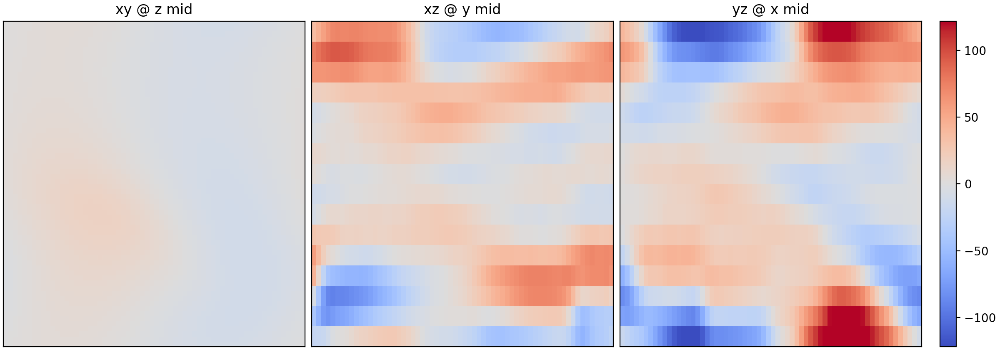
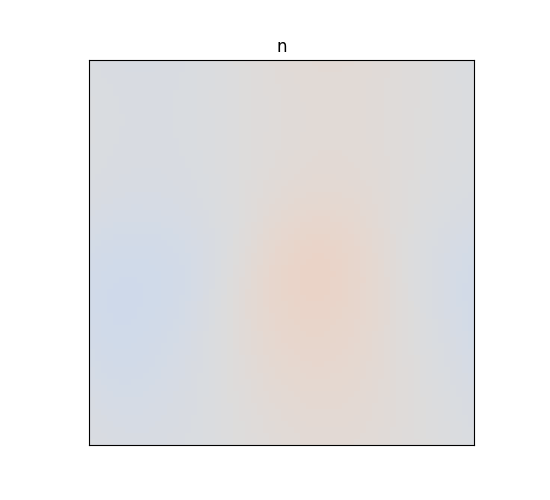

# Figures & Diagnostics

This page showcases **representative nonlinear DRB results** and highlights
diagnostic outputs available in `jax_drb`.

The plotting scripts in `tools/` call internal diagnostics utilities under
`jaxdrb.diagnostics` (spectra, PDFs, and zonal averages) so all figures remain
fully reproducible without external code.

## Nonlinear Snapshot Panel


The panel shows mid‑plane snapshots of key fields from a nonlinear plane run with
tokamak‑style curvature drive: `n`, `phi`, `omega`, and `Te`. By default we plot
**fluctuations** (zonal‑mean subtracted for `n`/`Te`, global‑mean subtracted for
`phi`/`omega`) to highlight nonlinear structure.

Regenerate it with:

```bash
python examples/plane_nonlinear/run.py --make-figures --make-movies
```

## RMS Time Series


The RMS traces highlight transient growth and saturation behavior. Use these to
validate stability windows, time‑stepping, and dissipation choices. The same
example command above regenerates them.

## Zonal Profiles


Zonal averages highlight self‑organized flow structure and large‑scale shear.

## Zonal Flow


Time‑averaged zonal flow (`v_{E,y}`) computed from the zonal mean of `phi`.

## Spectra


The isotropic spectra are computed using internal `jax_drb` diagnostics.

## PDFs


PDFs are computed from fluctuation fields (mean‑subtracted) to characterize
intermittency.

## Blob Movie


This short GIF is generated from the saved snapshots in the public example.

## Open Field‑Line Example


Poloidal visualization (circular cross‑section) of the open/closed SOL mask and
equilibrium profile used in the open‑field‑line example.


Fluctuation snapshot overlaid on the equilibrium profile to highlight open vs
closed‑field structure.


## Field‑Aligned 3D Example



3D slice views (xy/xz/yz) from a field‑aligned s‑alpha example.




