# Figures & Diagnostics

This page showcases **representative nonlinear DRB results** and highlights
diagnostic outputs available in `jax_drb`.

The plotting scripts in `tools/` call internal diagnostics utilities under
`jaxdrb.diagnostics` (spectra, PDFs, and zonal averages) so all figures remain
fully reproducible without external code.

## Tokamak SOL Benchmark Panel

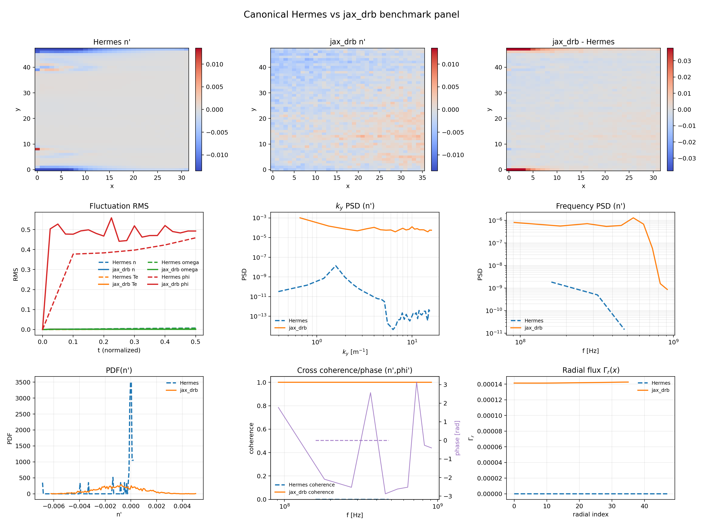
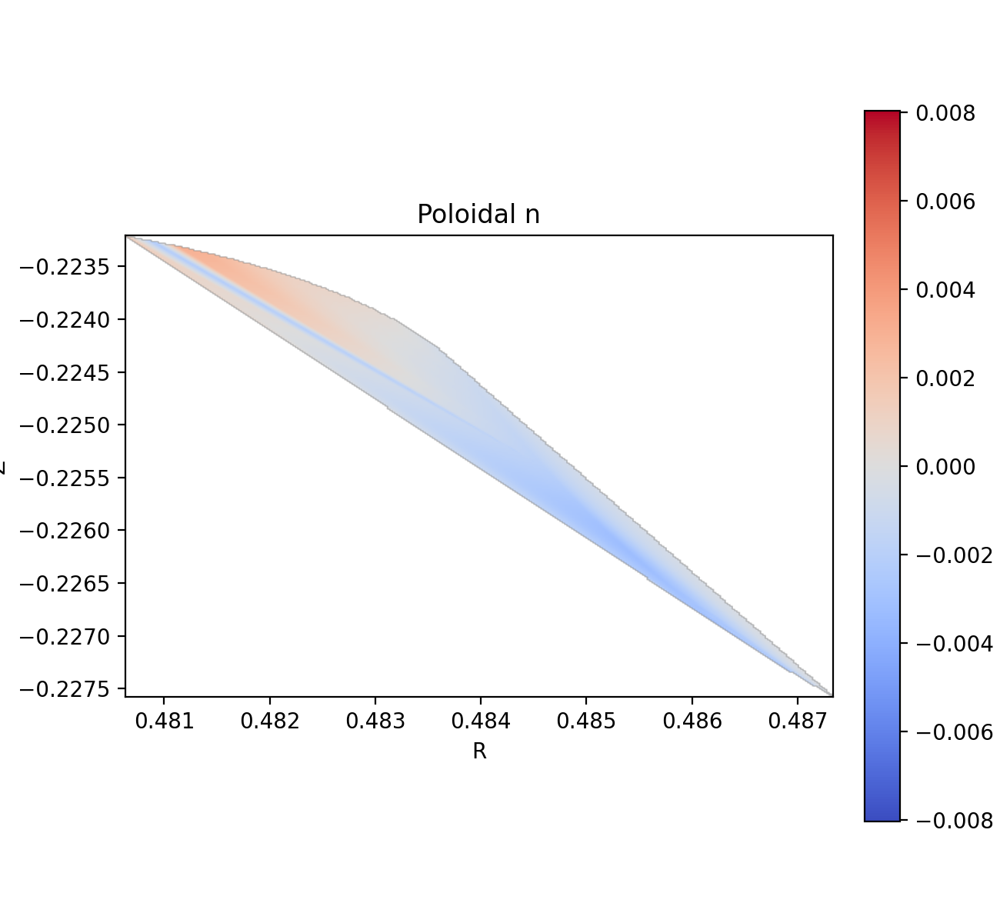
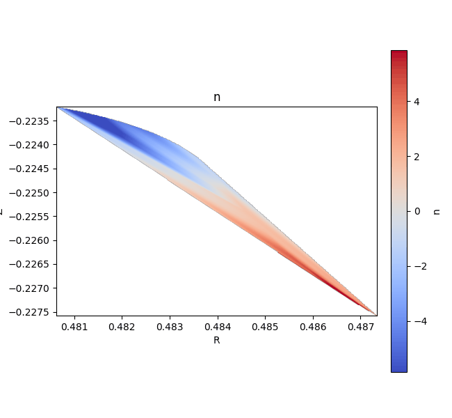
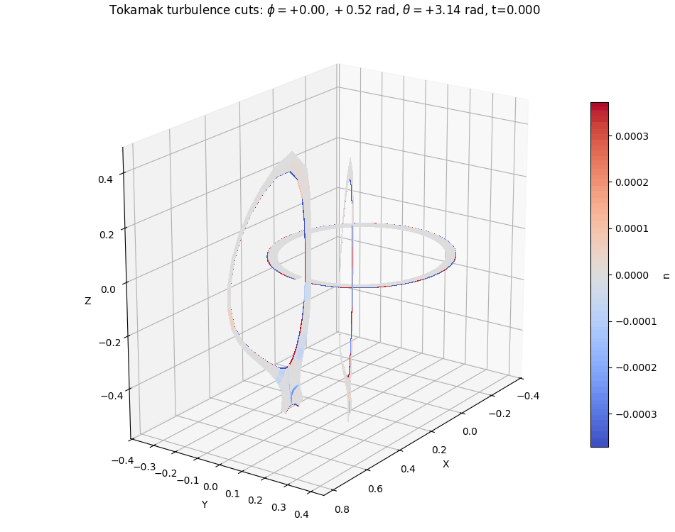

Generate panel + movies in one command:

```bash
PYTHONPATH=src python tools/run_tokamak_hermes_benchmark.py \
  --jax-config examples/open_field_line/input_tokamak_bxcv_benchmark_es_cold.toml \
  --hermes-data runs/hermes_open_field_short/data \
  --out-dir runs/tokamak_benchmark_latest \
  --fig-dir docs/figures \
  --t-end-short 0.1 \
  --t-end-visual 1.2 \
  --field n
```

## Nonlinear Snapshot Panel

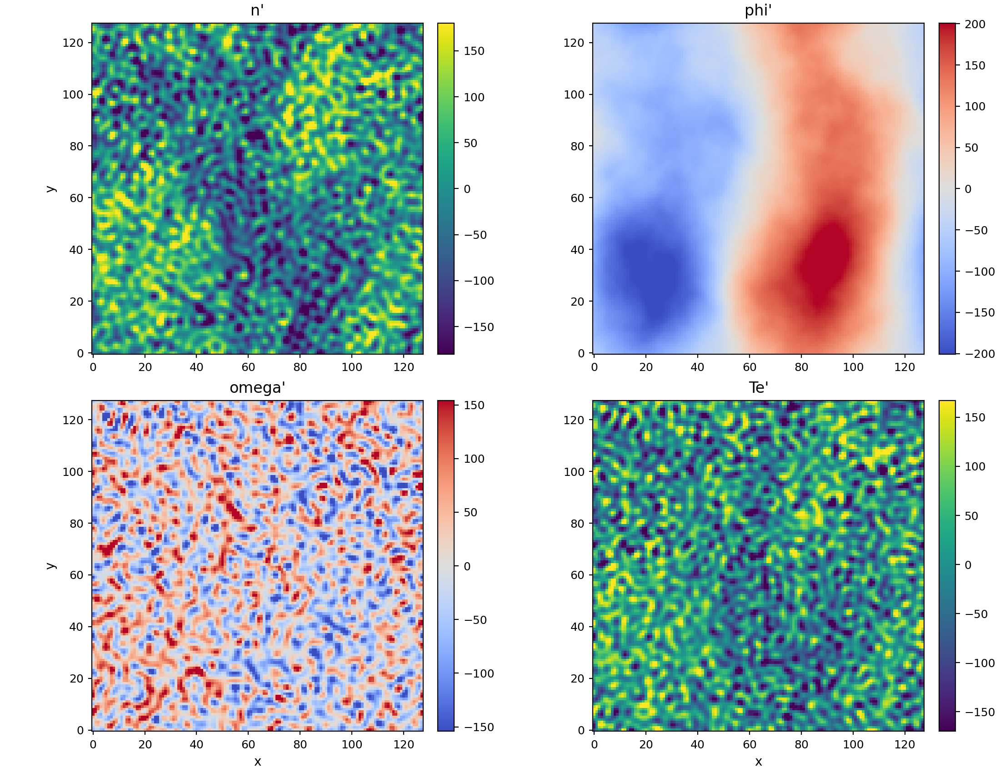

The panel shows mid‑plane snapshots of key fields from a nonlinear plane run with
tokamak‑style curvature drive: `n`, `phi`, `omega`, and `Te`. By default we plot
**fluctuations** (zonal‑mean subtracted for `n`/`Te`, global‑mean subtracted for
`phi`/`omega`) to highlight nonlinear structure.

Regenerate it with:

```bash
python examples/plane_nonlinear/run.py --make-figures --make-movies
```

## RMS Time Series

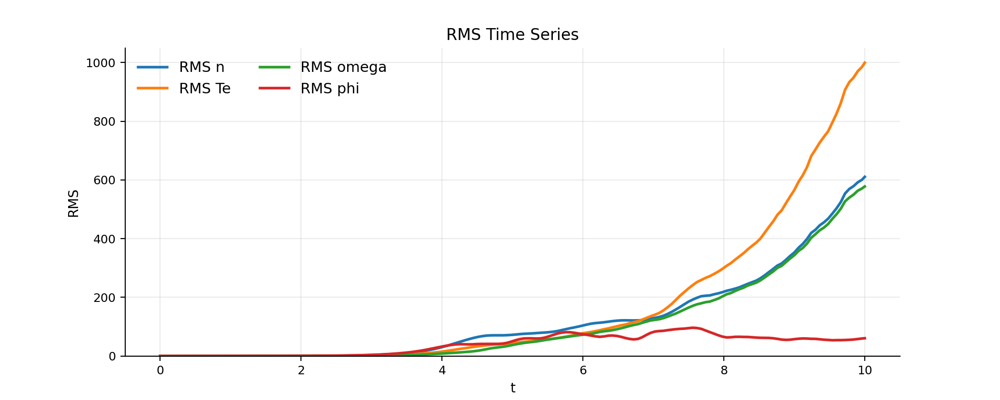

The RMS traces highlight transient growth and saturation behavior. Use these to
validate stability windows, time‑stepping, and dissipation choices. The same
example command above regenerates them.

## Energy Conservation

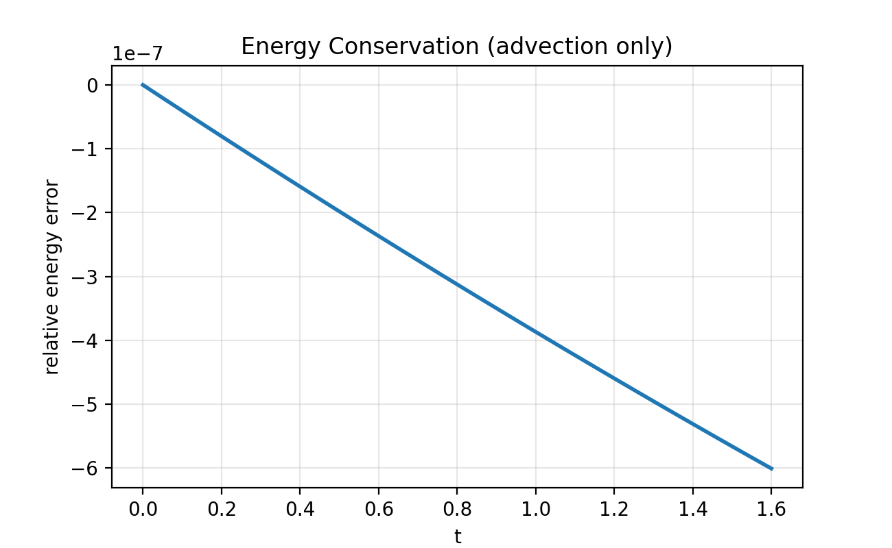

Relative energy error for an advection‑only conservation check (`examples/conservation_check/`).

## Zonal Profiles

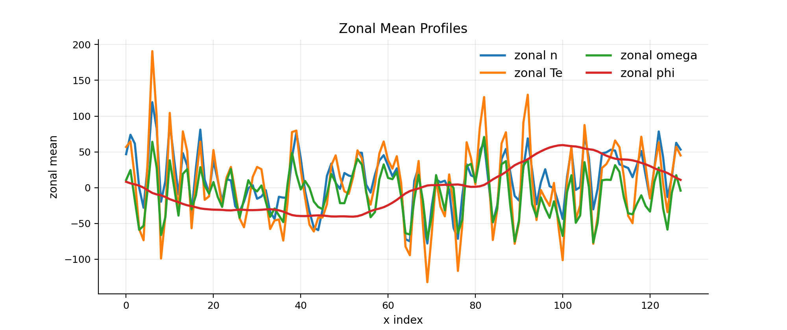

Zonal averages highlight self‑organized flow structure and large‑scale shear.

## Zonal Flow

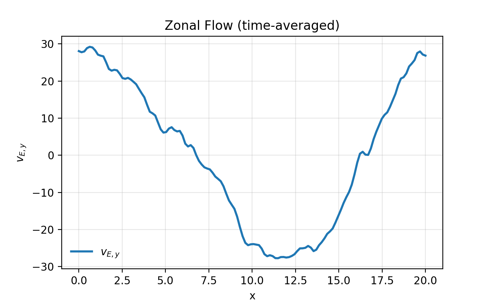

Time‑averaged zonal flow (`v_{E,y}`) computed from the zonal mean of `phi`.

## Spectra

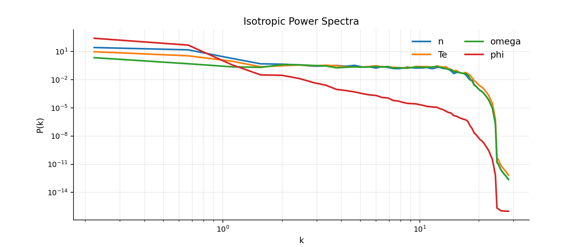

The isotropic spectra are computed using internal `jax_drb` diagnostics.

## PDFs

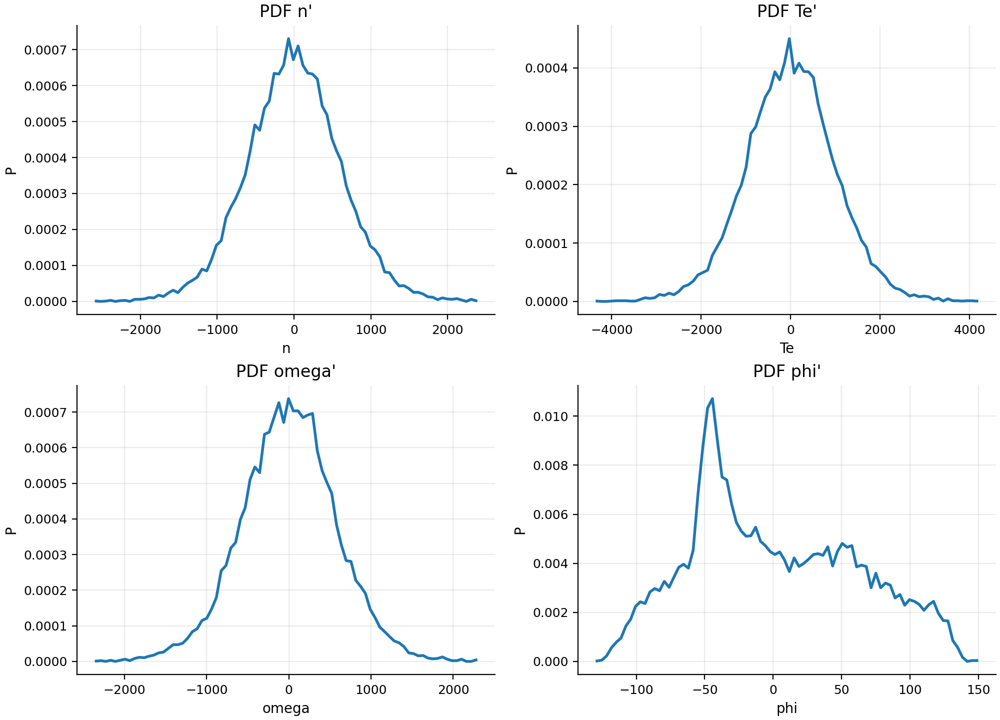

PDFs are computed from fluctuation fields (mean‑subtracted) to characterize
intermittency.

## Blob Movie

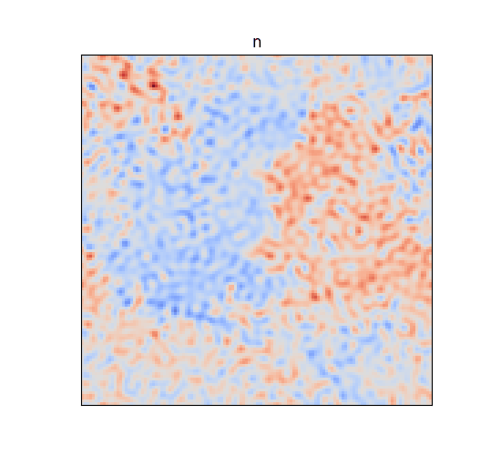

This short GIF is generated from the saved snapshots in the public example.

## Open Field‑Line Example

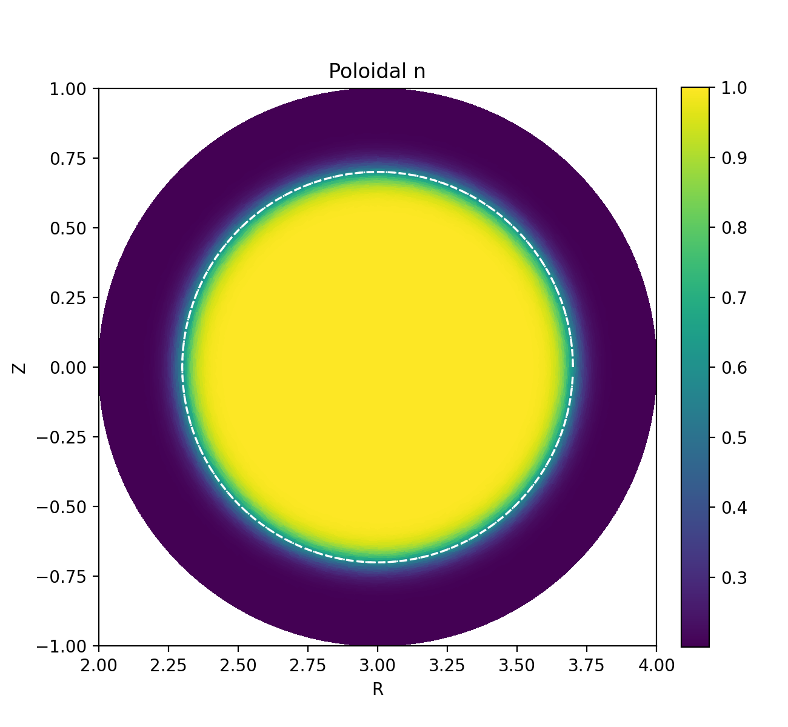

Poloidal visualization (circular cross‑section) of the open/closed SOL mask and
equilibrium profile used in the open‑field‑line example.

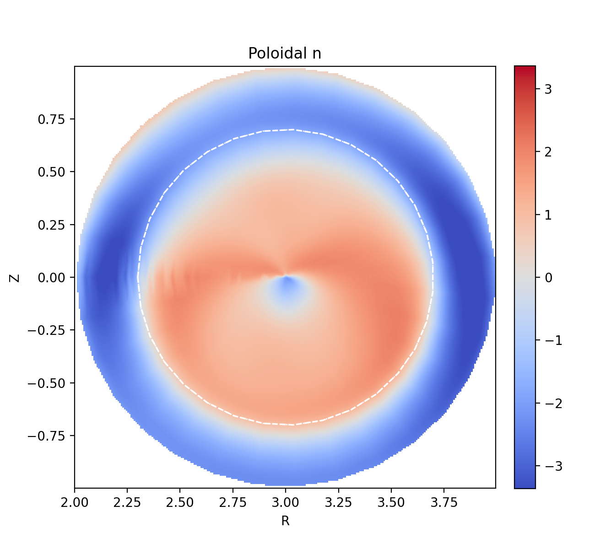

Fluctuation snapshot overlaid on the equilibrium profile to highlight open vs
closed‑field structure.

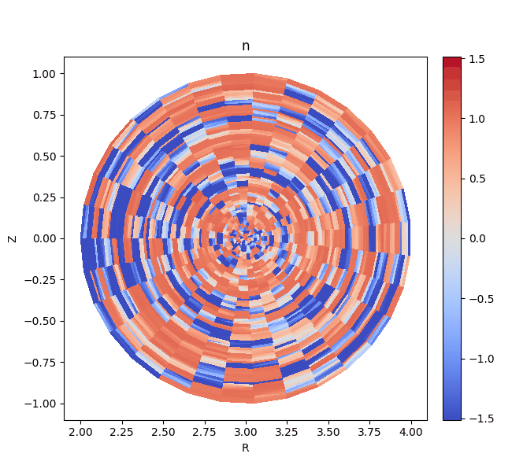

### Poloidal Conventions

Tokamak diagnostics are commonly shown in the **poloidal \((R,Z)\) plane**, where
a vertical slice through the torus exposes the magnetic cross‑section and flux
surfaces. We follow this convention by rendering poloidal cuts in \((R,Z)\) and
overlaying the last closed flux surface (LCFS / separatrix) as a **dashed
circle**, consistent with common presentation in edge‑turbulence literature. See
the coordinate definitions and poloidal cross‑section convention in
[ASCOT5’s coordinate notes](https://ascot4fusion.github.io/ascot5/main/theory/coordinates.html),
and example separatrix overlays in tokamak edge turbulence figures (e.g.
[Pan et al. 2018, Entropy](https://www.mdpi.com/1099-4300/20/4/227)).

## Field‑Aligned 3D Example

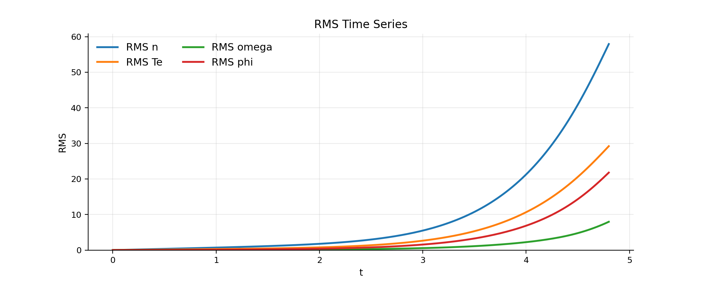
