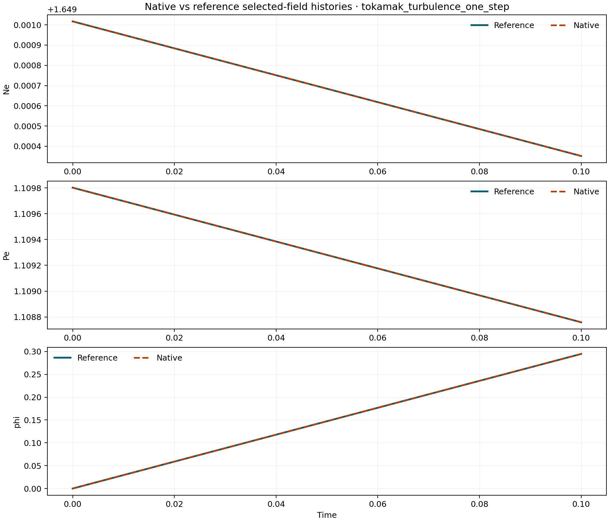
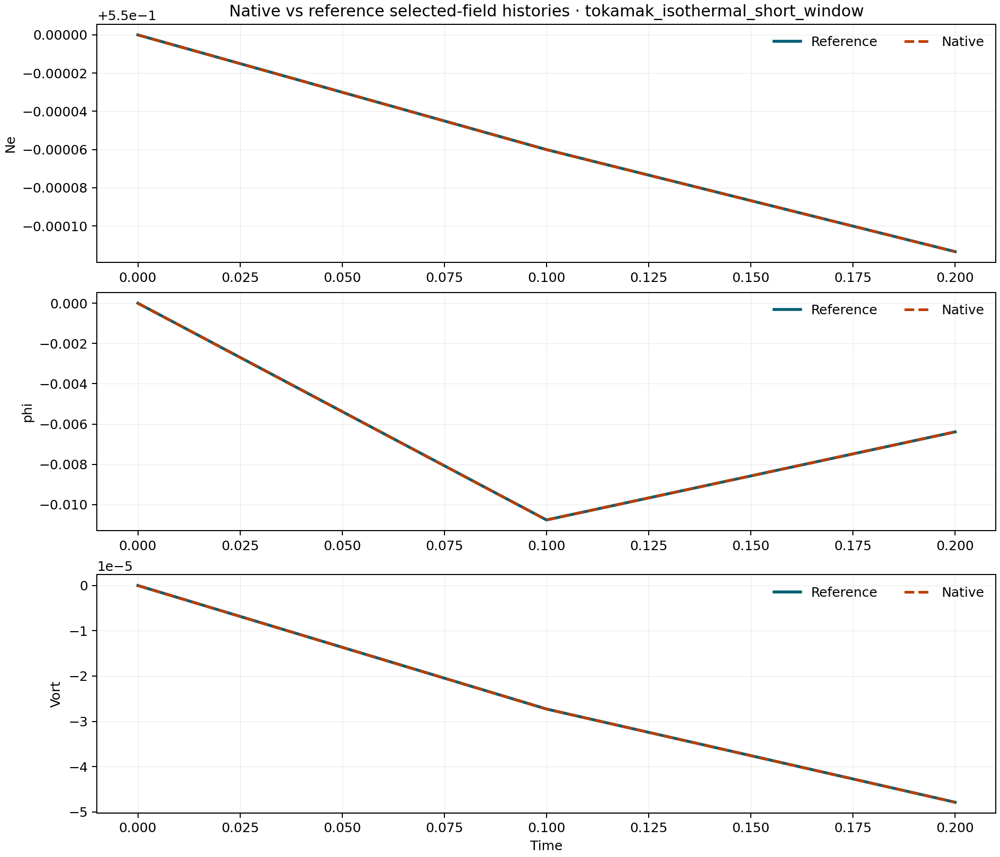

# Hermes Comparison Gallery

This page collects the current committed native-vs-reference comparison
surfaces and the compact summary plot built from them.

The top summary plot is an index figure, not the main scientific evidence
surface. The lane-specific comparison figures below remain the stronger
publication-facing artifacts.

## Summary

## Native Tokamak One-Step

## Native Tokamak Short-Window

## Native Traced-Field-Line Reduced Rung

## Native Stellarator VMEC Reduced Rung

