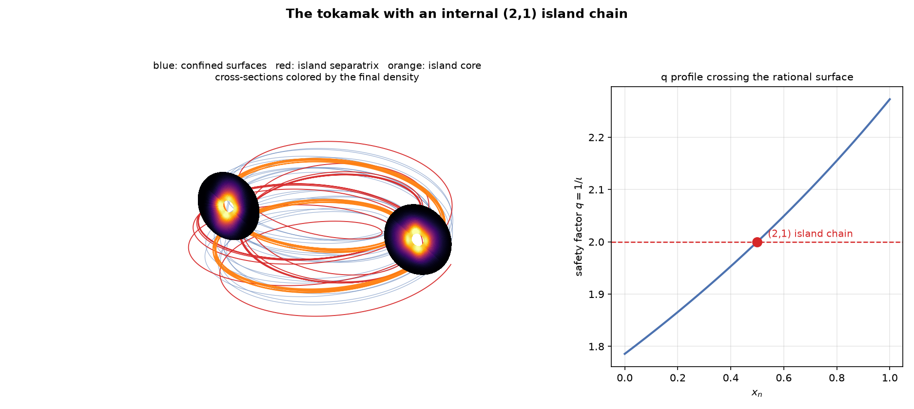
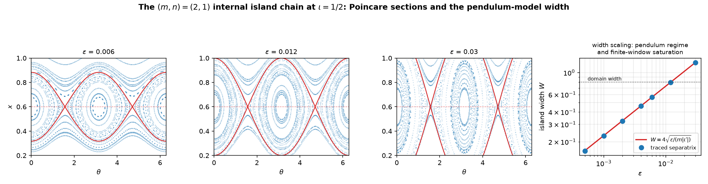
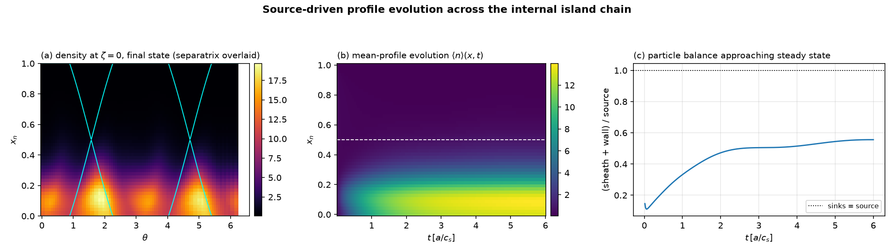
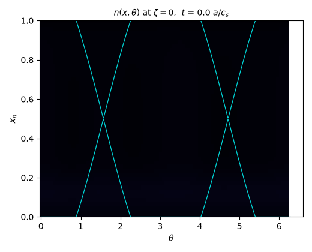

# Tokamak with an internal island chain

`examples/island_tokamak_profiles.py` evolves source-driven profiles on a
tokamak-like configuration with a single internal magnetic-island chain, and
`examples/island_tokamak_figure.py` renders every figure and movie on this
page from its outputs.



## The configuration

The rotational transform falls from `iota = 0.56` at the inner boundary to
`0.44` at the outer one, crossing the rational `iota = 1/2` — the `q = 2`
surface — in the middle of the domain. A single `(m, n) = (2, 1)` resonant
radial perturbation of amplitude `eps` opens an island chain there
(`drbx.geometry.IslandDivertorField` with one resonance and
`n_field_periods = 1`). The inner region is fully confined; only the
outermost field lines reach the wall, in the manner of a limiter.

In the 3-D view above, the two blue field lines lie on confined surfaces
inside and outside the chain, the red line traces the island separatrix, and
the orange line winds around the island O-point — the `(2, 1)` helical tube
that closes on itself after two poloidal and one toroidal turn. The two
cross-section rings are colored by the final simulated density.

## Geometry verification against the standard island model

Poincare sections of the traced field reproduce the textbook island
structure quantitatively:



* the chain sits exactly at `iota = n/m` (dashed line);
* the analytic pendulum-model separatrix (red), with no fitted parameter,
  lies on the traced chains at every amplitude;
* the island width measured from a near-separatrix trace follows

      W = 4 sqrt(eps / (m |iota'|))

  — the standard result (J. Wesson, *Tokamaks*, ch. 7; R. B. White, *The
  Theory of Toroidally Confined Plasmas*) — to ~1% rms across the pendulum
  regime, saturating only where the island fills the sheared-iota window.

## Flux-driven profile evolution

The four-field drift-reduced Braginskii model evolves the density
flux-driven, in the same convention the production edge-turbulence codes use
for saturated states (GBS: Giacomin et al., JCP 463, 111294, 2022; GRILLIX:
Zholobenko et al., NF 61, 116015, 2021; TOKAM3X: Tamain et al., JCP 321,
606, 2016):

* a Gaussian-in-radius particle **source shell** near the inner boundary is
  the only drive — its amplitude is the throughput;
* a smooth **wall buffer** in the outermost few percent of the radius is the
  sink;
* **no Dirichlet clamping anywhere** — the profile is emergent.





The particle balance settles into a quasi-steady state within a few transit
times, and the density organizes on the island phase: the cross-section
develops lobes locked to the X-point columns of the separatrix (cyan
overlay — the same analytic separatrix as in the Poincare figure).

The whole time step — the RK4 advance of `four_field_rk4_step` plus source,
sinks, and filters — compiles to a single XLA program. That is what makes
hour-scale profile-evolution runs practical: the production `48x96x32` run
takes about an hour on one 16 GB GPU in fp32, while a raw Python composition
of the same operations costs ~50x more in dispatch overhead.

## Recovered vs. new

| | status |
|---|---|
| Island position at `iota = n/m` | recovered exactly |
| Pendulum island width `W = 4 sqrt(eps/(m iota'))` (Wesson; White) | recovered to ~1% rms |
| Flux-driven saturation convention (GBS / GRILLIX / TOKAM3X) | reproduced on an island geometry |
| Density lobes locked to the island X-point phase | emergent in this model |
| Mean-profile flattening across the island (Fitzpatrick, PoP 2, 825, 1995: requires the parallel channel to beat perpendicular transport over the island width) | *not* in the default run — see below |
| End-to-end differentiability of the island-tokamak state | new; no production DRB code offers it |

The classic island signature — the mean profile flattening across the
separatrix — is gated here by the parallel-flow friction `mu`
(`DRBX_ISLAND_MU`). The default `mu = 8` keeps the drift-acoustic channel
firmly damped: the balance is steady, but the parallel equilibration that
flattens the island is throttled and the measured gradient ratio
inside/outside the island band stays at ~1.3–1.4. At `mu = 0.5` the channel
is under-damped at these parameters and the run goes unstable. This is the
Fitzpatrick critical-width physics in numerical form: flattening requires
effective parallel transport to win over perpendicular transport across the
island, and the damped-parallel regime sits below that transition. Mapping
the intermediate-`mu` regime — where the island response emerges with the
acoustic channel still under control — is the experiment this example sets
up.

## Reproducing

```bash
# laptop smoke test (~1 minute)
DRBX_ISLAND_SHAPE=16,32,12 DRBX_ISLAND_STEPS=400 \
  python examples/island_tokamak_profiles.py

# GPU production (fp32; fp64 runs at 1/64 rate on consumer GPUs)
DRBX_PRECISION=float32 DRBX_ISLAND_SHAPE=48,96,32 \
  DRBX_ISLAND_DT=2.5e-4 DRBX_ISLAND_STEPS=80000 DRBX_ISLAND_EPS=0.03 \
  DRBX_ISLAND_S0=2.5 python examples/island_tokamak_profiles.py

# figures and movies
python examples/island_tokamak_figure.py poincare
python examples/island_tokamak_figure.py 3d output/island_tokamak/island_tokamak.npz
python examples/island_tokamak_figure.py evolution output/island_tokamak/island_tokamak.npz
python examples/island_tokamak_figure.py movie3d output/island_tokamak/island_tokamak.npz
```

Every physics knob is env-overridable: island amplitude (`DRBX_ISLAND_EPS`),
throughput (`DRBX_ISLAND_S0`), perpendicular diffusion (`DRBX_ISLAND_D`),
parallel friction (`DRBX_ISLAND_MU`), grid, timestep, and duration.
