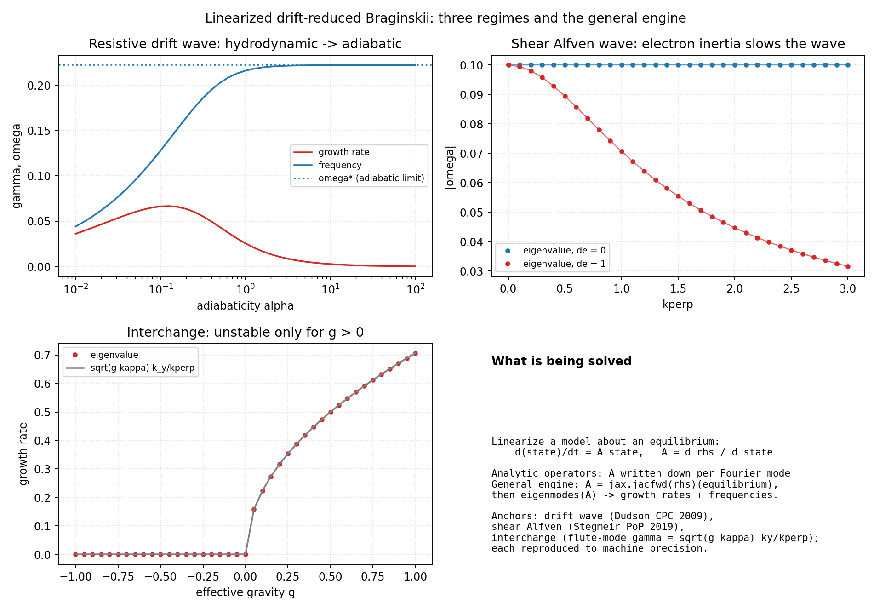

# The Linearized Drift-Reduced Braginskii Solver

`drbx.linear` answers the first question asked of any plasma model: *given
an equilibrium, which perturbations grow, and how fast?*

## What is solved

Linearizing a model about an equilibrium `u0` gives

```
d(delta u)/dt = A delta u,        A = d rhs / d u |_(u0)
```

Writing a perturbation as `delta ~ exp(lambda t)`, the eigenvalues
`lambda = gamma + i Omega` of `A` give the growth rate `gamma = Re(lambda)`
and the oscillation frequency `|Omega|` of every eigenmode.

## How it is solved

Two entry points, one engine:

- **Analytic dispersion operators** — for a single Fourier mode of a reduced
  model, `A` is a small complex matrix written down from the linearized
  equations (`resistive_drift_wave_operator`, `shear_alfven_operator`,
  `interchange_operator` in
  [`linear/dispersion.py`](../src/drbx/linear/dispersion.py)). Because the
  operators are assembled from the model equations, diagonalizing them
  *reproduces* the analytic dispersion relations rather than having those
  relations wired in.
- **The general engine** — `jacobian_operator(rhs, equilibrium)` builds `A`
  from *any* right-hand side with `jax.jacfwd` (no hand derivation), and
  `eigenmodes(A)` returns growth rates, frequencies, and eigenvectors sorted
  by growth ([`linear/eigen.py`](../src/drbx/linear/eigen.py)). States must
  be real; complex spectral states are realified first (the pattern used in
  the Hasegawa-Wakatani gate below).

## Regimes and literature anchors



| Regime | Physics | Analytic limit reproduced | Reference |
|---|---|---|---|
| Resistive drift wave, hydrodynamic (`alpha << 1`) | weak parallel coupling; resistive branch grows | growth rises toward the hydrodynamic regime | Dudson et al., *CPC* 180, 1467 (2009); Hasegawa & Wakatani, *PRL* 50, 682 (1983) |
| Resistive drift wave, adiabatic (`alpha >> 1`) | electrons force `n ~ phi`; a propagating drift wave | `omega -> omega* = kappa k_y / (1 + kperp^2)` | Dudson et al., *CPC* 180, 1467 (2009) |
| Shear Alfven wave (`d_e = 0`) | ideal field-line bending | `omega = k_par v_A` | Stegmeir et al., *PoP* 26, 052517 (2019) |
| Shear Alfven with electron inertia | finite electron mass slows the wave | `omega = k_par v_A / sqrt(1 + kperp^2 d_e^2)` | Stegmeir et al., *PoP* 26, 052517 (2019) |
| Interchange, stable (`g kappa < 0`) | curvature and gradient oppose (good curvature) | `gamma = 0` (stable oscillation) | flute-mode theory |
| Interchange, unstable (`g kappa > 0`) | curvature drives the gradient (bad curvature) | `gamma = sqrt(g kappa) k_y / kperp`, flute (`k_x -> 0` largest) | flute-mode theory; the linear physics behind SOL blobs |

Every row is reproduced to machine precision (1e-12 to 1e-16) in
[`tests/test_linear_dispersion.py`](../tests/test_linear_dispersion.py) (24
tests), and surveyed with printed explanations in
[`examples/benchmarks/linear_drb_survey.py`](../examples/benchmarks/linear_drb_survey.py);
the compact two-panel version is
[`examples/benchmarks/linear_dispersion.py`](../examples/benchmarks/linear_dispersion.py).

## Geometries

The dispersion operators above live on a periodic slab flux tube (the
Hasegawa-Wakatani setting). The same linearization machinery is exercised on
curved and non-axisymmetric geometry elsewhere in the suite:

- **The real nonlinear model.** The general engine linearizes the full
  pseudo-spectral Hasegawa-Wakatani model (realified spectral state) and
  recovers the analytic single-mode operator to ~1e-15
  (`test_general_engine_linearizes_the_hasegawa_wakatani_model`) — the check
  that `jacobian_operator` is trustworthy on production right-hand sides.
- **Helical flux tube.** A single Fourier mode of the nonlinear
  Hasegawa-Wakatani model grows at the resistive drift-wave operator's
  eigenvalue to ~1e-14 (`tests/test_hasegawa_wakatani.py`), tying the
  nonlinear code to the linear solver; the drift-reduced FCI operator stack
  carries the same curvature terms on the shifted-torus helical geometry.
- **Rotating-ellipse stellarator.** The small-amplitude response on the
  genuinely non-axisymmetric metric is pinned by the differentiable rollout
  gates: the gradient of an evolved diagnostic matches finite differences
  (`tests/test_rotating_ellipse_fci.py`), which is the linearized response
  computed two independent ways.

## Using it

```python
from drbx.linear import jacobian_operator, eigenmodes

operator = jacobian_operator(my_rhs, my_equilibrium)   # A = d rhs / d u
modes = eigenmodes(operator)                           # sorted by growth rate
print(modes.growth_rates[0], modes.frequencies[0])     # the fastest mode
```

## Reproduce

```bash
PYTHONPATH=src python examples/benchmarks/linear_drb_survey.py       # full survey
PYTHONPATH=src python examples/benchmarks/linear_dispersion.py  # compact B2/B3
pytest -q tests/test_linear_dispersion.py
```
