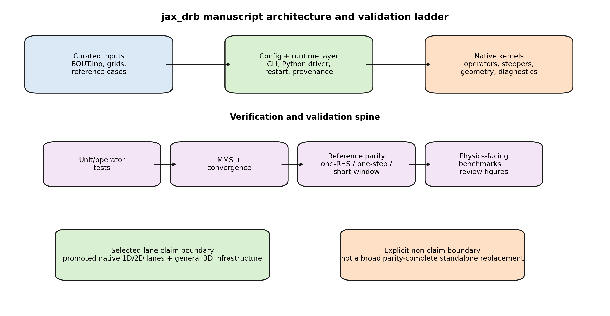
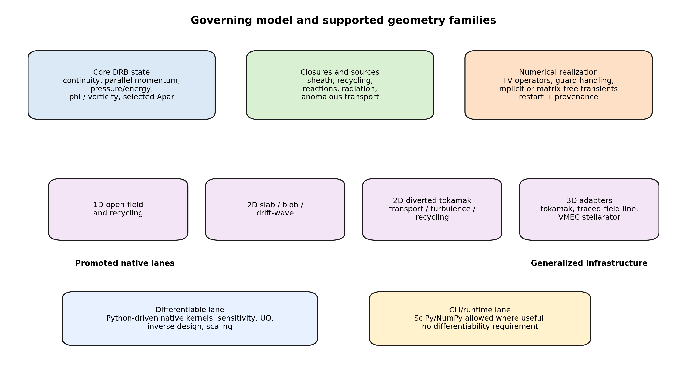
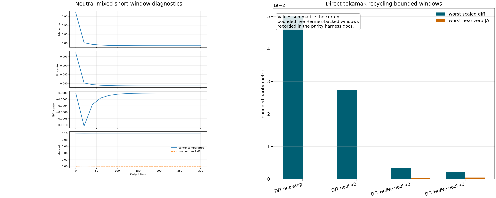

# Manuscript Figures

This page tracks the remaining manuscript-specific figures that are generated
from committed repo state rather than assembled manually at submission time.

Run:

```bash
PYTHONPATH=src .venv/bin/python examples/publication/manuscript_figures_demo.py \
  --output-root docs/data/manuscript_figures_artifacts
```

Outputs:

- `docs/data/manuscript_figures_artifacts/data/manuscript_figures_manifest.json`
- `docs/data/manuscript_figures_artifacts/images/manuscript_figures_architecture.png`
- `docs/data/manuscript_figures_artifacts/images/manuscript_figures_equations_geometry.png`
- `docs/data/manuscript_figures_artifacts/images/manuscript_figures_transient_panel.png`

What these figures cover:

- an architecture and validation-ladder schematic tied to the current selected-lane claim boundary;
- an equations and geometry summary schematic tied to the currently supported physics and geometry matrix;
- a transient validation panel that pairs the promoted neutral short-window diagnostics with the currently bounded direct-tokamak recycling windows.

These figures are manuscript-facing rather than regression-facing. They exist so
the paper does not depend on last-minute manual figure assembly or on
screenshots extracted from unrelated docs pages.

## Architecture and Validation Ladder



## Governing Model and Geometry Summary



## Transient Validation Panel


