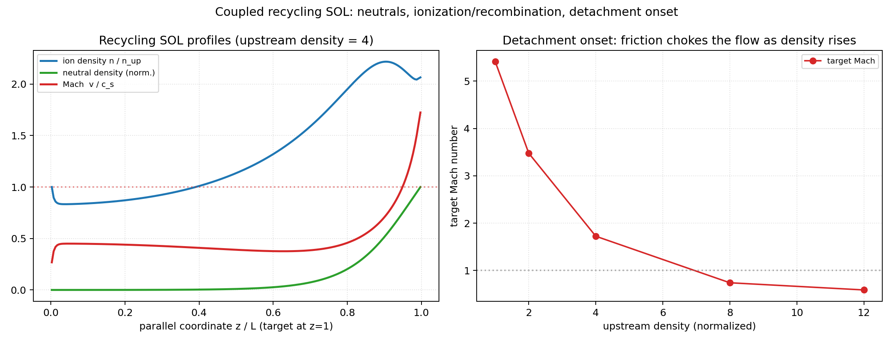

# Neutrals and Recycling

`drbx` couples a hydrogenic plasma to a recycled neutral gas through the
hermes-3 atomic reaction model, implemented natively in JAX (differentiable,
self-contained). The physics is exercised on a 1D scrape-off-layer flux tube and,
as source terms, on the 3D flux-coordinate-independent (FCI) geometries -- closed
and open field lines.



## Atomic reactions ([`drbx.native.neutrals`](../src/drbx/native/neutrals/atomic_rates.py))

Ionization and recombination rate coefficients `<sigma v>(Te, ne)` come from the
packaged AMJUEL double-polynomial fits; charge exchange uses the AMJUEL H.2 3.1.8
polynomial `<sigma v>(Teff)`. The coefficient tables ship with the package
(`drbx.data.atomic_rates`), so there is no external-database dependency. The
rates are physically correct -- ionization rises steeply through 3-30 eV,
**recombination rises as the plasma cools** (the detachment driver), and charge
exchange grows with the collision energy -- and every routine is
`jit`/`grad`/`vmap` transparent. The hydrogen fits (H.4/H.10 2.1.5 and 2.1.8,
H.2 3.1.8) are pinned to the AMJUEL report version of January 13, 2020; the
2011 version differs by up to ~5% in recombination. Inputs are clamped to
0.1-1e4 eV and 1e14-1e22 m^-3.

[`compute_hydrogen_reaction_sources`](../src/drbx/native/neutrals/reactions.py)
assembles the plasma <-> neutral source channels following the hermes-3 closure:
Galilean-invariant particle and momentum transfer (each transfer carries the
source species' `m V` and `1.5 T`), a charge-exchange frictional heating
`0.5 m R dV^2`, and the electron ionization-cost / recombination-radiation channel
from the AMJUEL energy-loss fits. The ion and neutral particle and momentum
sources cancel exactly.

## 1D recycling SOL ([`recycling_sol_model`](../src/drbx/native/neutrals/recycling_sol_model.py))

The coupled 1D model transports the plasma to the target on a prescribed
hot-upstream / cold-target temperature profile (the imposed-temperature closure,
which sidesteps the stiff self-consistent conduction/radiation balance), with a
neutral that is recycled from the Bohm ion flux at the target, transported by
parallel diffusion (solved implicitly with a solvax tridiagonal solve so the
parabolic term is unconditionally stable), and ionized/recombined back into the
plasma (operator-split, per-cell implicit against the stiff ionization source).
The charge-exchange + recombination momentum friction drags the flow toward the
neutrals.

The figure shows the result: neutrals recycled at the target build a **cushion**
there, ionization feeds the plasma, and -- crucially -- as the upstream density
rises the friction **chokes the parallel flow**, so the target Mach number falls
toward and below 1 (right panel): the onset of detachment. The gate
[`tests/test_native_recycling_sol.py`](../tests/test_native_recycling_sol.py)
pins stability, the ionization/recombination spatial structure, the neutral
cushion, the detachment-onset Mach trend, and differentiability.

## Neutrals on 3D FCI field lines

Because the reactions act on any field shape and the FCI sheath closure acts on
the traced target endpoints, the coupling carries over to the 3D FCI geometries.
[`tests/test_fci_neutrals_3d.py`](../tests/test_fci_neutrals_3d.py) checks that on
the genuinely non-axisymmetric **closed** rotating ellipse the reaction sources
conserve particles and momentum cell-by-cell and integrate to zero over the
metric-Jacobian-weighted volume, and that on the **open** slab the Bohm-sheath
recycling turns the target ion flux into a neutral source matching the recycled
accounting (residuals ~1e-16), landing only on the two open target planes.

## SD1D-matched detachment model (B6)

[`detachment_sol_model`](../src/drbx/native/neutrals/detachment_sol_model.py)
reproduces SD1D (Dudson et al., *PPCF* 61, 065008 (2019); source commit
e4417531) term by term for the hydrogen-only, fixed-ionisation-cost
configuration: density, momentum and pressure (`P = 2NT`, `Te = Ti`) for the
plasma; density, momentum and pressure for the neutrals; SD1D's flux-split
MinMod advection, area-weighted finite volumes on the stretched grid, upwinded
Spitzer conduction with no flux limiter, SD1D's own hydrogen rate fits
(`UpdatedRadiatedPower`: Janev ionisation, AMJUEL-form recombination with
radiative and three-body terms, CX at 10 eV) integrated with SD1D's Simpson rule,
neutral diffusion `dneut vth^2/(nu_cx + nu_iz + nu_nn)` with the 0.1 m
mean-free-path cap and 0.5 eV floor, the sheath outflow `max(c_s, V)` with
linearly extrapolated density and pressure and no conduction through the target
face (so `gamma = 6` is the total energy flux), recycling of the actual target
flux at 3.5 eV, and the upstream particle/power sources over the first 10 m. The
module docstring is the equation ledger. SD1D's PI density controller is
replaced, at steady state, by its fixed point: the constraint `N_0 = n_up` with
the source amplitude as an extra unknown.

The steady state is found by pseudo-transient continuation (backward-Euler
steps solved by Newton with the exact Jacobian, assembled from 30 colored
forward-mode products in 2-cell block-tridiagonal form and bordered by the
source/constraint pair). The run reports the scaled steady residual
`max_v ||dU_v/dt|| tau / ||U_v||` (`tau` = sound transit time), typically
1e-10 to 1e-8; an 800-cell solve takes about 3 s warm-started and 20 s cold on
a laptop CPU.


**What is verified** (`tests/test_native_detachment_sol.py`; slow tests marked):

| check | result |
|---|---|
| SD1D's own 2e19 final state in this module's residual | 0.05, vs 30-2000 with one ingredient changed (Eiz 30 eV, no CX, frecycle 0.98, dneut 5) |
| SD1D 13.6eV scan, 18 steady points 1.7-7.0e19, 800 cells | T_t within 0.35%, Gamma_t A_t within 0.15% (tolerance 1%) |
| profiles at 2e19 and 5e19 (800 cells) | N, T within 5e-4; Mach within 1.2e-3; Nn within 2.3e-3 where Nn > 1e-3 of its peak |
| steady particle and power ledgers | close to 1e-8 or better, machine precision at residual < 1e-9 (source + net ionisation = target flux; input = target advected power + radiation + transfer to neutrals + compression work) |
| implicit gradient of T_t and Gamma_t A_t w.r.t. n_up and power | jacfwd = grad; central differences converge at second order to 3e-6 |

The scan does **not** roll over: with hydrogen only and a 13.6 eV ionisation
cost the target cools from 29 eV to 3.4 eV while the flux keeps rising. SD1D's
rollover needs the impurity radiation and excitation of the paper's baseline,
which this module does not include. SD1D's 7.5e19 restart is not a steady
state (no PI integral saved, residual ~100x the others); there DRBX gives
3.43 eV against SD1D's 3.13 eV.

**Grid convergence** (SD1D's nonuniform grid, last-cell values):

| n_up | T_t (100/200/400/800/1600 cells) | 800 vs 1600 | observed order (400-800-1600) |
|---|---|---|---|
| 2.0e19 | 15.50 / 18.74 / 20.25 / 21.30 / 21.96 eV | 3.0% | 0.7 |
| 4.0e19 | 5.04 / 5.65 / 5.94 / 6.20 / 6.39 eV | 2.9% | 0.45 |
| 7.0e19 | 3.17 / 3.43 / 3.53 / 3.62 / 3.69 eV | 2.1% | 0.1 |

Gamma_t A_t changes 2.3-4.0% from 800 to 1600 cells. The last-cell quantities
converge slowly because the flow accelerates to the sound speed at the target
face and the last cell shrinks with resolution (last-cell Mach 0.77 -> 0.85 at
2e19). The 800-cell numbers therefore match SD1D's 800-cell runs, not a
grid-converged limit; SD1D's published values carry the same few-percent
resolution dependence. Upstream temperature changes by 0.2%.

## Gradient-based detachment control

The sensitivity of the steady target temperature to the upstream density
(or power) comes from the implicit-function theorem at the converged state
(`detachment_target_outputs`, `jax.custom_jvp` + `lax.custom_linear_solve`
with the transposed block solve; call outside `jit`). The example finds the
upstream density that gives a requested target temperature with Newton steps
on `ln T_t` (four solves from 2e19 to 10.000 eV on 200 cells) and checks the
derivative against a central difference (3e-5):


The gate [`tests/test_detachment_control.py`](../tests/test_detachment_control.py)
checks that one Newton step with the implicit derivative lands within 1% of a
requested temperature. Reproduce with `examples/autodiff/detachment_control.py`.

## Reproduce

The examples are flat scripts with their knobs as top-of-file constants. The
B6 script prints, per density, the Newton iterations, the steady residual, the
SD1D comparison, and the particle/power ledger closures.

```bash
PYTHONPATH=src python examples/sol/recycling_sol.py
PYTHONPATH=src python examples/benchmarks/b6_detachment_sd1d.py
pytest -q tests/test_native_atomic_rates.py tests/test_native_reactions.py \
          tests/test_native_recycling_sol.py tests/test_fci_neutrals_3d.py \
          tests/test_native_detachment_sol.py
pytest -q -m slow tests/test_native_detachment_sol.py   # SD1D scan, profiles, grid convergence
```
