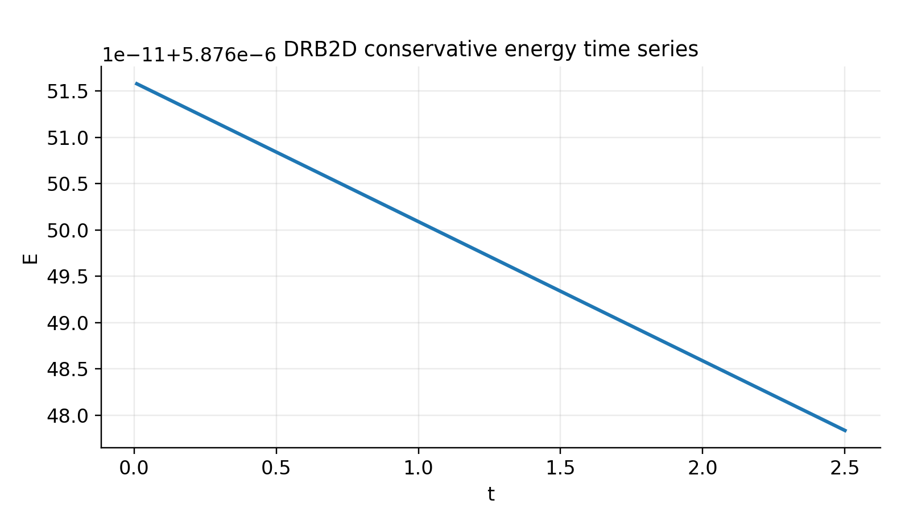

# Conservative nonlinear DRB (preparation)

This page describes ongoing preparation steps to evolve `jaxdrb` toward **nonlinear**, **conservative**
drift-reduced Braginskii (DRB) simulations.

The key motivation is that standard drift-reduced formulations commonly used in SOL turbulence codes can
lose exact conservation properties at the order at which polarisation effects enter, unless the implicit
polarisation relation is handled carefully.

## Primary reference

- B. De Lucca et al., *Conservative formulation of the drift-reduced fluid plasma model* (2026),
  arXiv: [`2601.05704`](https://arxiv.org/abs/2601.05704).

The paper constructs a conservative formulation by **analytically inverting** the implicit relation
that defines the polarisation velocity in terms of the time derivative of the electric field, and shows
exact conservation laws (energy, mass, charge, momentum) in arbitrary magnetic geometry (including EM).

## What exists today in `jaxdrb`

`jaxdrb` currently includes:

- robust matrix-free linear solvers and geometry abstraction for linear stability analysis,
- nonlinear HW2D as a fast testbed for numerical kernels and end-to-end differentiability,
- MPSE/sheath boundary-condition infrastructure for open field lines in the **linear** model,
- optional neutral interactions (minimal milestone model).

Nonlinear conservative DRB is **not yet implemented**; the HW2D milestone and the conservative utilities
in `src/jaxdrb/nonlinear/conservative/` exist to make the transition more systematic.

As a concrete bridge, `jaxdrb` now includes a **field-line cold-ion DRB conservative gate** for the
periodic/no-source subset, with both finite-time and instantaneous operator checks:

- energy functional and invariant diagnostics:
  - [`src/jaxdrb/models/invariants.py`](https://github.com/uwplasma/jax_drb/blob/main/src/jaxdrb/models/invariants.py)
- hard tests:
  - [`tests/test_drb_nonlinear_conservative_gate.py`](https://github.com/uwplasma/jax_drb/blob/main/tests/test_drb_nonlinear_conservative_gate.py)
  - [`tests/test_drb_operator_rates.py`](https://github.com/uwplasma/jax_drb/blob/main/tests/test_drb_operator_rates.py)
- reproducible verification example:
  - [`examples/10_verification/drb_cold_ion_conservative_gate.py`](https://github.com/uwplasma/jax_drb/blob/main/examples/10_verification/drb_cold_ion_conservative_gate.py)
  - [`examples/10_verification/drb_cold_ion_operator_gate.py`](https://github.com/uwplasma/jax_drb/blob/main/examples/10_verification/drb_cold_ion_operator_gate.py)
  - [`examples/10_verification/drb_operator_split_diagnostics.py`](https://github.com/uwplasma/jax_drb/blob/main/examples/10_verification/drb_operator_split_diagnostics.py)
- hard CI benchmark gate:
  - [`benchmarks/check_drb_conservative_gate.py`](https://github.com/uwplasma/jax_drb/blob/main/benchmarks/check_drb_conservative_gate.py)

## Figures and diagnostics (current implementation)

The conservative gate now produces three canonical figures that are used in both documentation
and CI-facing validation:

1. **Finite-time invariant drifts** from a periodic conservative subset (energy, mass, charge,
   parallel current, momentum). These should remain at roundoff-level for the conservative subset.
2. **Operator-level residuals** measured directly from `dy = rhs_nonlinear(y)` on random states
   and multiple `k_y`, enforcing that *instantaneous* invariant rates are small.
3. **Operator split diagnostics** to verify conservative/source/dissipative decomposition and
   show the relative magnitude of each component across `k_y`.


## DRB2D conservative testbed (new)

A minimal 2D nonlinear DRB testbed is now included to validate conservative operators in a
fully nonlinear setting while keeping the domain periodic and the numerics lightweight.
This is the next step beyond HW2D and uses the same conservative Arakawa bracket in the
perpendicular plane.

Key properties:

- 5-field DRB state: `(n, omega, vpar_e, vpar_i, Te)`
- ExB nonlinearity via Arakawa bracket (periodic x/y)
- Optional parallel coupling via constant `kpar` (off for conservative gate)
- Operator split toggles (`operator_split_on`, `operator_conservative_on`, etc.)

Example:

```bash
python examples/08_nonlinear_drb2d/drb2d_conservative_gate.py
```



### DRB2D energy budget with curvature + drives

The DRB2D testbed also includes a full energy-budget diagnostic with curvature and
background-gradient drives enabled. This provides a quantitative closure check
(`dE/dt` from finite differences vs. the RHS budget), and it is enforced in tests.

Example:

```bash
python examples/08_nonlinear_drb2d/drb2d_energy_budget.py
```


## What “conservative nonlinear DRB” requires

### 1) A discrete energy functional and a budget diagnostic

For any candidate nonlinear DRB formulation, we need:

- a precise discrete energy functional $E(y)$ matching the continuous conservation statement,
- a budget tool to compute $\dot E$ from the discrete RHS term-by-term,
- tests that demonstrate conservation in the appropriate limits (periodic, no sources/sinks, etc.).

This is why HW2D includes an explicit budget diagnostic (`HW2DModel.energy_budget`) and why conservation
checks are centralized in `src/jaxdrb/nonlinear/conservative/checks.py`.

For the cold-ion field-line branch, `jaxdrb` now also checks **operator residuals** directly from
`dy = rhs_nonlinear(y)`:

$$
\dot E = \Re\left\langle
n^*\,\dot n
-\phi^*\,\dot\Omega
+\hat m_e v_{\parallel e}^*\,\dot v_{\parallel e}
+v_{\parallel i}^*\,\dot v_{\parallel i}
+\frac{3}{2}\alpha_{Te}\,T_e^*\,\dot T_e
\right\rangle,
$$

with companion checks on $\frac{d}{dt}\langle n\rangle$, $\frac{d}{dt}\langle\Omega\rangle$,
$\frac{d}{dt}\langle j_\parallel\rangle$, and
$\frac{d}{dt}\langle v_{\parallel i}+\hat m_e v_{\parallel e}\rangle$.

The cold-ion branch now also exposes explicit split terms in code:
$$
\partial_t Y = \mathcal{R}_{\mathrm{cons}} + \mathcal{R}_{\mathrm{src}} + \mathcal{R}_{\mathrm{diss}},
$$
via `rhs_nonlinear_decomposed(...)` and the split toggles in `DRBParams`.

### DRB2D curvature and drive terms

The DRB2D testbed now includes a simple slab curvature operator and background-gradient drives:

- Curvature operator:  $C(f) = -\omega_c\,\partial_y f$
- Density/vorticity:  $\partial_t n \leftarrow \partial_t n + C(p) - C(\phi)$,
  $\partial_t \Omega \leftarrow \partial_t \Omega + C(p)$
- Temperature: $\partial_t T_e \leftarrow \partial_t T_e + \tfrac{2}{3} C(\tfrac{7}{2}T_e + n - \phi)$

These terms match the structure of the field-line DRB model in slab curvature limits and provide
an interchange-like drive in 2D. They are exposed in `DRB2DParams` via `curvature_on` and
`curvature_coeff`.

Example (linear-phase benchmark):

```bash
python examples/08_nonlinear_drb2d/drb2d_linear_phase_benchmark.py
```


### 2) A conservation-respecting discretization (perpendicular + parallel)

Perpendicular (in $(x,y)$ / $(\psi,\\alpha)$):

- For Poisson brackets / $E\\times B$ advection, Arakawa-style conservative Jacobians are a strong default on
  structured grids, and are already used in HW2D.
- For higher-order methods, an energy/enstrophy-preserving discretization should be maintained (e.g. compatible
  finite-difference/SBP operators or a conservative DG formulation).

Parallel (along $l$):

- For open-field-line SOL physics, parallel boundary conditions and sheath closures make the system stiff.
- A stable, differentiable discretization benefits from SBP-like finite differences or DG with a stable numerical
  flux, together with an IMEX or semi-implicit time integrator.

### 3) Implicit / semi-implicit solves in JAX (stiffness)

Nonlinear SOL DRB typically has stiffness from:

- parallel conduction and resistivity,
- sheath losses and boundary closures,
- (eventual) electromagnetic coupling.

To remain fast and differentiable in JAX, we prefer:

- matrix-free Krylov solvers (`jax.scipy.sparse.linalg.cg` / custom GMRES) with JAX-friendly preconditioners,
- IMEX time integrators (explicit nonlinear advection + implicit stiff linear terms),
- careful control of allocations (scan-based stepping, static shapes, `vmap` for parameter scans).

## Next nonlinear milestone (proposed)

The lowest-risk path is:

1. **Nonlinear periodic slab DRB (no sheath)**: add nonlinear $E\\times B$ advection terms to the existing
   reduced equations and verify conservation and known turbulence diagnostics in periodic settings.
2. **Introduce open-field-line parallel direction** (3D flux-tube) with sheath BCs in a controlled way, keeping
   the perpendicular discretization conservative.
3. **Adopt the conservative polarisation formulation** (De Lucca et al. 2026) and verify energy conservation with
   dedicated tests.

These steps allow progressively stronger validation before adding the full complexity of SOL boundaries, sources,
and multi-physics closures.
