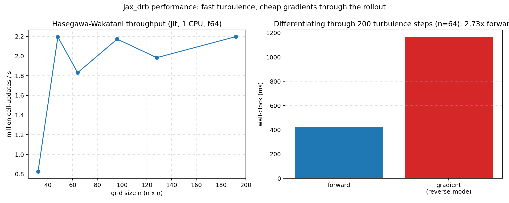
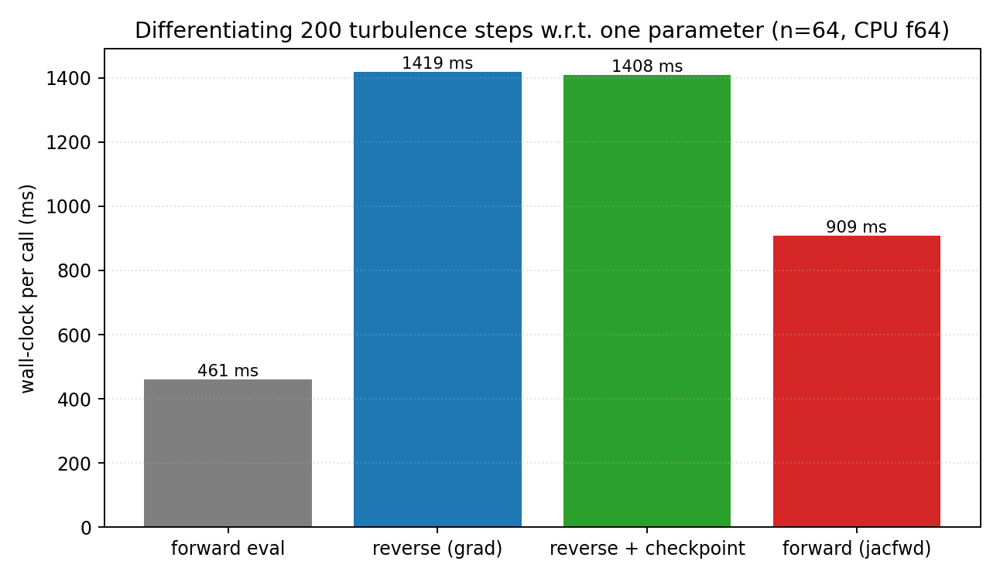
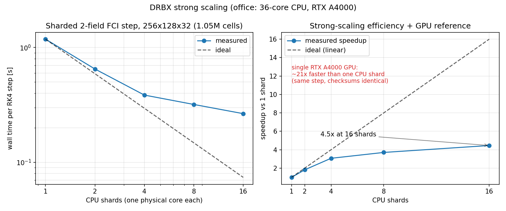

# Performance And Differentiability

!!! note "Plan authority"
    This page explains current performance and differentiability evidence. The
    active execution plan is [`plan_dkx.md`](../plan_dkx.md) at the
    repository root. If this page conflicts with that plan, follow the plan and
    update this page afterward.

This page records the current fast paths, the current differentiable paths, and
the reproducible profiling workflow.

## Measured Turbulence Performance

The core closed-field-line drift-wave turbulence model (Hasegawa-Wakatani,
FFT-spectral RK4) is `jit`-compiled and differentiable end-to-end. Two measured
numbers quantify the "fast and differentiable" claim:



- **Throughput** is roughly grid-size-independent at about **2 million
  cell-updates per second** on a single CPU in float64 (each step is a dealiased
  spectral Poisson bracket); it rises substantially on GPU and in float32.
- **Differentiating *through* the turbulence is cheap.** One reverse-mode
  gradient of a diagnostic of the evolved state with respect to the
  transport-drive parameter — taken through the *entire* multi-step rollout —
  costs only about **2.7x a single forward evaluation** (here, 200 steps at
  `n = 64`), the expected small constant factor of reverse-mode autodiff rather
  than a cost that grows with the number of steps.

Regenerate with

```bash
PYTHONPATH=src python examples/benchmarks/performance_benchmark.py
```

Absolute timings depend on the host; the scalings do not.

## Choosing a Differentiation Method

The same gradient can be computed several ways, and the choice changes cost,
never the answer (gated to machine agreement in
`tests/test_autodiff_methods.py`). Measured on 200 turbulence steps at `n = 64`
(one scalar parameter, CPU f64):



- **Forward mode** (`jax.jacfwd`) is the most efficient for a *few* parameters:
  one tangent rides along the rollout — no reverse sweep, no stored trajectory —
  costing about **2x a forward evaluation** (vs ~3.1x for reverse mode here).
- **Reverse mode** (`jax.grad`) wins when differentiating with respect to
  *many* parameters at once (fields, geometry): one backward sweep covers them
  all, at the cost of storing the trajectory.
- **Checkpointed reverse** (`jax.grad` + `jax.checkpoint` on the step) trades a
  modest recompute for bounded memory — the fix when a long reverse rollout is
  memory-bound.

Rule of thumb: `jacfwd` for O(1-10) scalars, `grad` for parameter fields,
add `jax.checkpoint` when reverse mode runs out of memory. Reproduce with

```bash
PYTHONPATH=src python examples/autodiff/differentiation_methods.py
```

## Multi-Device Strong Scaling

The FCI drift-reduced two-field step runs across multiple devices with
`shard_map`. The domain is decomposed into shards, each device owns a block of
cells plus a halo, and the halo is exchanged every step. The sharded RK4 step is
**bit-exact** against the single-device step — `tests/test_fci_sharded_2field.py`
checks a single-device sharded run and a forced four-device run
(`XLA_FLAGS=--xla_force_host_platform_device_count=4`) both reproduce the direct
step to ~1e-16 — so sharding changes only *where* the work runs, not the result.

The strong-scaling driver is
[`examples/benchmarks/fci_sharded_strong_scaling.py`](../examples/benchmarks/fci_sharded_strong_scaling.py).
It sweeps device counts by re-invoking itself once per count (the XLA host device
count must be set before JAX imports) and, on Linux, binds one physical core per
shard with `taskset` — the crucial detail: without core-binding a single-device
CPU program already spreads across all cores via XLA intra-op threading, so the
domain decomposition looks like it does nothing. On a 36-core Linux host with
core-binding, a 1.05M-cell (`256 x 128 x 32`) two-field step scales as
**1.75x at 2 shards, 3.22x at 4 (about 81% efficiency), 4.35x at 8, and 7.4x
at 16**.



The same 1.05M-cell step on one NVIDIA RTX A4000 GPU runs about **96x faster
than a single CPU shard** — the whole-step comparison, not a kernel
microbenchmark. Running across the *two* A4000s on the office host currently
trips a cross-device gather bug in the sharded step's halo path; the 2-GPU
configuration is under investigation and is not a supported claim yet
(status as of 2026-07).

```bash
PYTHONPATH=src python examples/benchmarks/fci_sharded_strong_scaling.py
```

The demo writes its artifacts as `scaling_<platform>.json` and
`scaling_<platform>.png` (one pair per host/platform), so CPU and GPU sweeps
from different machines can coexist in the same output directory.

!!! note "Host requirement"
    Meaningful strong-scaling numbers need a Linux host with `taskset` and at
    least as many physical cores as the maximum shard count. On macOS (no
    `taskset`) the demo still runs and verifies the cross-shard checksums, but
    the wall times are threading-limited, not a true scaling curve.

## Current Fast Native Lanes

The strongest current native paths are the compact JAX-native field updates that
stay inside `jax.numpy` kernels with lightweight analysis/output:

- anomalous diffusion (matrix-exponential propagator);
- electrostatic vorticity;
- Hasegawa-Wakatani drift-wave turbulence (pseudo-spectral);
- the reduced FCI operator and selected-field 3-D geometry kernels.

These are the best lanes for:

- performance measurements;
- precision studies;
- restart demonstrations;
- differentiable optimization loops.

## Current End-To-End Differentiable Lanes

The intended end-to-end differentiable lane is:

- TOML deck or Python driver;
- native JAX field evolution;
- portable array payload;
- JAX-side objective or analysis functional.

The compact diffusion and vorticity kernels, the Hasegawa-Wakatani flagship, and
the differentiable FCI drift-reduced RHS (`native/fci_drb_rhs.py`) are the best
starting points today because they stay fully inside JAX.

The diffusion lane has committed focused differentiable examples:

- sensitivity analysis: [examples/autodiff_diffusion_sensitivity.py](../examples/autodiff_diffusion_sensitivity.py)
- inverse design: [examples/autodiff_diffusion_inverse_design.py](../examples/autodiff_diffusion_inverse_design.py)
- fixed-workload CPU/GPU scaling: [examples/strong_scaling_diffusion.py](../examples/strong_scaling_diffusion.py)

The current artifact bundle is documented in
[autodiff_and_scaling_examples.md](autodiff_and_scaling_examples.md).

The Hasegawa-Wakatani flagship is differentiable end-to-end, enabling
gradient-based inverse design through turbulence; see
[Drift-Wave Turbulence](drift_wave_turbulence.md). The FCI drift-reduced RHS is
a PyTree that can be passed through `jax.jvp`, checked against finite
differences, and matched under `vmap`, as documented in
[Stellarator FCI Validation](stellarator_fci_validation.md).

## Current Differentiable Example Results

On the committed diffusion examples:

- autodiff and finite-difference gradients match closely on the compact
  four-parameter sensitivity study;
- first-order autodiff uncertainty propagation agrees with the vectorized
  Monte Carlo comparison on the compact field and scalar quantities of interest;
- the inverse-design example reduces the objective from about `2.95e-3` to about
  `5.52e-5`;
- the compact differentiable fixed-workload scaling artifact shows modest local
  CPU scaling on a MacBook: about `1.08x` from `1 -> 2` and `1.10x` from
  `1 -> 4` in process-group mode, and about `1.07x` and `1.08x` in host-device
  CPU `pmap` mode.

Those scaling numbers are intentionally framed narrowly: the compact diffusion
curve is a differentiability and execution-mode check, not a headline
performance claim, and it is measured on a differentiable objective rather than
only on a forward solve.

## What The Current Profiling Already Says

The committed profiling and runtime bundles already answer the first practical
performance questions:

- avoid tiny per-field JIT dispatches on the reduced 3-D kernels;
- batch same-shape selected fields before entering the jitted kernel;
- warm once before timing;
- keep solver/case metadata out of static JIT arguments;
- keep file I/O, plotting, and JSON serialization outside hot kernels.

They also answer the first CPU-parallelism question:

- the default JAX CPU runtime appears as one CPU device and relies on XLA's
  internal CPU threading;
- explicit host-device CPU parallelism is possible by setting
  `DKX_HOST_DEVICE_COUNT=N` before importing `dkx` or `jax`;
- on the committed differentiable diffusion scaling surface the local
  process-group mode is slightly stronger than the host-device `pmap` mode on
  this MacBook, but both are modest;
- CPU parallelization is real and usable here, but it should be treated as a
  bounded strong-scaling tool, not as an automatic replacement for accelerator
  execution.

### Parallelization Model

There are three distinct execution modes worth separating:

- default CPU execution: one JAX CPU device with XLA-managed internal threading;
- explicit host-device CPU execution: multiple CPU devices exposed with
  `DKX_HOST_DEVICE_COUNT=N`, then mapped with `pmap` or equivalent
  device-parallel transforms;
- process-group CPU execution: multiple Python workers with one JAX CPU device
  each.

The committed diffusion scaling artifact measures the last two explicitly, with
the modest results quoted above.

## Current GPU Status

The reachable `office` machine exposes two CUDA-visible JAX devices
(`RTX A4000`, `cuda:0` and `cuda:1`) with `jax[cuda12]`. Status as of 2026-07:

- **single GPU**: the 1.05M-cell sharded two-field step runs about **96x
  faster on one A4000 than on a single core-bound CPU shard** (the
  whole-RK4-step measurement from
  `examples/benchmarks/fci_sharded_strong_scaling.py`);
- **two GPUs**: the 2-device sharded run currently fails in a cross-device
  gather inside the halo-exchange path; this bug is under investigation, so
  no 2-GPU scaling number is claimed;
- earlier small-kernel measurements (compact reduced lanes, ~1e-4 s warm
  executes) remain valid but are microbenchmarks, not whole-code claims.

## Reproducible Profiling Workflow

The supported profiling entry point for the reduced FCI/geometry lanes is
[scripts/profile_stellarator_drb_pytree.py](../scripts/profile_stellarator_drb_pytree.py),
which can collect `cProfile` output, JAX TensorBoard / Perfetto traces,
device-memory profiles, persistent compilation-cache runs, and XLA dump trees.
The workflow and recommended cases are documented in
[profiling_runtime.md](profiling_runtime.md).

## 4-Field Step: Fast Path, Whole-Step JIT, Coarse LU (2026-07-17)

Profiling the 4-field interchange RK4 step on the rotating ellipse at
`(24, 32, 8)`, single CPU, found the old eager default costing **1.200 s per
step**, of which roughly half was host-synced convergence checking in the
perpendicular-Laplacian phi solver: the diagnostic path recomputes the true
residual after each GMRES solve and converts residual norms and iteration
counts to Python floats — about **490 device transfers per 4 steps** (one
batch per RK4 stage). Three changes landed in response, bringing the same
step to **0.623 s per step (1.9x)**, with all 26
operator/turbulence/MMS/blob/sharded gates passing:

- **phi-solver fast path**: constructing `PerpLaplacianInverseSolver` with
  `check_residual=False` and calling it without `return_diagnostics`
  dispatches a jitted phi-only solve — no diagnostic matvecs, no residual
  floats, no host syncs — making the solver safe to call from inside
  `jit`-compiled stepping code. The diagnostic path is unchanged and remains
  the default for validation harnesses.
- **whole-step JIT**: the entire RK4 step — all four RHS evaluations,
  including their GMRES phi inversions — now compiles as **one jit program**
  in `dkx.native.stellarator_turbulence.run_stellarator_turbulence`
  (a one-time compile of about 9 s, then no per-stage Python dispatch).
  Supporting this, `compute_2field_rhs` / `compute_4field_*` now return
  `timings=None` by default (sync-free, jittable); passing
  `with_diagnostics=True` restores the host-synced stage-timings and
  phi-diagnostics payload the validation harnesses use.
- **honored GMRES tolerance**: the phi solve now honors the requested
  `phi_inversion_tol` — it was previously hardcoded to `rtol=atol=1e-6`,
  silently over-solving every stage for models that asked for a looser
  tolerance. Solvers constructed with the default `tol=1e-6` are unchanged.

Additionally, `build_perp_laplacian_mg_hierarchy` now LU-factorizes the
coarsest-level dense operator once at build time
(`jax.scipy.linalg.lu_factor`, coarse systems up to 512 cells), so each
V-cycle does a triangular solve instead of relying on coarse smoothing
sweeps (see [Solvers and Design Decisions](solvers_and_design.md)).

## JAX Ecosystem Usage

- `solvax` carries every structured solve: the FCI perpendicular-Laplacian
  inversion (`solvax.gmres`, restarted flexible GMRES over the matrix-free
  conservative operator — it replaced the earlier `lineax` backend on
  2026-07-17 and measured ~1.8x faster per turbulence step), plus the
  Fourier–Helmholtz and tridiagonal solves.
- `equinox` and `diffrax` are still not used by any promoted kernel; they
  remain future options, not active dependencies.

## Guidance For Users

If you need:

- the cleanest standalone runtime workflow:
  start from [restartable_diffusion_tutorial.md](restartable_diffusion_tutorial.md);
- compact high-quality figures and movies:
  use [validation_gallery.md](validation_gallery.md);
- the best current base for differentiable research code:
  start from the compact native-exact diffusion and vorticity lanes, the
  Hasegawa-Wakatani flagship, or the differentiable FCI drift-reduced RHS.

## Recommended Next Refactors

- keep expressing new physics directly on fixed-layout JAX-native arrays so the
  linearized residual does not need to reconstruct full guard-cell fields for
  each transform;
- fuse small same-shape analysis reductions where they currently enter JAX one
  field at a time;
- use more `vmap`-style batching where case structure is already homogeneous;
- keep plotting, output writing, and CLI serialization as boundary code rather
  than inside hot kernels;
- only widen `equinox`/`diffrax` usage where it removes a measured bottleneck.
