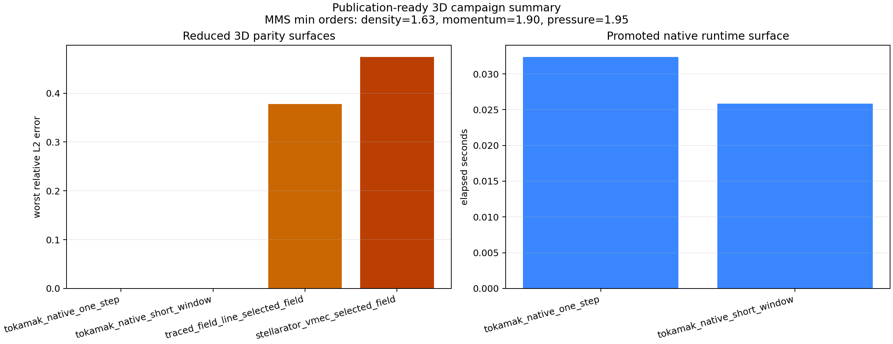

# Publication-Ready 3D Campaign

This page assembles the current reviewer-facing 3D evidence into one reproducible
bundle. It does not widen the claim boundary. It summarizes the promoted native
tokamak reduced rungs, the explicit external-pair non-tokamak parity gates, and
the current manufactured-solution convergence evidence that supports the
publication story.

Run it with:

```bash
PYTHONPATH=src .venv/bin/python examples/publication/three_d_campaign_demo.py \
  --output-root docs/data/publication_ready_3d_artifacts
```

The package writes:

- `docs/data/publication_ready_3d_artifacts/data/publication_ready_3d_campaign.json`
- `docs/data/publication_ready_3d_artifacts/images/publication_ready_3d_campaign.png`

The summary JSON reports:

- reduced-lane parity summaries for the native tokamak one-step and short-window rungs;
- reduced-lane parity summaries for the traced-field-line and stellarator explicit external-pair gates;
- minimum observed manufactured-solution orders from the committed 1D fluid convergence campaign;
- the remaining campaign blockers before a full publication-ready 3D claim.

Current explicit blockers in that report are:

- the first native non-tokamak 3D reduced rung;
- a broader native 3D convergence, scaling, and runtime campaign beyond the
  current reduced tokamak bundle.

Preview:


