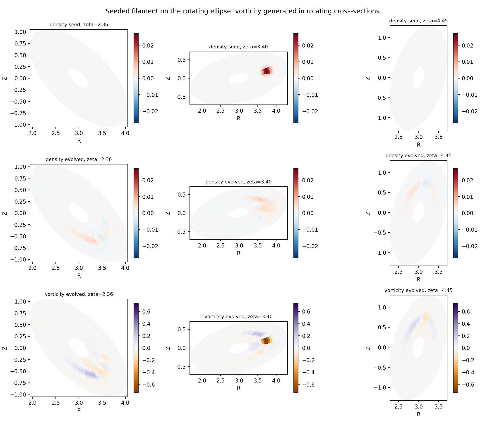

# Rotating-Ellipse FCI

The rotating-ellipse (`l = 2`) stellarator is the canonical minimal
non-axisymmetric magnetic field: a torus whose elliptical cross-section rotates
as it is followed around toroidally, so the metric depends on **all three**
logical coordinates. It is the reference geometry for checking that the
flux-coordinate-independent (FCI) parallel operators are correct on a genuinely
three-dimensional field, and it is the flagship non-axisymmetric benchmark in
`drbx`.


## Geometry

The logical coordinates are `(x, theta, zeta)` with a minor-radius label `x` and
periodic poloidal / toroidal angles. The physical embedding into Cartesian space
is

```
p0  = (1 + delta) * x * cos(theta)
q0  = (1 - delta) * x * sin(theta)
lam = n_field_periods * zeta
p   = cos(lam) * p0 - sin(lam) * q0
q   = sin(lam) * p0 + cos(lam) * q0
R   = r0 + p
X, Y, Z = R cos(zeta), R sin(zeta), q
```

so a surface `x = const` is an ellipse of elongation `(1 + delta) / (1 - delta)`
whose major axis rotates `n_field_periods` times per toroidal turn. The left
panel of the figure shows the nested flux surfaces at four toroidal angles: the
ellipse orientation genuinely turns with `zeta`.

The metric is obtained by **automatic differentiation** of this embedding,
`g_ij = d_i X . d_j X`, rather than by hand. This keeps the construction exact
(the contravariant and covariant metrics are a consistent inverse pair to
machine precision) and differentiable with respect to the shape parameters
themselves — the same autodiff that builds the metric gives the gradient of any
geometric diagnostic with respect to the elongation, which is what makes
stellarator-shape optimization through the FCI stack possible.

The magnetic field is helical on the flux surfaces, `B^x = 0`,
`B^theta = iota * c_phi / J`, `B^zeta = c_phi / J`, so its field lines wind with
rotational transform `iota` and never leave a surface.

The constructor is
[`drbx.geometry.build_rotating_ellipse_geometry`](../src/drbx/geometry/rotating_ellipse.py);
the embedding is exposed separately as `rotating_ellipse_position`.

## What is checked

The gate in
[`tests/test_rotating_ellipse_fci.py`](../tests/test_rotating_ellipse_fci.py)
pins:

- **Non-axisymmetry and metric consistency** — the covariant metric varies along
  the toroidal axis (an axisymmetric geometry would be constant in `zeta`), the
  contravariant/covariant pair inverts to the identity to better than `1e-10`,
  and the Jacobian stays positive.
- **Second-order parallel-gradient convergence** — with a manufactured field, the
  FCI parallel gradient converges at order 2 on the rotating-ellipse metric, both
  for the direct `b^i d_i f` operator and for the traced-field-line operator
  `grad_parallel_op_fci`, which follows the field lines between toroidal planes
  (the FCI-specific path). The right panel of the figure shows both tracking the
  slope-`-2` reference line.
- **Shape differentiability** — `jax.grad` of a metric diagnostic with respect to
  the ellipse elongation matches a central finite difference.

The rotating ellipse is a standard FCI convergence test case (see Stegmeir et
al., *Comput. Phys. Commun.* 198, 139 (2016), the GRILLIX field-line-map
approach).

## Seeded-filament dynamics

Beyond the linear operator gate, the four-field drift-reduced FCI model (density,
vorticity, ion/electron parallel velocity) runs a seeded filament on this
geometry. A localized density blob is initialised with no vorticity; the
curvature drive then generates vorticity from the pressure blob -- the
interchange mechanism that moves a filament -- and because the flux surfaces
rotate with the toroidal angle, the filament evolves differently in each
toroidal plane.



The figure shows, in physical `(R, Z)` cross-sections at three toroidal angles
(each a differently oriented ellipse), the seeded density blob, the evolved
density, and the evolved vorticity: a clear interchange dipole develops, oriented
with the local rotated cross-section. The gate
[`tests/test_rotating_ellipse_filament.py`](../tests/test_rotating_ellipse_filament.py)
pins that the run stays finite, the density stays positive and bounded, and both
vorticity and a parallel ion flow are generated from the seed. Regenerate the
figure with

```bash
PYTHONPATH=src python examples/stellarator/rotating_ellipse_filament.py
```

## Reproduce

```bash
PYTHONPATH=src python examples/stellarator/rotating_ellipse_fci.py
```

writes `output/rotating_ellipse_fci/` with the two-panel figure (rotating flux
surfaces + parallel-operator convergence) and a JSON summary. Run the gate with

```bash
pytest -q tests/test_rotating_ellipse_fci.py
```
