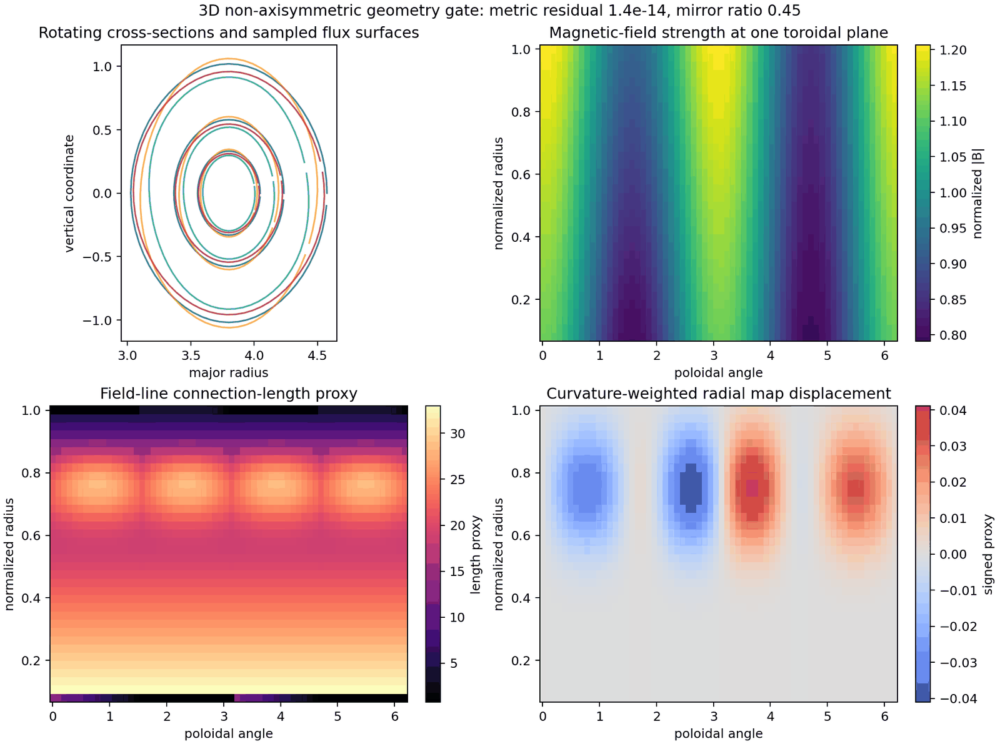
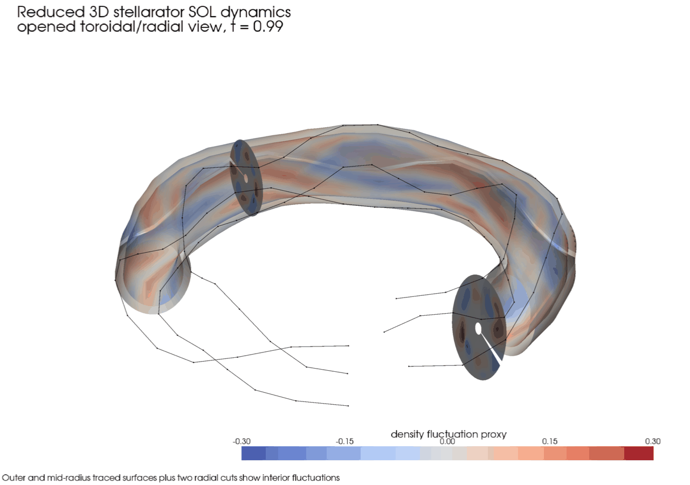

# Stellarator Examples, Equations, and Literature Links

This page is the user-facing guide for the 3D stellarator examples in
`examples/geometry-3D/stellarator-fci/`. The examples are intentionally written
like SIMSOPT driver scripts: constants are defined near the top, reusable
objects are imported from `drbx`, and the script runs from top to bottom.
This mirrors the workflow described in the
[SIMSOPT overview](https://simsopt.readthedocs.io/v0.18.0/overview.html), where
problems are configured in ordinary Python scripts rather than hidden inside
large input-file front ends. SIMSOPT itself documents the same modular style
for stellarator geometry and Biot-Savart fields in its
[magnetic-field API guide](https://github.com/hiddenSymmetries/simsopt/blob/master/docs/source/fields.rst).

The current examples are small enough to run on a laptop. They are not
device-grade stellarator turbulence predictions; they are educational and
validation-oriented scripts that show the same geometry, field-line-map,
operator, plotting, and artifact APIs used by the regression campaigns.

## Example Map

| Example | Purpose | Main APIs |
| --- | --- | --- |
| [`geometry_plotting.py`](https://github.com/uwplasma/drbx/blob/main/examples/geometry-3D/stellarator-fci/geometry_plotting.py) | Build a deterministic non-axisymmetric geometry, export arrays, and plot surfaces, \(|B|\), connection length, and curvature-weighted FCI displacement. | [`build_synthetic_stellarator_geometry`](https://github.com/uwplasma/drbx/blob/main/src/drbx/geometry/stellarator.py), [`build_stellarator_fci_geometry_report`](https://github.com/uwplasma/drbx/blob/main/src/drbx/validation/stellarator_fci_geometry_campaign.py), [`save_stellarator_fci_geometry_plot`](https://github.com/uwplasma/drbx/blob/main/src/drbx/validation/stellarator_fci_geometry_campaign.py) |
| [`linear_mode.py`](https://github.com/uwplasma/drbx/blob/main/examples/geometry-3D/stellarator-fci/linear_mode.py) | Evolve a single field-aligned mode with linear drive, damping, parallel FCI diffusion, and perpendicular diffusion. | [`laplace_parallel_fci`](https://github.com/uwplasma/drbx/blob/main/src/drbx/native/fci.py), [`laplace_perp_xz`](https://github.com/uwplasma/drbx/blob/main/src/drbx/native/fci.py), [`save_stellarator_sol_snapshot_panel`](https://github.com/uwplasma/drbx/blob/main/src/drbx/validation/stellarator_sol_showcase.py) |
| [`vorticity_bracket.py`](https://github.com/uwplasma/drbx/blob/main/examples/geometry-3D/stellarator-fci/vorticity_bracket.py) | Compose the JAX-native DRB RHS with a vorticity/potential solve and a tested logical \(E\times B\) bracket. | [`compute_fci_drb_rhs`](https://github.com/uwplasma/drbx/blob/main/src/drbx/native/fci_drb_rhs.py), [`logical_exb_bracket_xz`](https://github.com/uwplasma/drbx/blob/main/src/drbx/native/fci.py), [`save_stellarator_sol_diagnostics_panel`](https://github.com/uwplasma/drbx/blob/main/src/drbx/validation/stellarator_sol_showcase.py) |
| [`nonlinear_turbulence.py`](https://github.com/uwplasma/drbx/blob/main/examples/geometry-3D/stellarator-fci/nonlinear_turbulence.py) | Run the compact nonlinear reduced SOL benchmark and write snapshot, diagnostic, 3D poster, and GIF movie artifacts. | [`simulate_reduced_stellarator_sol_dynamics`](https://github.com/uwplasma/drbx/blob/main/src/drbx/validation/stellarator_sol_showcase.py), [`build_stellarator_sol_showcase_report`](https://github.com/uwplasma/drbx/blob/main/src/drbx/validation/stellarator_sol_showcase.py), [`save_stellarator_sol_3d_movie`](https://github.com/uwplasma/drbx/blob/main/src/drbx/validation/stellarator_sol_showcase.py) |
| [`turbulent_profile_analysis.py`](https://github.com/uwplasma/drbx/blob/main/examples/geometry-3D/stellarator-fci/turbulent_profile_analysis.py) | Analyze the nonlinear SOL history with radial fluctuation profiles, RMS intensity, transport-proxy profiles, connection-length weighting, and nonlinear energy traces. | [`build_synthetic_stellarator_geometry`](https://github.com/uwplasma/drbx/blob/main/src/drbx/geometry/stellarator.py), NumPy/Matplotlib postprocessing of the NPZ history written by `nonlinear_turbulence.py` |
| [`validation_campaign.py`](https://github.com/uwplasma/drbx/blob/main/examples/geometry-3D/stellarator-fci/validation_campaign.py) | Regenerate the full promoted stellarator validation package. | Campaign builders in [`drbx.validation`](https://github.com/uwplasma/drbx/blob/main/src/drbx/validation/__init__.py) |

Run an example with:

```bash
PYTHONPATH=src python examples/geometry-3D/stellarator-fci/vorticity_bracket.py
PYTHONPATH=src python examples/geometry-3D/stellarator-fci/nonlinear_turbulence.py
PYTHONPATH=src python examples/geometry-3D/stellarator-fci/turbulent_profile_analysis.py
```

Every script writes arrays and figures under `docs/data/stellarator_fci_example_artifacts/`.

## Expected Output

The examples regenerate lightweight versions of the promoted validation
figures. The publication-quality validation gallery remains release-hosted so
the repository stays small, but the scripts expose the same plotting functions
used to create these artifacts.



- Stellarator reduced SOL diagnostics — release-hosted figure: [`docs__data__stellarator_fci_validation_artifacts__showcase__images__stellarator_sol_showcase_diagnostics.png`](https://github.com/uwplasma/drbx/releases/download/validation-artifacts-2026-04-28/docs__data__stellarator_fci_validation_artifacts__showcase__images__stellarator_sol_showcase_diagnostics.png) (requires repository access)



## Geometry

The analytic validation geometry is constructed in
[`src/drbx/geometry/stellarator.py`](https://github.com/uwplasma/drbx/blob/main/src/drbx/geometry/stellarator.py).
It is a deterministic, five-period, non-axisymmetric shell with rotating
elliptical cross-sections, helical mirror modulation, an island-like FCI map
displacement, a curvature proxy, and a connection-length proxy. In logical
coordinates \(x^1=s\), \(x^2=\phi\), \(x^3=\theta\), the physical position is

```text
r(s, phi, theta) = (R(s, phi, theta) cos(phi),
                    R(s, phi, theta) sin(phi),
                    Z(s, phi, theta)).
```

The metric terms used by the conservative operators are

```text
e_i = partial r / partial x^i,
g_ij = e_i dot e_j,
J = sqrt(det(g_ij)),
g^ij = inverse(g_ij).
```

The geometry campaign checks finite metric entries, \(J>0\), \(|B|>0\), and
\(\max |g^{ik}g_{kj}-\delta^i_j|\) near roundoff. This mirrors the verification
pattern used in recent non-axisymmetric edge-fluid work, where metric tests,
field-line maps, target-aware geometry, and 3D visualization precede turbulence
claims; see the open-access
[GRILLIX stellarator extension paper](https://www.sciencedirect.com/science/article/pii/S0010465525003765).

## Field-Line-Map Operators

The field-line-map layer follows the flux-coordinate-independent idea: the mesh
does not need to be a magnetic-flux coordinate grid, but parallel operators use
forward and backward field-line intersections on neighboring toroidal planes.
The original FCI method is described by Hariri and Ottaviani,
[Computer Physics Communications 184, 2419-2429 (2013)](https://cir.nii.ac.jp/crid/1360299150620318336),
and later X-point applications are discussed in
[Hariri et al., Physics of Plasmas 21, 082509 (2014)](https://doi.org/10.1063/1.4892405).

In `drbx`, the map object is
[`FciMaps`](https://github.com/uwplasma/drbx/blob/main/src/drbx/geometry/fci_maps.py). If \(I\) is bilinear
interpolation in logical \((s,\theta)\), then

```text
f_up(i,j,k) = I[f(:, j+1, :)](x_fwd(i,j,k), z_fwd(i,j,k)),
f_dn(i,j,k) = I[f(:, j-1, :)](x_bwd(i,j,k), z_bwd(i,j,k)).
```

The compact centered operators in
[`src/drbx/native/fci.py`](https://github.com/uwplasma/drbx/blob/main/src/drbx/native/fci.py)
are

```text
grad_parallel(f) = (f_up - f_dn) / (2 Delta phi),
L_parallel(f) = (f_up - 2 f + f_dn) / Delta phi^2.
```

The conservative diffusion form used for neutral and scalar gates is

```text
L_K f = J^{-1} partial_parallel(J K partial_parallel f),
```

implemented by mapped face fluxes and zero-flux treatment when a traced map
hits an open endpoint.

## Linear Mode Example

[`linear_mode.py`](https://github.com/uwplasma/drbx/blob/main/examples/geometry-3D/stellarator-fci/linear_mode.py)
is the smallest way to see a time-dependent stellarator calculation. It
initializes one mode,

```text
n_tilde(s, phi, theta, 0)
  = exp(-((s - s0) / w)^2) cos(m theta - n phi),
```

and advances

```text
partial_t n_tilde
  = chi_parallel L_parallel(n_tilde)
  + chi_perp L_perp(n_tilde)
  + gamma_C C(s, phi, theta) n_tilde
  - gamma_d n_tilde.
```

This is deliberately linear, so the mode energy should evolve smoothly. The
script exports the history as NPZ and uses the same plotting functions as the
nonlinear campaign, allowing users to compare linear growth/decay against the
nonlinear example without changing plotting code.

## Vorticity and Bracket Example

[`vorticity_bracket.py`](https://github.com/uwplasma/drbx/blob/main/examples/geometry-3D/stellarator-fci/vorticity_bracket.py)
is the recommended first script for nonlinear stellarator physics. It builds a
full `FciDrbState`, calls
[`compute_fci_drb_rhs`](https://github.com/uwplasma/drbx/blob/main/src/drbx/native/fci_drb_rhs.py)
for sheath/recycling, neutral reaction-diffusion, charge exchange, vorticity
diffusion, and potential inversion, then advects density, pressure, and
vorticity with the tested logical bracket
[`logical_exb_bracket_xz`](https://github.com/uwplasma/drbx/blob/main/src/drbx/native/fci.py):

```text
{phi, f}_{s,theta}
  = (partial_theta phi partial_s f - partial_s phi partial_theta f) / B.
```

This is the discrete \(E\times B\) nonlinear coupling used by the compact
non-axisymmetric demonstration. The coefficients in the example are labeled as
explicit timestep/model strengths, not fitted physical constants. For
publication-grade turbulence claims, use this script as a starting point and
then run grid-refinement and timestep-sensitivity campaigns before
interpreting the resulting transport metrics.

## Nonlinear Reduced Turbulence Example

[`nonlinear_turbulence.py`](https://github.com/uwplasma/drbx/blob/main/examples/geometry-3D/stellarator-fci/nonlinear_turbulence.py)
calls
[`simulate_reduced_stellarator_sol_dynamics`](https://github.com/uwplasma/drbx/blob/main/src/drbx/validation/stellarator_sol_showcase.py).
The compact reduced model evolves a fluctuation proxy according to

```text
partial_t n_tilde
  = chi_parallel L_parallel(n_tilde)
  + chi_perp L_perp(n_tilde)
  + alpha C partial_s n_tilde
  + N[n_tilde]
  + S(s, phi, theta, t)
  - beta n_tilde
  - gamma n_tilde^3.
```

Here \(C\) is a curvature proxy, \(N\) is a reduced nonlinear transfer proxy
used for fast movie QA, and the cubic term prevents the compact explicit run
from becoming an unbounded drive test. Use `vorticity_bracket.py` when the
goal is to inspect nonlinear coupling through a potential/vorticity solve
rather than a scalar visualization benchmark. The outputs include R-Z panels
at multiple toroidal angles, fluctuation RMS, skewness, radial-flux proxy, a
toroidal-poloidal spectrum, and a 3D opened-surface view.

The result diagnostics are patterned after the stellarator SOL literature,
where fluctuation levels, skewness, coherent structures, spectra, radial flux,
connection length, and target geometry are all part of the interpretation; see
the stellarator island-divertor turbulence articles linked from
[docs/stellarator_fci_validation.md](stellarator_fci_validation.md), and the
broader edge/SOL modeling context in the
[GBS code paper](https://www.sciencedirect.com/science/article/pii/S0021999116001923),
and [GENE-X edge/SOL paper](https://www.sciencedirect.com/science/article/pii/S0010465521000989).

After the nonlinear script writes the NPZ history, run
[`turbulent_profile_analysis.py`](https://github.com/uwplasma/drbx/blob/main/examples/geometry-3D/stellarator-fci/turbulent_profile_analysis.py)
to create a compact profile-analysis figure. The profile script bins the final
fluctuation field and time-RMS intensity over normalized radius, computes a
curvature-weighted radial-flux proxy, compares it with a connection-length
weighted amplitude, and plots the nonlinear energy trace. These are lightweight
analysis diagnostics rather than a replacement for the promoted validation
campaign, but they teach the same profile-and-transport workflow users need
before moving to larger 3D cases.

## JAX Execution Model

The example kernels are written with `jax.numpy` arrays and pure functions, so
they can be staged into XLA with `jax.jit`, batched with `jax.vmap`, and
differentiated where the control flow is JAX-transformable. This follows the
official JAX model of composable transformations described in the
[JAX documentation](https://docs.jax.dev/), especially the
[JIT compilation guide](https://docs.jax.dev/en/latest/jit-compilation.html).

The practical rule is:

```text
file IO, plotting, and report writing: ordinary Python
geometry arrays, field-line maps, RHS kernels: JAX arrays and pure functions
```

That boundary is why the examples first build or load a geometry object, then
call JAX-native kernels, and only at the end write NPZ/PNG/GIF artifacts.

## What To Modify First

Change these constants first in the examples:

- `NX`, `NY`, `NZ`: grid size and runtime.
- `FRAMES`, `SUBSTEPS_PER_FRAME`, `DT`: temporal resolution.
- `ISLAND_AMPLITUDE`, `MIRROR_AMPLITUDE`, `IOTA_AXIS`, `IOTA_EDGE`: geometry and field-line-map character.
- `CHI_PARALLEL`, `CHI_PERP`, `LINEAR_DRIVE`, `LINEAR_DAMPING`: linear-mode physics.

Use the validation campaign before interpreting new geometry as physics:

```bash
PYTHONPATH=src python examples/geometry-3D/stellarator-fci/validation_campaign.py
PYTEST_DISABLE_PLUGIN_AUTOLOAD=1 PYTHONPATH=src python -m pytest -q tests/test_validation_stellarator_fci_campaigns.py
```
