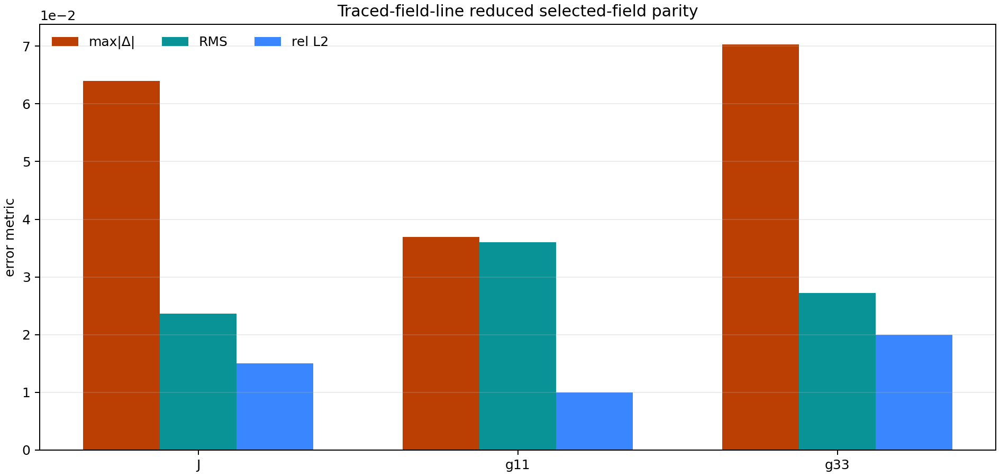

# Traced-Field-Line Selected-Field Parity Demo

This page documents the first reduced parity gate on the non-tokamak 3D adapter
family. It is not a native 3D solve. It is a compact selected-field comparison
on traced-field-line metric fields, intended to prove that the general 3D
parity/reporting surface is no longer tokamak-only.

The committed artifact bundle in this repository is now generated from a real
external FCI grid when one is available locally. If a reference mesh spec is
provided but no candidate is given, the package derives the candidate
deterministically from the reference input so the external-data gate is runnable
without a second handcrafted mesh file.

## Run It

Automatic external-grid mode, if the local external FCI grid is available:

```bash
PYTHONPATH=src .venv/bin/python examples/tokamak-3D/traced-field-line/selected_field_parity_demo.py \
  --output-root docs/data/traced_field_line_selected_field_artifacts
```

With explicit reference and candidate mesh specs:

```bash
PYTHONPATH=src .venv/bin/python examples/tokamak-3D/traced-field-line/selected_field_parity_demo.py \
  --reference-mesh-spec /path/to/reference_grid.json \
  --candidate-mesh-spec /path/to/candidate_grid.json \
  --output-root docs/data/traced_field_line_selected_field_artifacts
```

## Artifacts

- parity JSON: [traced_field_line_selected_field_parity.json](data/traced_field_line_selected_field_artifacts/data/traced_field_line_selected_field_parity.json)
- parity arrays: [traced_field_line_selected_field_parity.npz](data/traced_field_line_selected_field_artifacts/data/traced_field_line_selected_field_parity.npz)
- observable report: [traced_field_line_selected_field_parity_observable_report.json](data/traced_field_line_selected_field_artifacts/data/traced_field_line_selected_field_parity_observable_report.json)
- parity figure: [traced_field_line_selected_field_parity.png](data/traced_field_line_selected_field_artifacts/images/traced_field_line_selected_field_parity.png)

## Preview



## What This Gate Does

1. compares a compact selected metric-field surface on a non-tokamak 3D geometry;
2. publishes `max|Δ|`, RMS, and relative-L2 errors on the same public artifact model as the tokamak selected-field gate;
3. writes a shared observable report so the selected-field surface can be consumed through the same geometry-adapter schema as line, plane, and benchmark-profile families.
4. can now use a real external traced-field-line reference input and a deterministic derived candidate instead of only a synthetic preview pair.
