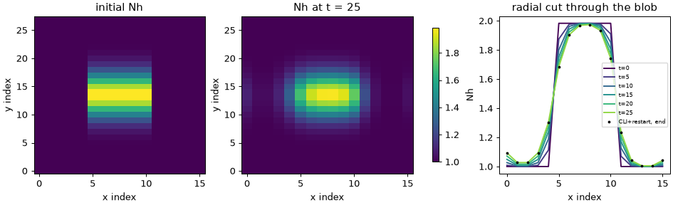

# 01 First run: an input deck, the CLI, Python, and a restart

**Goal:** run one input deck from the terminal and from Python, read the
outputs, and continue a run from a restart file.

Script: [`examples/tutorial/01_first_run.py`](../../examples/tutorial/01_first_run.py) ·
deck: [`examples/tutorial/01_diffusion.toml`](../../examples/tutorial/01_diffusion.toml)

## Equations

One hydrogen species with density \(N_h\) and pressure \(P_h\) spreads radially
by anomalous diffusion:

$$
\partial_t N_h = \frac{1}{J}\,\partial_x\!\left(J\, D\, g^{xx}\, \partial_x N_h\right),
\qquad \text{same for } P_h,
$$

with Neumann walls. In the deck:

| Term | Deck key | Code |
|---|---|---|
| species and equations | `[species.h] type = ["evolve_density", "evolve_pressure", "anomalous_diffusion"]` | `drbx.native.deck_runner` |
| \(D\) | `anomalous_D` | `_build_radial_diffusion_operator` in `native/transport.py` |
| \(dx\), \(J\) | `[mesh] dx`, `J` | `StructuredMetrics` |
| initial \(N_h\), \(P_h\) | `[fields.Nh] function`, `[fields.Ph] function` | expression parser |

The diffusion operator is linear, so DRBX advances it with its exact matrix
exponential over each output interval. A restarted run therefore reproduces
the uninterrupted run exactly.

## Run from the CLI

```bash
drbx inspect examples/tutorial/01_diffusion.toml   # resolved plan: mesh, components
drbx run examples/tutorial/01_diffusion.toml       # 3 outputs into output/tutorial/01_first_run/deck
drbx run examples/tutorial/01_diffusion.toml --output-dir output/r2 \
    --restart-in output/tutorial/01_first_run/deck/01_diffusion_restart.npz --resume-steps 2
drbx run examples/tutorial/01_diffusion.toml --precision float32   # override a deck value
```

`drbx deck.toml` is short for `drbx run deck.toml`. Each run writes
`<case>_summary.json` (min/max/mean of each variable), `<case>_arrays.npz` (all
outputs), `<case>_restart.npz` (the resume point) and `<case>_run_log.json`
(the event log). All deck keys and flags are listed in
[Native Runtime CLI](../native_runtime_cli.md).

## Run from Python

```python
from drbx.native import run_input_case
result = run_input_case("examples/tutorial/01_diffusion.toml", output_steps=5, verbose=True)
result.variables["Nh"]   # array (time, x, y, z), including guard cells
result.time_points       # (0, 5, 10, 15, 20, 25)
```

The script does this, then calls the CLI entry point (`drbx.cli.main`) for a
3-output run and a 2-output restart, and compares the two histories.

## Output

```text
[01] restart check: max |N_cli+restart - N_python| = 0.00e+00 (expect ~0: restart is exact)
[01] steepest radial jump in Nh: 0.983 -> 0.507 (radial diffusion smooths the edges)
```



The initial blob is a top hat in \(x\) times a Gaussian in \(y\). Only the
\(x\) edges smooth out: this deck diffuses radially only. The black dots
(CLI run plus restart) lie on the last curve of the single Python run.

## Try next

- Run the shipped deck `examples/inputs/restartable_diffusion.toml` (\(D = 2\)).
  Predict how far the edges move in the same time. (Diffusion length goes as
  \(\sqrt{D t}\), so about 10 times less.)
- Change `FIRST_NOUT` in the script to 1. The restart check should still read 0.
- Longer version with QA plots and a movie:
  [Restartable Diffusion Tutorial](../restartable_diffusion_tutorial.md).
