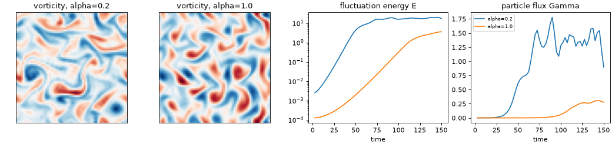

# 02 Drift-wave turbulence (Hasegawa-Wakatani)

**Goal:** run 2-D plasma turbulence from noise, see linear growth turn into
saturated turbulence, and see how the adiabaticity \(\alpha\) sets the
transport.

Script: [`examples/tutorial/02_drift_wave_turbulence.py`](../../examples/tutorial/02_drift_wave_turbulence.py)

## Equations

In the plane perpendicular to \(\mathbf B\), with lengths in \(\rho_s\) and
time in \(L_n/c_s\), the vorticity \(\zeta = \nabla^2\phi\) and density
fluctuation \(n\) evolve as

$$
\begin{aligned}
\partial_t \zeta &= -\{\phi,\zeta\} + \alpha(\phi - n) - \nu\nabla^4\zeta - \mu\zeta,\\
\partial_t n &= -\{\phi,n\} - \kappa\,\partial_y\phi + \alpha(\phi - n) - \nu\nabla^4 n - \mu n .
\end{aligned}
$$

| Term | Meaning | Code (`drbx.native.hasegawa_wakatani`) |
|---|---|---|
| \(\{\phi, f\}\) | \(E\times B\) advection (the nonlinearity) | `_bracket_hat`, dealiased pseudo-spectral |
| \(\alpha(\phi - n)\) | parallel electron response (resistive coupling) | `hw_rhs`, `adiabaticity` |
| \(-\kappa\,\partial_y\phi\) | background density gradient: the drive | `hw_rhs`, `gradient` |
| \(\nu\nabla^4\) | grid-scale damping | `hyperviscosity` |
| \(\mu\) | large-scale friction (stops the inverse cascade piling up) | `friction` |
| \(\phi = \nabla^{-2}\zeta\) | potential from vorticity | `potential_from_vorticity` |

The state is stored in Fourier space and advanced with RK4 (`hw_run`, one
jitted `lax.scan` per block). Diagnostics: energy
\(E = \langle|\nabla\phi|^2 + n^2\rangle\) and radial particle flux
\(\Gamma = \langle n\, v_x\rangle\) with \(v_x = -\partial_y\phi\) (`particle_flux`).

## Run

```bash
PYTHONPATH=src python examples/tutorial/02_drift_wave_turbulence.py
```

Python only: the CLI does not run this model. Each block prints
`step`, `t`, `E` and `Gamma`; the run takes about 50 s.

## Output

```text
[02] alpha=0.2: mean flux over the last 15 blocks = +1.358e+00
[02] alpha=1.0: mean flux over the last 15 blocks = +2.660e-01
```



- **Linear phase:** \(E\) grows as a straight line on the log plot. Its
  slope is twice the growth rate of the fastest mode (tutorial 03 checks this).
- **Saturation:** the \(E\times B\) nonlinearity moves energy between scales
  and \(E\) levels off.
- **Transport:** \(\Gamma > 0\) means density moves outward, down the gradient.
- **\(\alpha\):** with small \(\alpha\) the electrons barely tie \(n\) to
  \(\phi\). The instability grows faster and the turbulence carries about 5 times
  more flux than at \(\alpha = 1\). With large \(\alpha\) the response is
  adiabatic (\(n \approx \phi\)) and transport dies away.

## Try next

- Set `ADIABATICITIES = (0.2, 1.0, 4.0)`. Predict which case is still growing
  at \(t = 150\).
- Double `GRADIENT`. The growth rate scales roughly with \(\kappa\), so the
  linear phase should end about twice as early.
- Set `FRICTION = 0` and watch large vortices pile up at the box scale.
- Longer run with a movie: [Turbulence From Zero](../tutorial_hasegawa_wakatani.md).
