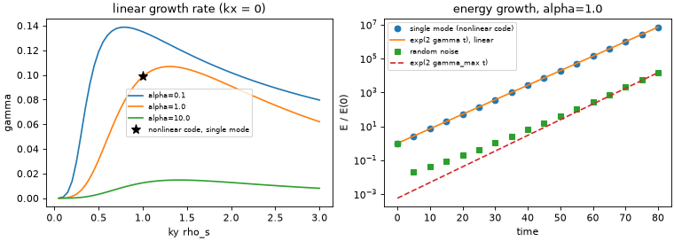

# 03 Linear dispersion vs nonlinear growth

**Goal:** compute growth rates from the linearized equations with
`drbx.linear`, and check that the nonlinear code of tutorial 02 grows at those
rates.

Script: [`examples/tutorial/03_linear_vs_nonlinear.py`](../../examples/tutorial/03_linear_vs_nonlinear.py)

## Equations

Drop the brackets and damping from tutorial 02 and take one Fourier mode
\(\propto e^{i\mathbf k\cdot\mathbf x + \lambda t}\), with \(\zeta = -k^2\phi\):

$$
\lambda \begin{pmatrix}\phi\\ n\end{pmatrix}
= A \begin{pmatrix}\phi\\ n\end{pmatrix},\qquad
A = \begin{pmatrix} -\alpha/k^2 & \alpha/k^2\\ \alpha - i\kappa k_y & -\alpha\end{pmatrix},
\qquad \lambda = \gamma + i\omega .
$$

| Piece | Code (`drbx.linear`) |
|---|---|
| matrix \(A(k_y, k^2, \alpha, \kappa)\) | `resistive_drift_wave_operator` |
| eigenvalues/vectors, sorted by \(\gamma\) | `eigenmodes` |
| \(A\) from any JAX right-hand side by `jax.jacfwd` | `jacobian_operator` |

A single Fourier mode has \(\{\phi,\phi\} = 0\) and \(\{\phi, n\} = 0\), so in
the nonlinear code it evolves exactly linearly. That makes a sharp test.

## Run

```bash
PYTHONPATH=src python examples/tutorial/03_linear_vs_nonlinear.py
```

Python only (about 6 s). For other linear operators (shear Alfvén, interchange)
see [`examples/benchmarks/linear_dispersion.py`](../../examples/benchmarks/linear_dispersion.py)
and [The Linearized Drift-Reduced Braginskii Solver](../linear_dispersion_benchmark.md).

## Output

```text
[03]   alpha=  0.1: gamma_max=0.1388 at ky=0.80
[03]   alpha=  1.0: gamma_max=0.1069 at ky=1.30
[03]   alpha= 10.0: gamma_max=0.0147 at ky=1.40
[03] single mode: measured gamma = 0.098684, linear = 0.098684, rel. diff 1.6e-11
[03] noise: late-time gamma = 0.0970, fastest box mode = 0.1067
```



- Left: \(\gamma(k_y)\). Large \(\alpha\) makes the electrons adiabatic and
  stabilizes the mode. The star is the growth rate measured in the nonlinear
  code.
- Right: the single eigenmode follows \(e^{2\gamma t}\) to 11 digits (energy
  grows at twice the amplitude rate). Random noise contains many modes. Its
  growth approaches the fastest mode that fits in the box, but several modes
  with nearly the same \(\gamma\) are still mixed at \(t = 80\).

## Try next

- Set `MODE = (1, 4)`. Adding \(k_x\) raises \(k^2\). Predict whether
  \(\gamma\) goes up or down, then check against the left panel.
- Set `ALPHA_RUN = 10`. The noise run should grow about 7 times slower.
