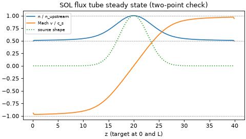

# 04 Open field lines: a SOL flux tube with Bohm sheaths

**Goal:** see what changes when field lines end on material targets: plasma
flows to the walls, the sheath sets the outflow speed, and the steady state
matches the two-point model.

Script: [`examples/tutorial/04_open_sol_sheath.py`](../../examples/tutorial/04_open_sol_sheath.py)

## Equations

Isothermal plasma along the field, \(z \in [0, L]\), speeds in units of
\(c_s\), density in units of the initial density:

$$
\partial_t n + \partial_z(nv) = S_n, \qquad
\partial_t(nv) + \partial_z\!\left(nv^2 + n c_s^2\right) = 0,
$$

with a Gaussian source \(S_n\) at the mid-plane and the **Bohm condition**
\(|v| \ge c_s\) at both targets. The steady state has \(v = 0\) at the
mid-plane and \(|v| = c_s\) at the targets. Total pressure
\(n(v^2 + c_s^2)\) is constant between them, which gives

$$ n_\text{target} = \tfrac12\, n_\text{upstream}. $$

| Piece | Code |
|---|---|
| open geometry (field lines end on two target planes) | `drbx.geometry.build_open_slab_geometry` |
| fluxes (Rusanov), Bohm outflow, RK4 | `drbx.native.sol_flux_tube`: `sol_flux_tube_rhs`, `sol_flux_tube_run` |
| source \(S_n\) | `sol_flux_tube_source` |
| target loads: \(\Gamma = n c_s\), \(q = \gamma\,\Gamma T\), recycled neutrals \(R\,\Gamma\) | `drbx.native.fci_sheath_recycling.compute_fci_sheath_recycling` |

## Run

```bash
PYTHONPATH=src python examples/tutorial/04_open_sol_sheath.py
```

Python only (about 3 s). Progress lines print the target Mach numbers, the
density ratio and the residual \(\max|\partial_t n|\), which falls to
\(10^{-13}\).

## Output

```text
[04] Bohm: Mach at targets -0.9427, +0.9427 (two-point: -1, +1 at the target face)
[04] n_target/n_upstream = 0.4931 (two-point: 0.5)
[04] particles in (source) = 0.1418, out to both targets = 0.1418
```



The flow accelerates from the stagnation point to the sound speed at each
target. The printed values are at the last cell centre, half a cell before
the target face, so they read slightly below 1 and slightly below 0.5. In
steady state the particles leaving through the sheaths balance the source
exactly. With 95% recycling, 95% of them return as neutrals; tutorial 05
follows those neutrals.

## Try next

- Set `NZ = 400`. The last cell centre moves closer to the target, so the
  Mach number should move closer to 1.
- Double `SOURCE_AMPLITUDE`. The density doubles, but the Mach profile and the
  0.5 ratio do not change. Why? (The equations are linear in \(n\) at fixed
  \(v\).)
- Background and tests: [Open-Field-Line SOL](../open_field_line_sol.md),
  [Open SOL, Neutrals, Detachment](../tutorial_open_sol.md).
