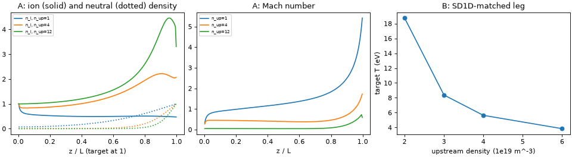

# 05 Collisions, neutrals and the divertor leg

**Goal:** add a second species (neutral atoms) with atomic collision rates,
then solve a 1-D divertor leg with evolved temperature and watch the target
cool as the upstream density rises.

Script: [`examples/tutorial/05_neutrals_and_detachment.py`](../../examples/tutorial/05_neutrals_and_detachment.py)

## Part A: recycling SOL (prescribed temperature)

Ions (density \(n_i\), momentum \(m_i n_i v\)) and neutral atoms (\(n_n\)) on a
fixed temperature profile, 30 eV upstream to 1.5 eV at the target:

$$
\begin{aligned}
\partial_t n_i + \partial_z(n_i v) &= S_\text{iz} - S_\text{rec},\\
\partial_t n_n - \partial_z(D_n\partial_z n_n) &= -(S_\text{iz} - S_\text{rec}),\\
\partial_t(m_i n_i v) + \partial_z(m_i n_i v^2 + p) &= -(S_\text{cx} + S_\text{rec})\, m_i v,
\end{aligned}
$$

with \(S_\text{iz} = \langle\sigma v\rangle_\text{iz} n_n n_e\),
\(S_\text{rec} = \langle\sigma v\rangle_\text{rec} n_i n_e\),
\(S_\text{cx} = \langle\sigma v\rangle_\text{cx} n_n n_i\). At the target,
ions leave at \(|v| \ge c_s\) and a fraction \(R\) comes back as neutrals.

| Piece | Code (`drbx.native.neutrals`) |
|---|---|
| AMJUEL rate fits \(\langle\sigma v\rangle(T_e, n_e)\) | `atomic_rates.py` |
| reaction sources with momentum and energy exchange | `reactions.py` |
| hyperbolic update, implicit neutral diffusion, implicit reactions | `recycling_sol_model.py`: `sol_recycling_step`, `sol_recycling_run` |
| prescribed \(T(z)\) | `linear_target_temperature_profile` |

Units: density in \(10^{19}\,\mathrm{m^{-3}}\), temperature in 100 eV
(`PlasmaNormalization`).

## Part B: the SD1D-matched divertor leg (evolved temperature)

A 30 m leg with the flux-tube area doubling toward the target, 50 MW/m² and
the particle source over the first 10 m, 99% recycling, hydrogen with
13.6 eV lost per ionization. It evolves \(N\), \(NV\), \(P = 2NT\) and the
neutral density, momentum and pressure (equations in
[Models and Governing Equations](../models_and_equations.md#sd1d-matched-detachment)).
`detachment_sol_run` finds the steady state by Newton / pseudo-transient
continuation. `detachment_ledger` checks that particles and power balance.

## Run

```bash
PYTHONPATH=src python examples/tutorial/05_neutrals_and_detachment.py
```

Python only (about 15 s at 200 cells).

## Output

```text
[05] Part A target Mach: n_up=1: 5.412, n_up=4: 1.724, n_up=12: 0.589
[05]   n_up=2.0e+19: 15 iterations, residual 2.1e-11, T_target= 18.75 eV, ... ledgers particle 0e+00 power 0e+00
[05] Part B target T:    2e+19: 18.75 eV, 3e+19: 8.38 eV, 4e+19: 5.64 eV, 6e+19: 3.84 eV
```



- **A:** more upstream plasma means more recycled neutrals near the target,
  so more charge-exchange friction. The target flow slows from supersonic to
  well below Mach 1: the onset of detachment. (At low density the imposed
  temperature drop speeds the flow past Mach 1. The Bohm condition is only
  a lower bound.)
- **B:** the same input power is shared by more particles, and more of it is
  spent on ionization, so the target temperature falls from about 19 eV to
  4 eV. The ledgers close to round-off. At 800 cells this model reproduces
  the published SD1D target temperatures to 0.35%
  (`examples/benchmarks/b6_detachment_sd1d.py`).

## Try next

- Set `RECYCLING_FRACTION = 0.5` in Part A. Predict the effect on the target
  neutral density and the target Mach number.
- Add `8.0e19` to `UPSTREAM_SCAN_B`. Is the target temperature still above
  3 eV? This model has no impurity radiation, so the target flux does not
  roll over.
- More: [Neutrals and Recycling](../neutrals_recycling.md),
  [Open SOL, Neutrals, Detachment](../tutorial_open_sol.md).
