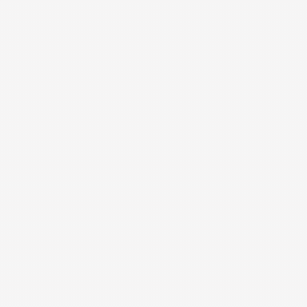

# Tutorial: From Zero to a Turbulence Movie (and a Gradient Through It)

This tutorial walks through the closed-field-line turbulence flagship —
the Hasegawa-Wakatani drift-wave model — from an empty Python file to a
saturating turbulence run with a movie, and then differentiates *through* the
whole nonlinear run. It follows
[`examples/tokamak/drift_wave_turbulence.py`](../examples/tokamak/drift_wave_turbulence.py)
and
[`examples/tokamak/drift_wave_inverse_design.py`](../examples/tokamak/drift_wave_inverse_design.py)
line by line, explaining every parameter choice. The governing equations are on
[Models and Governing Equations](models_and_equations.md); the physics context
is on [Drift-Wave Turbulence](drift_wave_turbulence.md).



## 1. Imports and float64

```python
import jax
import numpy as np

jax.config.update("jax_enable_x64", True)

import jax.numpy as jnp
import matplotlib.pyplot as plt

from dkx.native.hasegawa_wakatani import (
    HasegawaWakataniParameters,
    hw_grid,
    hw_run,
    particle_flux,
    potential_from_vorticity,
)
```

`jax_enable_x64` must be set **before** any array is created: JAX defaults to
float32, and the turbulence benchmarks (like all `dkx` validation gates)
are run in float64. Everything the model needs is five names from one module —
there is no solver object or input file to configure.

## 2. Parameters, and why these values

```python
N = 96                      # grid points per direction
LENGTH = 2.0 * np.pi * 8.0  # box size: k_min = 2*pi/LENGTH = 1/8
ADIABATICITY = 1.0          # alpha: parallel electron coupling
GRADIENT = 1.0              # kappa: background density-gradient drive
HYPERVISCOSITY = 5.0e-2     # nu: lap^2 damping of the grid scale
DT = 5.0e-3                 # fixed RK4 step
STEPS_PER_BLOCK = 400       # steps between diagnostics/frames
BLOCKS = 32                 # total run: 32 x 400 x 0.005 = 64 time units
SEED = 0
```

- **`N = 96`, `LENGTH = 16π`**: the box holds wavenumbers from
  \(k_{\min} = 2\pi/L = 0.125\) up to the dealiased
  \(k_{\max} = (2/3)(N/2)(2\pi/L) = 4\). The fastest-growing drift wave at
  \(\alpha = \kappa = 1\) sits near \(k \sim 1\), comfortably inside the
  resolved, dealiased band, with room below it for the inverse cascade to
  build large structures.
- **`ADIABATICITY = 1.0`**: the interesting middle regime. For
  \(\alpha \ll 1\) the model becomes hydrodynamic (2-D Navier-Stokes-like),
  for \(\alpha \gg 1\) it locks \(n \to \phi\) and transport dies; near 1 the
  resistive coupling drives the strongest instability.
- **`GRADIENT = 1.0`**: the free-energy source. The linear growth rate scales
  with \(\kappa\); doubling it roughly doubles the drive.
- **`HYPERVISCOSITY = 5e-2`**: \(\nu \nabla_\perp^4\) removes enstrophy at the
  grid scale without touching the energy-carrying scales. Too small and the
  spectrum piles up at \(k_{\max}\); too large and it eats the instability.
- **`DT = 5e-3`**: a fixed RK4 step must satisfy the stiff adiabatic-response
  limit \(\Delta t < 2.8\, k_{\min}^2/\alpha\) and the advective CFL, which
  tightens as fluctuations grow. This value keeps the shown window stable;
  reaching deep saturation needs CFL-adaptive stepping.
- **Blocks**: `hw_run` advances `STEPS_PER_BLOCK` jitted RK4 steps at a time;
  between blocks we come back to Python to record diagnostics and a movie
  frame. This is the standard `dkx` pattern — hot loop on device,
  diagnostics at the block boundary.

## 3. Grid, parameters, and the noise seed

```python
grid = hw_grid(N, LENGTH)
params = HasegawaWakataniParameters(
    adiabaticity=ADIABATICITY, gradient=GRADIENT, hyperviscosity=HYPERVISCOSITY
)
rng = np.random.default_rng(SEED)
seed = 1.0e-2 * (rng.standard_normal((N, N)) + 1j * rng.standard_normal((N, N)))
seed[0, 0] = 0.0
zeta = jnp.array(seed.copy())
density = jnp.array(seed.copy())
```

The state lives in **Fourier space**: `zeta` and `density` are the complex
spectral coefficients \(\hat\zeta_k, \hat n_k\). The initial condition is
small white noise (amplitude \(10^{-2}\)) so the linear instability selects
its own fastest-growing mode — nothing about the answer is put in by hand.
Zeroing the `[0, 0]` component removes the mean, which is unconstrained by
the periodic dynamics.

## 4. The run loop: growth, transport, frames

```python
for block in range(BLOCKS):
    zeta, density = hw_run(zeta, density, grid, params, dt=DT, steps=STEPS_PER_BLOCK)
    phi = potential_from_vorticity(zeta, grid)          # phi_k = -zeta_k / k^2
    energy = float(jnp.sum(grid.k2 * jnp.abs(phi) ** 2 + jnp.abs(density) ** 2))
    flux = float(particle_flux(zeta, density, grid))    # <n v_x>, outward > 0
    frames.append(np.real(np.asarray(jnp.fft.ifft2(zeta))))
```

Three diagnostics per block:

- **fluctuation energy** \(E = \sum_k k^2|\hat\phi_k|^2 + |\hat n_k|^2\) —
  exponential growth during the linear phase (the slope is the B2-verified
  growth rate), then rollover at nonlinear saturation;
- **particle flux** \(\langle n v_x\rangle\) — the physical payoff: positive
  means density is transported outward, down the background gradient;
- a real-space **vorticity frame** for the movie (`ifft2` back to the grid).

The example then encodes the frames as a palette-compressed GIF
(`_write_vorticity_gif`, plain Pillow — no external tools) and writes a
three-panel PNG: final vorticity field, energy history (log scale), flux
history. Run it:

```bash
PYTHONPATH=src python examples/tokamak/drift_wave_turbulence.py
```

Expected console output: one line per block with time, energy, and flux; the
energy grows by several orders of magnitude and the flux settles positive.
Outputs land in `output/drift_wave_turbulence/` (PNG, GIF, JSON time series).

## 5. A gradient through the turbulence

Because `hw_run` is pure JAX, any scalar diagnostic of the run is a
differentiable function of any parameter. From
[`drift_wave_inverse_design.py`](../examples/tokamak/drift_wave_inverse_design.py)
(smaller grid, `N = 32`, 240 steps, so each optimization iteration is cheap):

```python
def final_energy(kappa):
    params = HasegawaWakataniParameters(
        adiabaticity=ADIABATICITY, gradient=kappa, hyperviscosity=HYPERVISCOSITY
    )
    zeta, density = hw_run(zeta0, density0, grid, params, dt=DT, steps=STEPS)
    phi = potential_from_vorticity(zeta, grid)
    return jnp.sum(grid.k2 * jnp.abs(phi) ** 2 + jnp.abs(density) ** 2)

d_energy_d_kappa = jax.grad(final_energy)(1.3)   # reverse mode through 240 steps
```

`jax.grad` differentiates through the *entire* nonlinear rollout — every RK4
stage, every dealiased bracket — and the example checks it against a central
finite difference. The inverse-design loop then recovers a hidden drive:

```python
def loss(kappa):
    return (jnp.log(final_energy(kappa)) - jnp.log(target)) ** 2

value_and_grad = jax.jit(jax.value_and_grad(loss))
for iteration in range(ITERATIONS):
    loss_value, grad = value_and_grad(kappa)
    kappa = float(np.clip(kappa - LEARNING_RATE * grad, 0.05, 3.0))
```

Choices that matter here:

- the loss compares **log** energies — the energy varies over orders of
  magnitude with \(\kappa\), and the log makes the landscape well-scaled for
  a plain gradient step (`LEARNING_RATE = 0.15`);
- `jax.value_and_grad` gets loss and gradient in one compiled evaluation;
- the clip keeps \(\kappa\) inside the physically sensible range during early
  overshoot.

The run prints the autodiff-vs-FD sensitivity check and the recovery
(`kappa: 0.6 → ≈1.3` in ~40 iterations). Gates:
`tests/test_hasegawa_wakatani.py::test_inverse_design_recovers_a_parameter_through_turbulence`.

## 6. Where to go next

- Crank `N`, `BLOCKS`, and add `friction` (the `mu` drag in
  `HasegawaWakataniParameters`) to reach a statistically steady saturated
  state.
- Compare forward/reverse/checkpointed gradients on this exact rollout:
  `examples/autodiff/differentiation_methods.py` and
  [Performance and Differentiability](performance_and_differentiability.md).
- Move to 3-D open-field-line physics:
  [Tutorial: Building an Open SOL](tutorial_open_sol.md).
