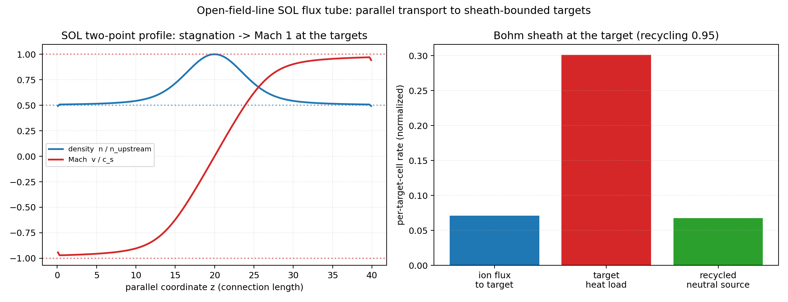

# Tutorial: Building an Open SOL — Sheath, Neutrals, Detachment

This tutorial builds up the scrape-off-layer (SOL) physics ladder in three
steps, each one a runnable example:

1. an **open flux tube** with Bohm sheath targets
   ([`examples/sol/open_sol_flux_tube.py`](../examples/sol/open_sol_flux_tube.py));
2. add **neutrals and recycling** with the hermes-3 atomic reactions
   ([`examples/sol/recycling_sol.py`](../examples/sol/recycling_sol.py));
3. evolve the **temperature** with the SD1D-matched model and compare with
   SD1D's 13.6 eV scan
   ([`examples/benchmarks/b6_detachment_sd1d.py`](../examples/benchmarks/b6_detachment_sd1d.py)).

The equations for each stage are on
[Models and Governing Equations](models_and_equations.md); physics pages:
[Open-Field-Line SOL](open_field_line_sol.md) and
[Neutrals and Recycling](neutrals_recycling.md).

## Step 1 — the open flux tube and the two-point steady state



An "open" geometry is one whose field lines terminate on material targets.
In `drbx` that is a property of the FCI maps, not a special coordinate
system:

```python
from drbx.geometry import build_open_slab_geometry

geometry = build_open_slab_geometry(SHAPE, parallel_length=PARALLEL_LENGTH)
```

with `SHAPE = (1, 1, 200)` — one flux tube, 200 parallel cells — and
`PARALLEL_LENGTH = 40.0` (the target-to-target connection length, normalized).
The forward field-line map exits the domain at `z = L` and the backward map at
`z = 0`, so the FCI endpoint masks mark exactly the two target planes. Every
open-field-line closure in the package keys off these masks.

The model parameters are one dataclass:

```python
params = SolFluxTubeParameters(
    sound_speed=1.0,        # isothermal c_s; sets the Bohm outflow speed
    source_amplitude=0.02,  # peak of the Gaussian upstream particle source
    source_width=4.0,       # parallel 1/e width of the source
    density_floor=1e-6,     # positivity floor applied after each RK4 step
)
source = sol_flux_tube_source(geometry, params)   # Gaussian at the midplane
density = jnp.ones(geometry.shape)                # uniform start, at rest
momentum = jnp.zeros(geometry.shape)
```

Why these values: the source is *weak* (`0.02`) so the steady state stays in
the quasi-linear two-point regime where the analytic prediction
(\(n_{\mathrm{target}} = n_{\mathrm{upstream}}/2\), Mach 1 at the plates)
holds; the width `4.0` localizes it upstream without making the profile a
delta function. The timestep is a CFL choice against the fastest wave
(\(|v| + c_s \le 2 c_s\) near the targets):

```python
dt = CFL * dz / (SOUND_SPEED + 1.0)   # CFL = 0.4
```

and `STEPS = 60000` RK4 steps is simply long enough (hundreds of sound times)
for the residual `max|dn/dt|` to fall many decades. The run loop prints, per
chunk, the target Mach numbers (→ ±1), the density ratio (→ 0.5), and the
residual. Finally the sheath/recycling closure audits the relaxed state:

```python
sheath = compute_fci_sheath_recycling(
    density, te, ti, geometry.maps, recycling_fraction=0.95
)
```

With `TE = TI = 0.5` the sheath sound speed \(\sqrt{T_e + T_i} = 1\) matches
the transport model's `c_s`, so the Bohm flux the closure reports equals the
flux the flux tube actually drained — and the particle-recycling and
zero-current identities close to ~1e-16. Run it:

```bash
PYTHONPATH=src python examples/sol/open_sol_flux_tube.py
```

## Step 2 — neutrals, recycling, and the onset of detachment


Real targets are not perfect absorbers: most of the ion flux returns as
neutral gas, which diffuses upstream, ionizes where the plasma is hot, and
drags the flow by charge exchange. The coupled model is
`drbx.native.neutrals.recycling_sol_model`, and the example drives it
half-domain (stagnation midplane at `z = 0`, one target at `z = L`):

```python
params = SolRecyclingParameters(
    parallel_length=30.0,      # metres — sets the *physical* atomic-rate scale
    upstream_density=4.0,      # normalized; Dirichlet-pinned at z = 0
    recycling_fraction=0.95,   # R: fraction of target ion flux returned as neutrals
    neutral_diffusion=8.0,     # parallel diffusion enhancement (kinetic proxy)
    neutral_temperature=0.04,  # ~2 eV Franck-Condon neutrals (normalized to 100 eV)
    ion_mass=2.0,              # deuterium
    normalization=PlasmaNormalization(),   # Nnorm = 1e19 m^-3, Tnorm = 100 eV
)
```

Parameter reasoning:

- **`parallel_length` is in metres** because the AMJUEL rate fits take
  physical \(T_e\) [eV] and \(n_e\) [m⁻³]: the connection length fixes how
  many ionization mean-free-paths fit in the tube.
- **The temperature profile is *prescribed*** (`UPSTREAM_EV = 30`,
  `TARGET_EV = 1.5`, quadratic in between via
  `linear_target_temperature_profile`): hot attached upstream, cold recycling
  region at the plate. Imposing \(T(z)\) sidesteps the stiff
  conduction/radiation energy balance — that is exactly what Step 3 adds.
- **`recycling_fraction = 0.95`** is a typical divertor value (5% pumped);
  `1.0` gives a fully recycling target, `0.0` recovers Step 1.
- **`neutral_diffusion = 8.0`** enhances the fluid neutral diffusivity as a
  proxy for kinetic neutral transport (hermes-3 practice).
- **`DT = 0.3 * (1/NZ) / 3`**: CFL 0.3 against the fastest normalized wave
  (~3 c_s); the *stiff* pieces (neutral diffusion, ionization) are implicit
  (solvax tridiagonal + per-cell implicit update), so the CFL only has to
  cover the hyperbolic transport.

The script relaxes a reference case, printing the target Mach number, target
flux, and neutral cushion per chunk, then scans
`UPSTREAM_SCAN = [1, 2, 4, 8, 12]`. The physics to watch: as upstream density
rises, charge-exchange + recombination friction **chokes the flow** — the
target Mach number falls toward and below 1. That is the onset of detachment,
with the temperature still held fixed.

```bash
PYTHONPATH=src python examples/sol/recycling_sol.py
```

## Step 3 — evolved temperature: the SD1D benchmark


Detachment proper needs the target temperature to *respond*.
`detachment_sol_model` reproduces SD1D (Dudson et al., *PPCF* 61, 065008
(2019)) for hydrogen with a fixed ionisation cost and solves it to steady
state with pseudo-transient Newton:

```python
params = DetachmentSolParameters(
    ny=800,                      # SD1D grid: 7 cm upstream -> 4 mm at the target
    upstream_density=3.0e19,     # held at cell 0 by the particle source amplitude
    power_flux=5.0e7,            # W/m^2 over the first 10 m
    ionisation_energy=13.6,      # eV lost per ionisation
    recycling_fraction=0.99,
)
result = detachment_sol_run(params)          # result.residual: steady residual
diag = detachment_diagnostics(result.state, params, result.source_scale)
```

The example scans the upstream density and reproduces SD1D's target
temperature to 0.35% and target flux to 0.15% at the same 800-cell resolution.
In this hydrogen-only scan the target cools from 29 eV to 3.4 eV and the flux
keeps rising: the flux rollover of the paper needs impurity radiation and
excitation, which are not in this model.

```bash
PYTHONPATH=src python examples/benchmarks/b6_detachment_sd1d.py
```

## Coda — controlling the target temperature with a gradient

The steady state is differentiable through the implicit-function theorem, so
"find the upstream density that puts the target at 10 eV" is a Newton
iteration on \(T_t(n_{\mathrm{up}})\) with the exact sensitivity from the
converged state (no differentiation through the pseudo-time iterations):


See [`examples/autodiff/detachment_control.py`](../examples/autodiff/detachment_control.py)
and the write-up on [Neutrals and Recycling](neutrals_recycling.md). Gates for
everything in this tutorial: `tests/test_open_field_line_sol.py`,
`tests/test_native_recycling_sol.py`, `tests/test_native_detachment_sol.py`,
`tests/test_detachment_control.py`.
