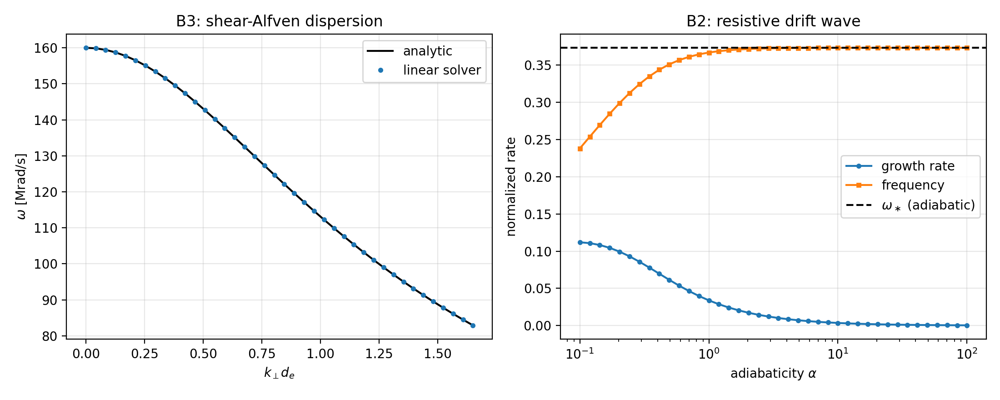
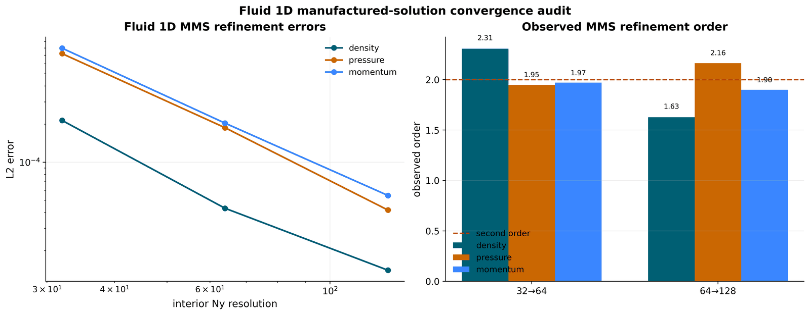
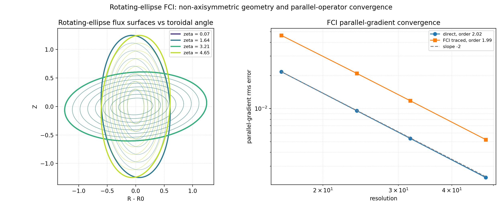
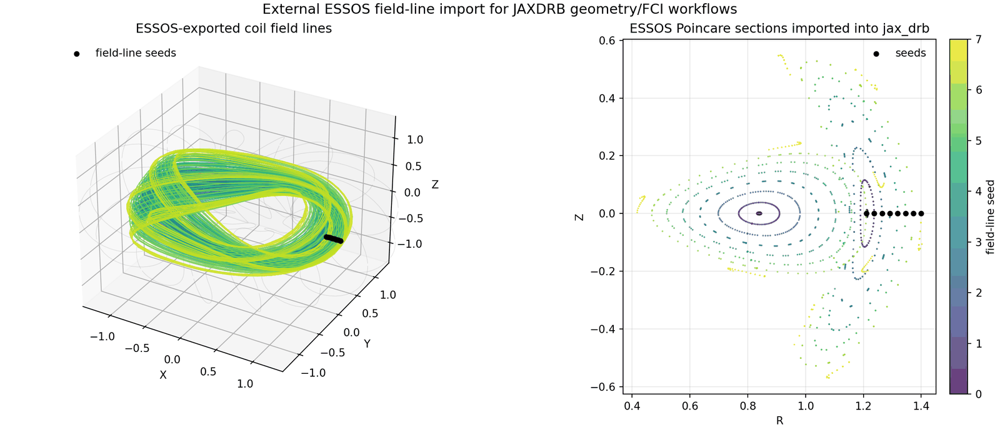
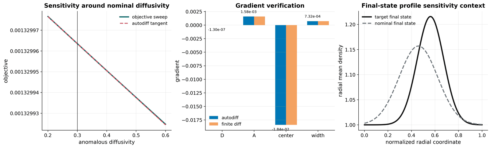
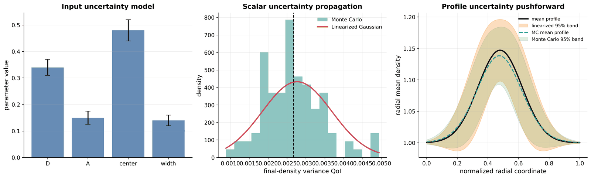
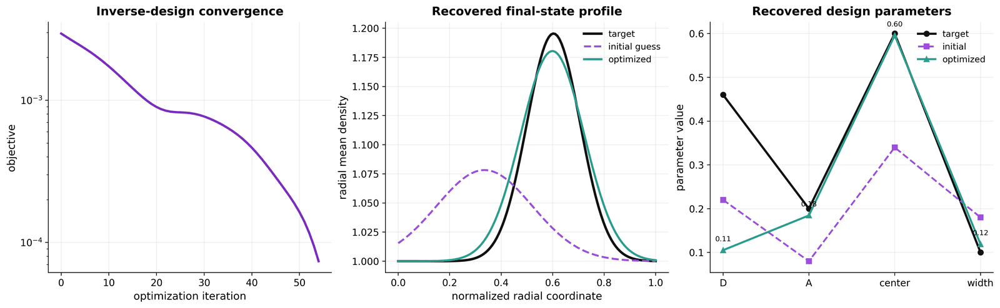
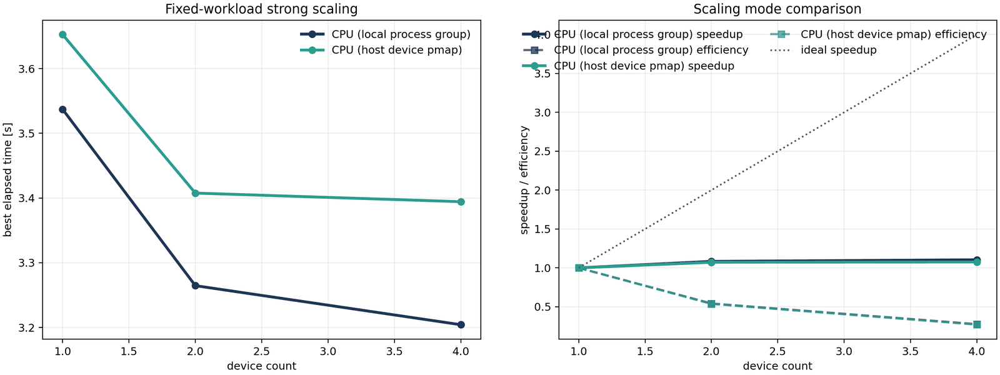

# Validation Gallery

!!! note "Plan authority"
    This page is a validation-gallery/status appendix. The active execution
    plan is [Research-Grade Execution Plan](research_grade_execution_plan.md).
    If this page conflicts with that plan, follow the execution plan and update
    this page afterward.

This page collects the current validation figures from the active validation
ladder. Figures embedded inline are committed compressed copies under
`docs/media/`. Full-resolution legacy campaign figures live on the
`validation-artifacts-2026-04-28` GitHub release; because this repository is
private, release-hosted images cannot render inline for readers, so those are
given as download links (they require repository access, or
`scripts/fetch_example_artifacts.py` to restore locally).

The figure classes match the main literature patterns used in verification
and edge/SOL validation papers: convergence curves and observed orders (Roy
2005, the GBS parallel-gradient work), profile and target comparisons
(TCV-X21, SOLPS-ITER), and differentiable-science summaries (JAX-Fluids and
related JAX solver papers).

## Figure Status

| Figure | Status | Meaning |
| --- | --- | --- |
| `Linear Dispersion / Linearized DRB` | `native_exact` | Drift-wave, shear-Alfven, interchange dispersion reproduced to machine precision. |
| `Hasegawa-Wakatani Turbulence` | `native_exact` | Linear growth matches the B2 eigenvalue; differentiable end to end. |
| `Fluid 1D MMS Convergence` | `native-validated` | Manufactured-solution observed orders on the promoted 1D fluid lane. |
| `Open SOL Two-Point Steady State` | `native-validated` | Mach 1 targets, half-upstream target density, roundoff-closed sheath accounting. |
| `Recycling / Detachment SOL` | `native-validated` | Neutral cushion, detachment onset, SD1D target-flux rollover, differentiable control. |
| `Rotating-Ellipse FCI` | `genuinely non-axisymmetric gate` | Autodiff metric; order-2 direct and traced parallel gradients; shape-differentiable. |
| `Stellarator Turbulence (closed/open)` | `native_operational` | 4-field interchange with limiter SOL drainage on the rotating ellipse. |
| `Stellarator FCI Validation` | `native non-axisymmetric gate` | Full-metric, field-line-map, operator, sheath/recycling, neutral, vorticity campaigns. |
| `VMEC-Extender Edge Field Import` | `self-contained synthetic imported-field gate` | Field-grid import, FCI maps, compact SOL smoke coupling on synthetic NetCDF fixtures. |
| `ESSOS / vmec_jax Imports` | `external geometry import gate` | Coil-field tracing, Poincare extraction, VMEC surface registration, traced-iota verification. |
| `Autodiff Diffusion Sensitivity / UQ / Inverse Design` | `differentiable validation` | Gradients vs finite differences, covariance pushforward vs Monte Carlo, gradient-based recovery. |
| `Strong Scaling` | `supporting performance audit` | Sharded FCI CPU scaling, single-GPU comparison, fixed-work diffusion scaling. |

## Linear Dispersion And Turbulence




Every analytic limit of the dispersion operators is reproduced to
1e-12–1e-16 in `tests/test_linear_dispersion.py`, and the nonlinear
Hasegawa-Wakatani flagship reproduces the B2 eigenvalue to machine precision
(`tests/test_hasegawa_wakatani.py`). Pages:
[Linear Dispersion Benchmark](linear_dispersion_benchmark.md),
[Drift-Wave Turbulence](drift_wave_turbulence.md).

## Fluid 1D MMS Convergence



An explicit manufactured-solution refinement bundle for the promoted 1D fluid
density, pressure, and momentum operators: per-resolution L2 errors and
observed orders on the same native lane used for the compact verification
tests. Details: [Fluid 1D MMS Convergence](fluid_1d_mms_convergence.md).

## Open SOL, Recycling, Detachment


The open-slab two-point steady state, the coupled recycling SOL with the
hermes-3 AMJUEL reactions, the SD1D detachment rollover, and gradient-based
detachment control. Gates: `tests/test_open_field_line_sol.py`,
`tests/test_native_recycling_sol.py`, `tests/test_native_detachment_sol.py`,
`tests/test_detachment_control.py`. Pages:
[Open-Field-Line SOL](open_field_line_sol.md),
[Neutrals and Recycling](neutrals_recycling.md).

## Rotating-Ellipse FCI



The classical rotating-ellipse (`l = 2`) stellarator — the canonical minimal
non-axisymmetric field. Its metric is built by automatic differentiation of
the analytic embedding (exact, and differentiable with respect to the shape),
and the FCI parallel gradient converges at second order for both the direct
and the traced-field-line operator. Gate:
`tests/test_rotating_ellipse_fci.py`; page:
[Rotating-Ellipse FCI](rotating_ellipse_fci.md). Regenerate:

```bash
PYTHONPATH=src python examples/stellarator/rotating_ellipse_fci.py
```

## Stellarator Turbulence And Geometry


The 4-field closed-vs-limiter-open comparison
(`examples/stellarator/stellarator_turbulence.py`), the island-divertor
stochastic SOL, and the synthetic stellarator FCI validation campaign
(geometry/metric checks with inverse residual ~1.44e-14, operator MMS
convergence with observed orders ~1.9, sheath/recycling and neutral balances
closed to roundoff, metric-weighted vorticity inversion to ~1.3e-3). The
campaign numbers and per-campaign figures are documented in
[Stellarator FCI Validation](stellarator_fci_validation.md).

## Imported Geometry (ESSOS, VMEC, vmec_jax)




ESSOS-owned field evaluation, adaptive field-line tracing, and Poincare
extraction exported into portable artifacts; VMEC surface registration; the
vmec_jax adapter with traced rotational transform matching the wout `iotaf`
profile to ~1e-6. Pages: [ESSOS Field-Line Import](essos_fieldline_import.md),
[ESSOS Imported FCI Validation](essos_imported_fci_validation.md),
[VMEC Extender Edge Fields](vmec_extender_edge_fields.md).

## Differentiable Validation







- `jax.grad` sensitivities match centered finite differences on all promoted
  design parameters;
- first-order covariance pushforward agrees with vectorized Monte Carlo on
  scalar and field quantities of interest;
- the inverse-design loop reduces the objective from about `2.95e-3` to about
  `5.52e-5`.

Details and commands: [Autodiff And Scaling Examples](autodiff_and_scaling_examples.md).

## Performance Evidence




Measured turbulence throughput, gradient-method costs, sharded FCI strong
scaling (7.4x at 16 CPU shards; ~96x on one A4000 vs one CPU shard), and the
fixed-work diffusion scaling audit. Context and caveats:
[Performance And Differentiability](performance_and_differentiability.md).

## Legacy Campaign Artifacts (release-hosted)

Earlier campaign bundles remain on the `validation-artifacts-2026-04-28`
release for maintainers: the diffusion/vorticity short-window parity figures,
the restartable-diffusion demo panels, the diverted-tokamak and TCV-X21
movie packages (their regeneration example scripts have since been removed;
the builder module `src/drbx/validation/diverted_tokamak_movie.py` is
still tested), the per-campaign stellarator FCI figure set, and the ESSOS
imported DRB movie QA bundles. Restore locally with:

```bash
python scripts/fetch_example_artifacts.py
```

Asset names for the per-campaign figures are listed in
[Stellarator FCI Validation](stellarator_fci_validation.md) and
[ESSOS Imported FCI Validation](essos_imported_fci_validation.md).

## Regeneration

The current inline gallery is regenerated entirely by committed example
scripts (`examples/tokamak/`, `examples/sol/`, `examples/stellarator/`,
`examples/benchmarks/`, `examples/autodiff/`) plus
`scripts/run_fluid_1d_mms_convergence.py` — no external inputs required.
The imported-geometry figures additionally need the ESSOS or vmec_jax
checkout named on their pages.
