# Validation Gallery

This page collects the first curated parity figures from the active validation ladder. Each figure is generated from the same committed baseline artifacts used by the regression harness, so the visuals and the automated checks stay in sync.

## Figure Status

| Figure | Status | Meaning |
| --- | --- | --- |
| `Diffusion Short Window` | `native-validated` | Transport baseline is locked. |
| `Electrostatic Vorticity Short Window` | `native-validated` | Electrostatic benchmark is locked. |
| `Coupled Drift-Wave One Step` | `native-validated` | First coupled 2D transient is locked. |
| `Drift-Wave Short-Window Parity` | `native-validated` | Drift-wave benchmark history is locked. |
| `Drift-Wave Short-Window Benchmark` | `native-validated` | Benchmark analysis is locked. |
| `Blob2d Short-Window Parity` | `native-validated` | Blob benchmark history is locked. |
| `Blob2d Meeting Movie` | `saved-payload visualization` | Fast one-step Blob2D visualization from a committed `.npz` payload. |
| `Diverted Tokamak Geometry Movie` | `benchmark-backed visualization` | Full-domain stitched tokamak turbulence movie with LCFS, wall, and divertor overlays. |
| `TCV-X21 Tokamak Scaffold` | `scaffolded_reference_backed` | First 3D tokamak kickoff package with a manifest-resolved preview path. |
| `Neutral Mixed Short-Window Benchmark Target` | `reference-only target` | Review artifact is staged; native transient is not yet promoted. |
| `Alfven-Wave Short-Window Benchmark` | `native-scaffolded target` | Electromagnetic transient benchmark is staged and benchmark-validated on the current scaffold. |

## Diffusion Short Window

What this locks down:

- structured mesh reconstruction;
- metric normalization on the transport path;
- Neumann guard handling;
- repeated output scheduling over a short transient.

## Electrostatic Vorticity Short Window

What this locks down:

- discrete X-Z XPPM advection;
- Boussinesq potential inversion;
- repeated electrostatic output parity for both `Vort` and `phi`.

## Coupled Drift-Wave One Step

What this locks down:

- coupled density, electron momentum, vorticity, and potential output;
- quasineutral electron closure;
- fixed-temperature electron pressure;
- trimmed active-cell comparisons for the first 2D density-vorticity benchmark.

## Drift-Wave Short-Window Parity

What this locks down:

- the full 50-output reduced drift-wave transient on the committed benchmark grid;
- benchmark-level growth and frequency agreement on the same stored history used by the regression harness;
- field-error history for `Ni`, `Ne`, `NVe`, `Vort`, and `phi`, published from the same native/reference comparison artifact used in docs and review material;
- the current documented native/reference envelope: max `|Ni-Ne|` error about `1.47e-3`, max `|NVe|` error about `1.70e-4`, max `|Vort|` error about `2.14e-2`, and max `|phi|` error about `4.31e-4`.

## Drift-Wave Short-Window Benchmark

What this locks down:

- benchmark postprocessing on the committed short-window array baseline;
- measured growth-rate and frequency extraction from the periodic density history;
- analytic finite-electron-mass dispersion evaluation from the same normalization and geometry scalars used by the run;
- documentation-ready reviewer figures backed by automated regression tests.

## Blob2d Short-Window Parity

What this locks down:

- the full 50-output sheath-connected blob transient on the recalc-metric benchmark geometry;
- the optimized X-Z ExB transport kernel that made the native long-enough blob run practical without changing the discrete flux formulas;
- benchmark-level parity on summary blob diagnostics rather than only pointwise field maxima: peak density excess plus radial and binormal center-of-mass trajectories;
- the current documented native/reference envelope: peak-excess max error about `1.41e-2`, radial COM max error about `6.29e-1` active cells, and binormal COM max error about `7.32e-1` active cells.

## Blob2d Meeting Movie

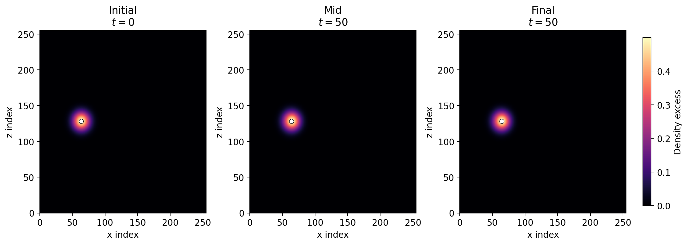

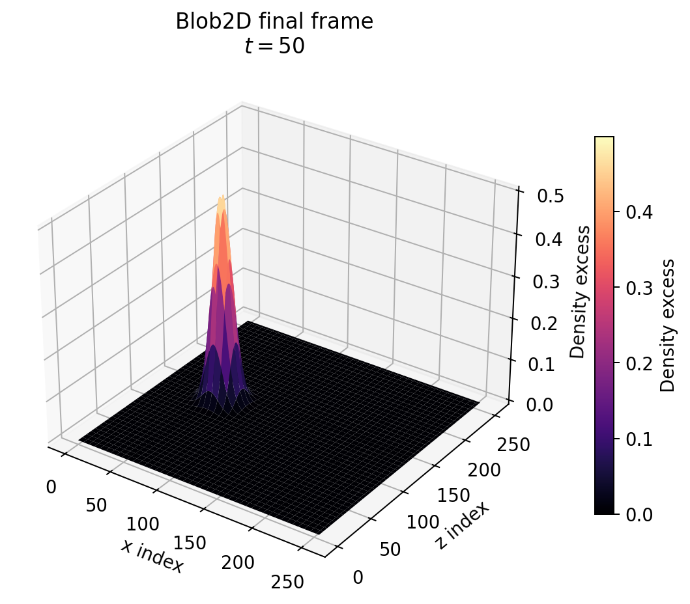

What this locks down:

- a fast saved-result visualization workflow using [examples/blob2d_meeting_demo.py](examples/blob2d_meeting_demo.py);
- a real 2D movie artifact from [blob2d_one_step.npz](references/baselines/reference_arrays/blob2d_one_step.npz), written to [docs/movies/blob2d_meeting_2d.mp4](docs/movies/blob2d_meeting_2d.mp4);
- a matching 3D surface movie and poster for presentation use;
- an explicit `--skip-parity` mode for saved payloads whose output timeline does not match the short-window parity metrics.

## Diverted Tokamak Geometry Movie

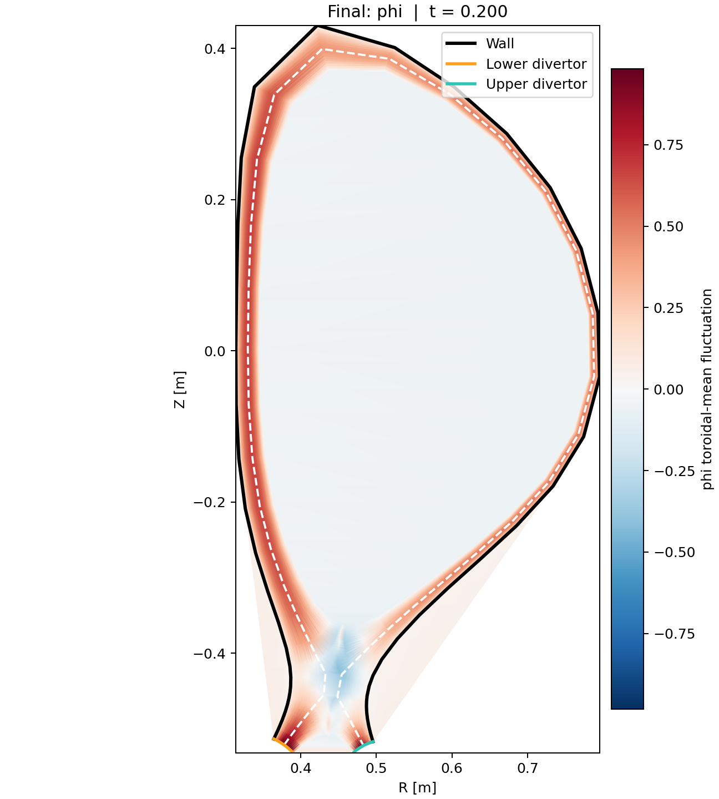

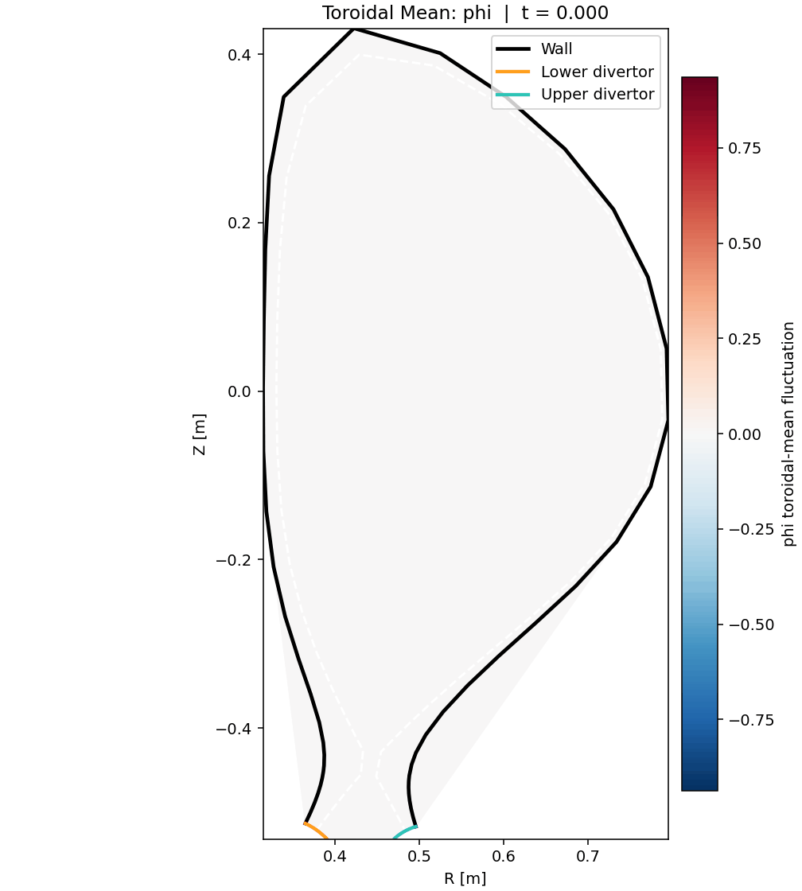

What this locks down:

- a stitched full-domain visualization path for the exact `tokamak_turbulence_short_window` benchmark lane;
- direct use of the tokamak mesh geometry via `Rxy`, `Zxy`, and `psixy`;
- LCFS overlay from `psixy = 0`, plus explicit wall and divertor target curves;
- a summary 2D diverted tokamak figure package generated by [examples/diverted_tokamak_movie_demo.py](../examples/diverted_tokamak_movie_demo.py).

## TCV-X21 Tokamak Scaffold

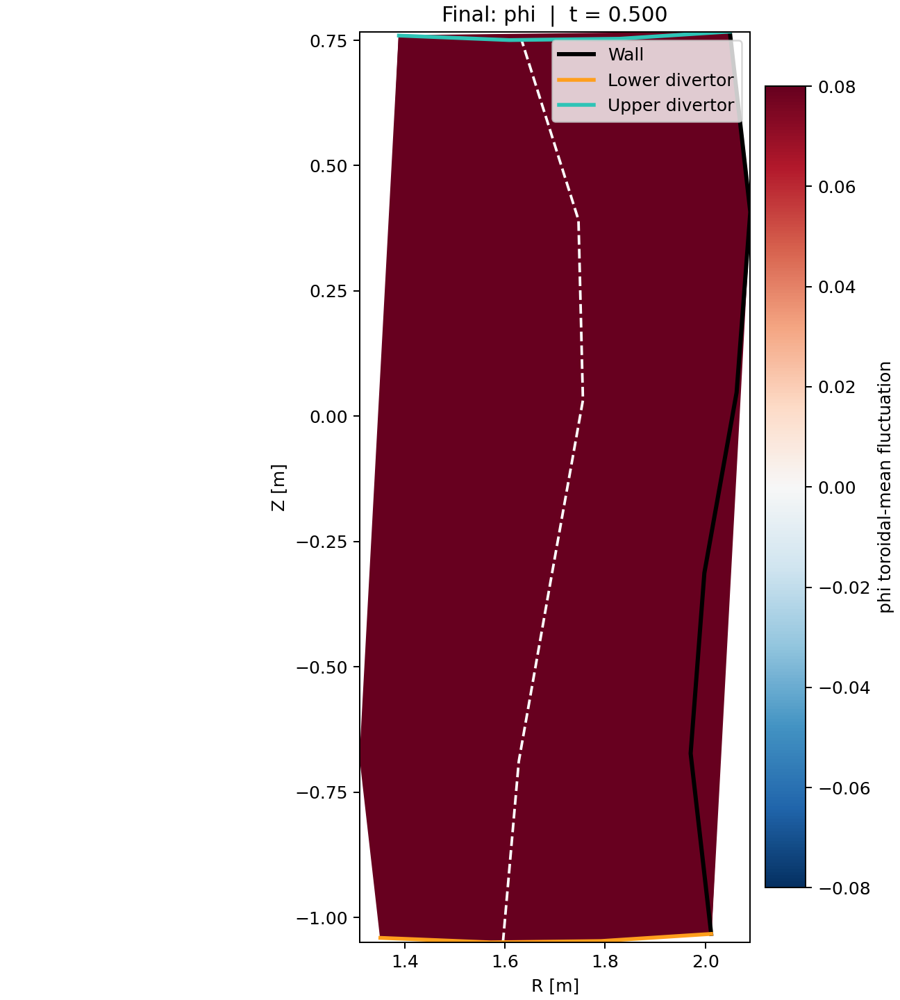

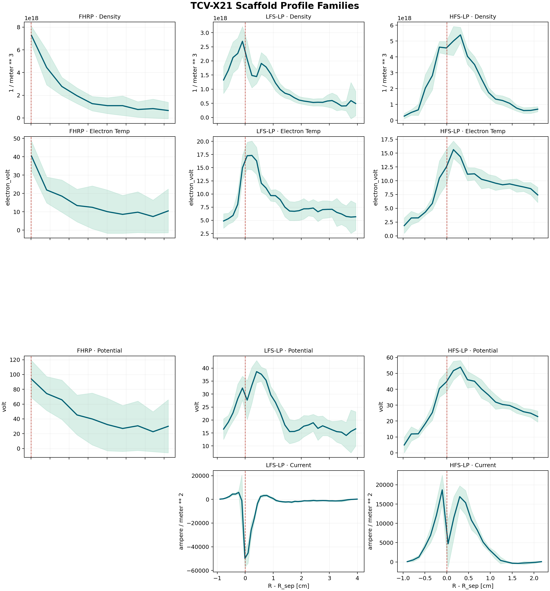

What this documents:

- the first 3D tokamak kickoff package in the tree;
- manifest resolution for `tokamak_tcv_x21_escalation`;
- a structured deck/input report plus a benchmark-data report alongside the public figure bundle;
- an explicit benchmark validation contract covering FHRP, HFS-LP, and LFS-LP observable families;
- a shared observable report that describes those profile families on the generic 3D adapter schema;
- a staged profile report and compact NPZ bundle for those observable families, now populated from the public benchmark observable record;
- a summary profile summary plot derived from the same staged bundle;
- a public benchmark-data mode that can be regenerated without a heavy local 3D solve;
- LCFS, wall, and divertor overlays in the same diverted-geometry style as the existing tokamak visualizations, now driven by the public sample geometry/snapshot files.
- a reviewer-friendly bridge between the case manifest and the future selected 3D execution lane.
- the reduced selected-field parity package now exists as the next explicit gate after the scaffold bundle, on compact `Ne`/`Pe`/`phi` histories from either two 3D workdirs or the public TCV-X21 benchmark-data root plus a reproducible derived candidate.

## TCV-X21 Toroidal Movie

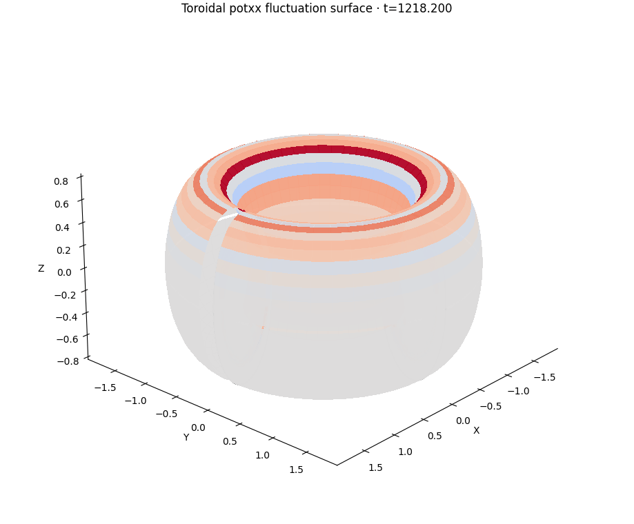

What this documents:

- a true toroidal 3D visualization path built from the committed scaffold arrays;
- outer-shell fluctuation coloring plus orthogonal poloidal cuts carrying the staged time dynamics;
- a clearer device-scale view for the README and docs surface than the flat scaffold slice GIF.

## Native Tokamak Selected-Field Rung

What this documents:

- the first reduced native 3D execution rung in the tree;
- a promoted native tokamak one-step case on the compact `Ne`/`Pe`/`phi` surface;
- parity JSON/NPZ artifacts on the same compact surface used by the benchmark-backed gate;
- a direct native-vs-reference selected-field history comparison bundle on the same committed artifact path;
- a shared observable report plus a runtime/provenance report for the native run.

## Traced-Field-Line Geometry Scaffold

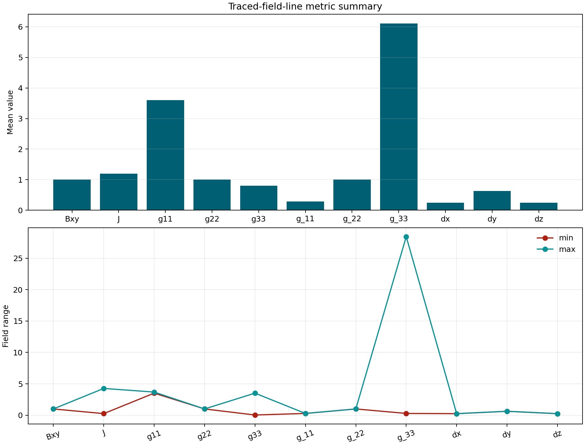

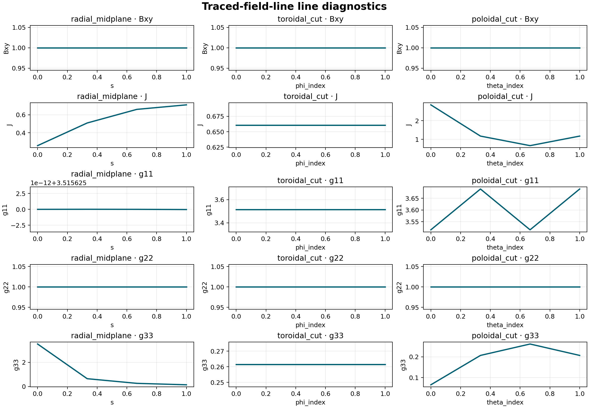

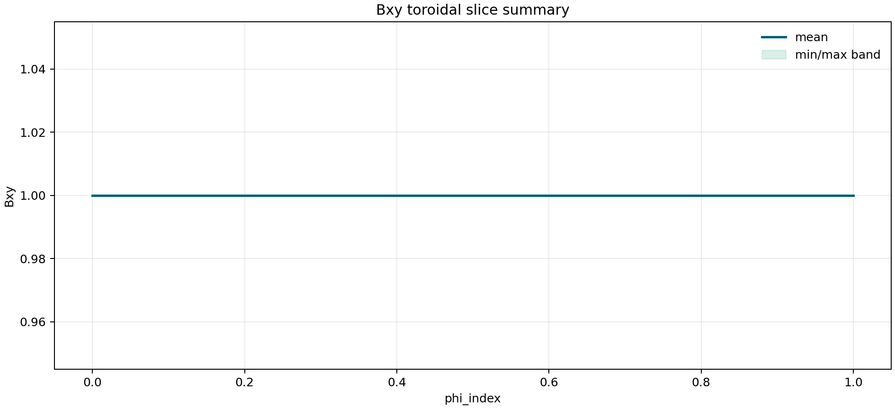

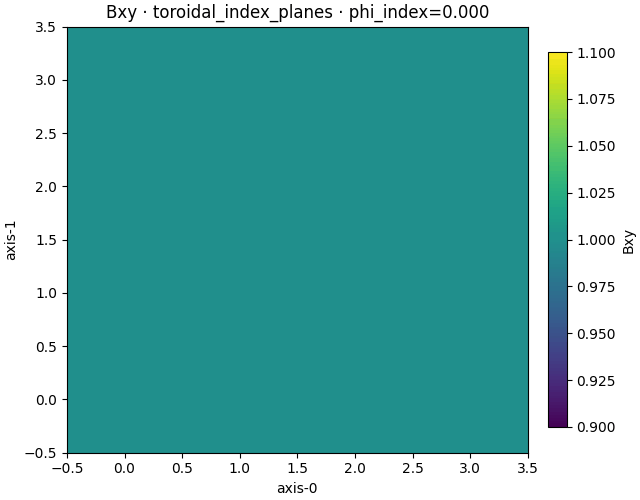

What this documents:

- the second 3D geometry-adapter scaffold in the tree;
- a non-diverted, traced-field-line geometry family riding on the same general 3D infrastructure;
- a reusable metric summary JSON and compact NPZ metric bundle;
- a shared observable report covering the line-diagnostic and selected-plane families on the same adapter schema;
- reusable radial, toroidal, and poloidal line diagnostics on the same artifact model;
- reusable selected-plane summaries and a first geometry-family GIF on the same artifact model;
- a summary metric summary plot that can be regenerated from either a synthetic preview or an explicit mesh/metric JSON specification;
- an explicit geometry-adapter validation contract before any native non-tokamak 3D claim is made.

## Traced-Field-Line Selected-Field Parity

What this documents:

- the first reduced parity gate on the second 3D geometry family;
- a compact selected-field compare surface on traced-field-line metric fields;
- shared observable-report output on the same geometry-adapter schema used by the scaffold packages;
- a non-tokamak counterpart to the tokamak selected-field parity lane;
- an explicit external-pair source report when the public external FCI sample is available locally.

## Traced-Field-Line Native Reduced Selected-Field

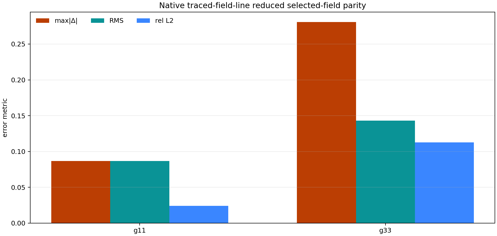

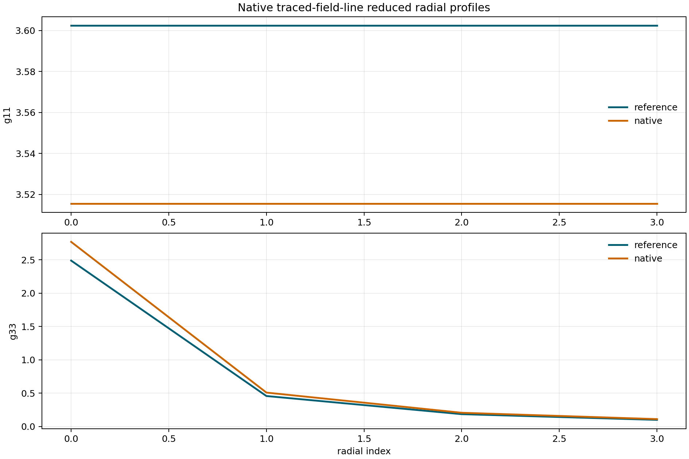

What this documents:

- the first native reduced rung on a non-tokamak 3D geometry family;
- a JAX-native radial-profile reduction on explicit traced-field-line metric pairs;
- the same public parity, comparison, observable, and runtime artifact surfaces used by the native tokamak reduced rung;
- an honest bridge between external-pair validation-only geometry adapters and future broader native non-tokamak execution work.

## Stellarator VMEC Scaffold

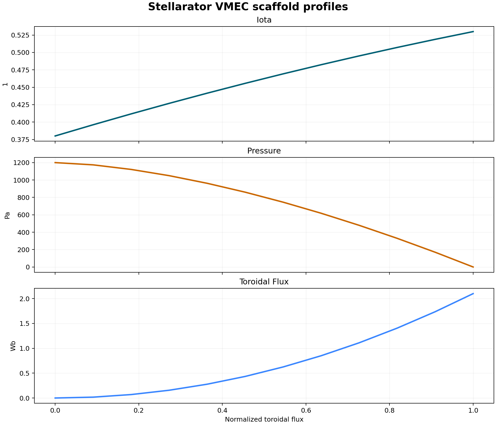

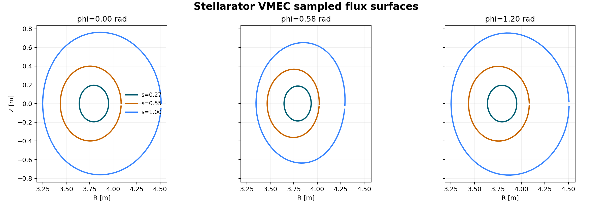

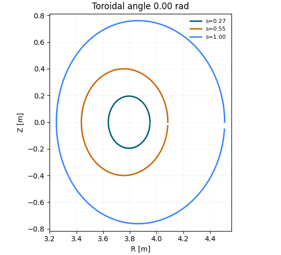

What this documents:

- the third 3D geometry adapter in the tree;
- a VMEC-style stellarator equilibrium bundle on the same manifest and observable schema as the tokamak and traced-field-line adapters;
- reusable profile diagnostics for `iota`, `pressure`, and `toroidal_flux`;
- sampled `R`/`Z` flux-surface cross-sections across toroidal angle, with a summary summary figure and a compact movie path;
- a pressure test for the general 3D artifact model on a geometry family that is neither diverted tokamak nor FCI-grid-only.

## Stellarator VMEC Selected-Field Parity

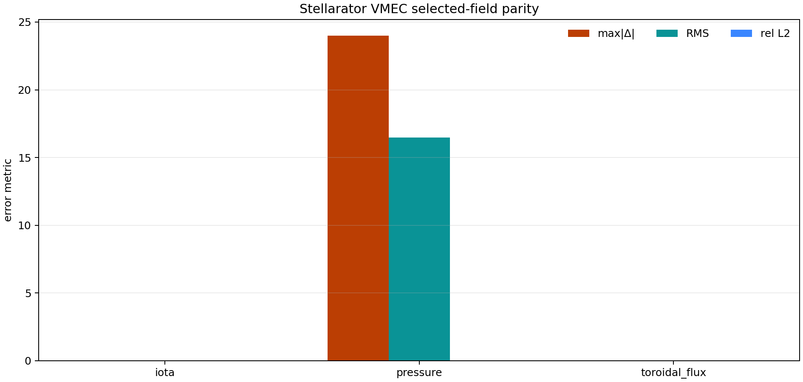

What this documents:

- the first reduced selected-field parity gate on the VMEC-style stellarator family;
- a compact compare surface on `iota`, `pressure`, and `toroidal_flux`;
- the same shared observable-report and source-report contract used by the other 3D parity packages;
- a real explicit external VMEC-pair regeneration path in addition to the synthetic preview mode.

## Stellarator VMEC Native Reduced Selected-Field

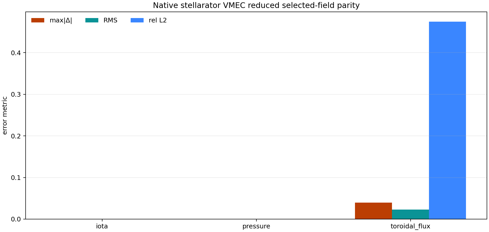

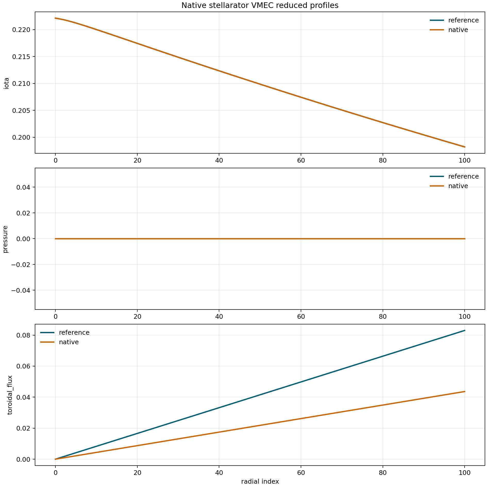

What this documents:

- the second native reduced rung on a non-tokamak 3D geometry family;
- a JAX-native profile reduction on `iota`, `pressure`, and `toroidal_flux`;
- the same parity, comparison, observable, and runtime artifact surface used by the traced-field-line native rung;
- a stronger general-geometry 3D story than a single non-tokamak native proof point.

## Native 3D Runtime Campaign

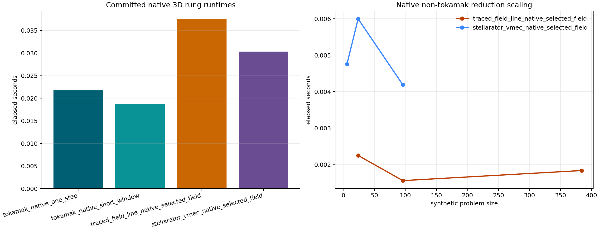

What this documents:

- one explicit runtime/scaling summary across the promoted native reduced 3D matrix;
- committed runtime reports from the native tokamak, traced-field-line, and stellarator reduced rungs;
- compact synthetic scaling sweeps for the non-tokamak native reduction kernels;
- the current engineering blocker after geometry diversity is no longer the main missing surface.

## Native 3D Convergence Campaign

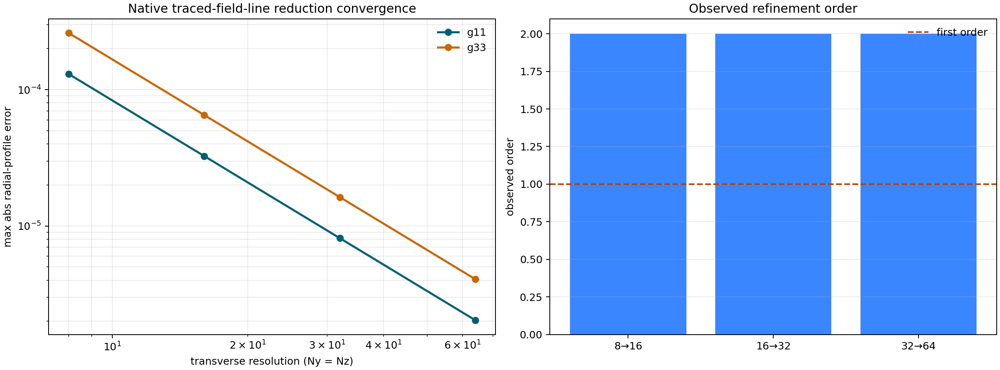

What this documents:

- an explicit operator-level convergence gate on the promoted traced-field-line native reduction path;
- observed refinement order against an analytic radial-average target rather than only parity and runtime numbers;
- the first committed convergence bundle specific to the reduced native 3D matrix itself.

## Fluid 1D MMS Convergence

What this documents:

- an explicit manufactured-solution refinement bundle for the promoted 1D fluid density, pressure, and momentum operators;
- per-resolution L2 errors and observed orders on the same native lane used for the compact verification tests;
- a literature-anchored verification figure that can be reused in docs and future paper surfaces instead of leaving the result trapped in a script output.

## JAX Native Profile Audit

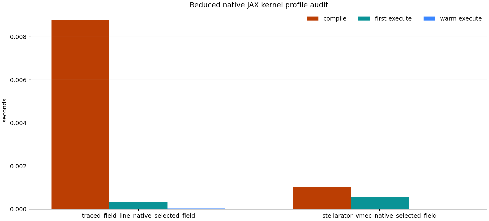

What this documents:

- compile, first-execute, and warm-execute timings on the promoted traced-field-line and stellarator reduced native kernels;
- the first committed Perfetto-compatible trace bundle for the reduced native JAX surfaces;
- the concrete engineering conclusion from that profiling pass: batch same-shape selected fields before entering jitted reductions, and warm kernels once before timing summary runs.

## Local CPU Scaling Campaign

What this documents:

- a reviewer-facing local CPU scaling result on a real promoted heavy recycling solve rather than a tiny synthetic kernel;
- a heavier fixed-work ensemble with `16` repeated heavy solves, so launch and warmup overhead are better amortized;
- the stronger local throughput story users actually care about for UQ, optimization, and parameter scans: repeated heavy solves scale well across local worker processes after warmup;
- on the committed artifact the steady-state speedup is about `1.88x`, `3.67x`, and `4.94x` at `2`, `4`, and `8` workers;
- the retained `16`-solve ensemble was chosen deliberately because heavier local sweeps did not improve the curve on this MacBook;
- the operational recommendation for laptop users: keep one Jacobian thread per worker for batched heavy solves and use multiple local workers when the workload is naturally parallel.

## Hermes Comparison Summary

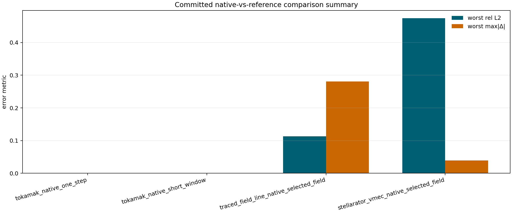

What this documents:

- one benchmark-facing summary plot across the committed native-vs-reference reduced comparison bundles;
- direct comparison of the native tokamak, traced-field-line, and stellarator reduced rungs on the same visual surface;
- a simpler summary entry point than asking readers to inspect each lane-specific comparison artifact separately.

## Controller Feedback Campaign

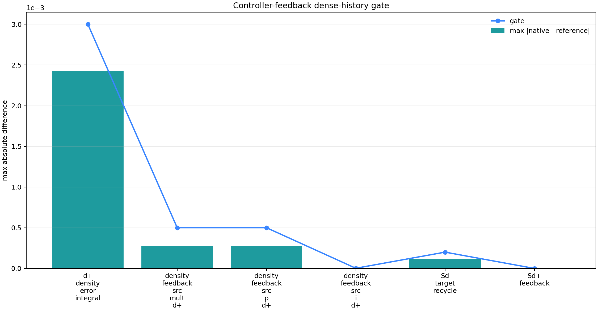

What this documents:

- the first reference-backed controller-history gate on a promoted native feedback path;
- dense-history comparison of controller multiplier, proportional term, integral term, reconstructed controller integral, and target recycling source;
- a controller-oriented closeout surface that is honest about stopping short of a full detachment-controller claim.

## Detachment Controller Campaign

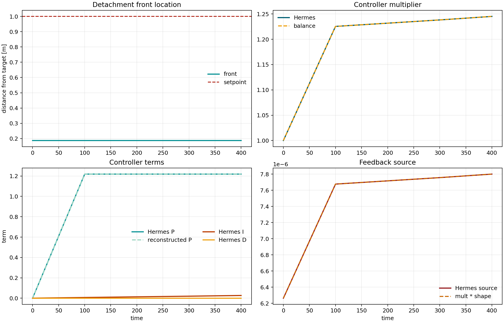

What this documents:

- the first genuinely bounded Hermes-backed `detachment_controller` lane on the local non-PETSc reference build;
- a reduced `cvode` deck that strips the incompatible `beuler`-only solver options and forces `settling_time = 0` so the bounded window actually exercises the controller;
- exact saved-diagnostic checks on the proportional term, controller balance, and `source_multiplier * source_shape`, plus a nontrivial response-span gate.

## Reactions And Collisions Campaign

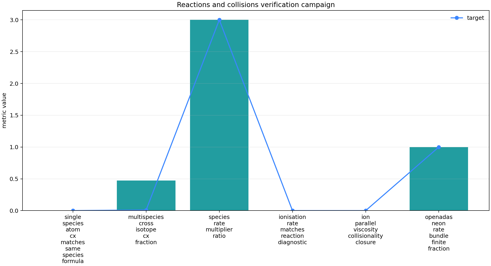

What this documents:

- a dedicated engineering and physics gate for reactions, collisions, and atomic-data breadth;
- explicit native checks for charge exchange, isotope coupling, CX multipliers, ionisation, ion-viscosity collisionality closure, and neon OpenADAS loading;
- profile-level lineouts for ionisation, isotope-resolved charge exchange, and collisionality closure, so the same validated surface can support future manuscript figures;
- a machine-readable JSON/NPZ/plot package instead of leaving this breadth implied only by low-level unit tests.

## Neutral Parallel Diffusion Campaign

What this documents:

- a dedicated closure study for the extracted neutral parallel-diffusion family on a prepared multispecies D/T/He recycling state;
- direct comparison between the `AFN` and `multispecies` collision modes on the same state, following the neutral-model distinction documented by Hermes-3;
- species-level summaries for the effective neutral diffusivity and the collision-budget decomposition that explains the AFN-versus-multispecies split;
- a machine-readable JSON/NPZ/plot package so this closure evidence is not trapped only inside operator tests.

## Collision Closure Campaign

What this documents:

- a dedicated closure study for the extracted Braginskii-style collision, viscosity, and conduction family on a prepared multispecies D/T/He recycling state;
- species-resolved ion-viscosity activity, representative collisional-friction activity, and conduction collision times on the same state;
- direct action-reaction checks for selected friction pairs, so the public artifact is tied back to a basic physical consistency condition rather than only to nonzero activity;
- a machine-readable JSON/NPZ/plot package so these closure diagnostics can feed the future paper directly instead of remaining trapped inside low-level tests.

## Temperature Feedback Campaign

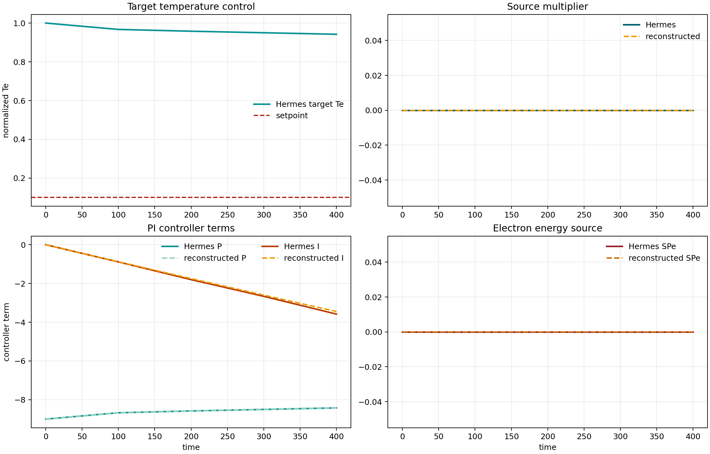

What this documents:

- a bounded reduced Hermes-backed temperature-control lane on `1D-recycling-with-Tt-control`;
- exact saved-diagnostic balance on the controller multiplier, proportional term, and `source_multiplier * source_shape`;
- bounded output-time integral reconstruction and visible target-temperature error reduction on the reduced `cvode` window;
- an auto-patched clean reference-worktree path for local Hermes trees that still carry the known `temperature_feedback.hxx` permission bug.

## Autodiff Diffusion Uncertainty

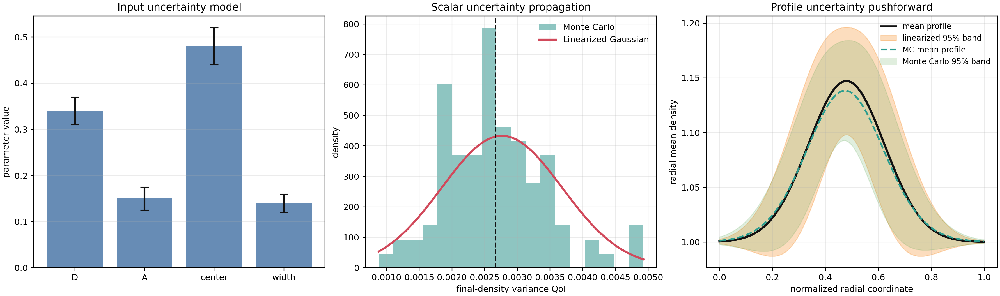

What this documents:

- a standard uncertainty-propagation example on the same compact native differentiable diffusion lane used for sensitivity and inverse design;
- a scalar QoI based on the final active-domain density variance plus a field QoI based on the final radial profile;
- agreement between first-order autodiff covariance pushforward and a vectorized Monte Carlo estimate on the same native solve path.

## Impurity And Radiation Campaign

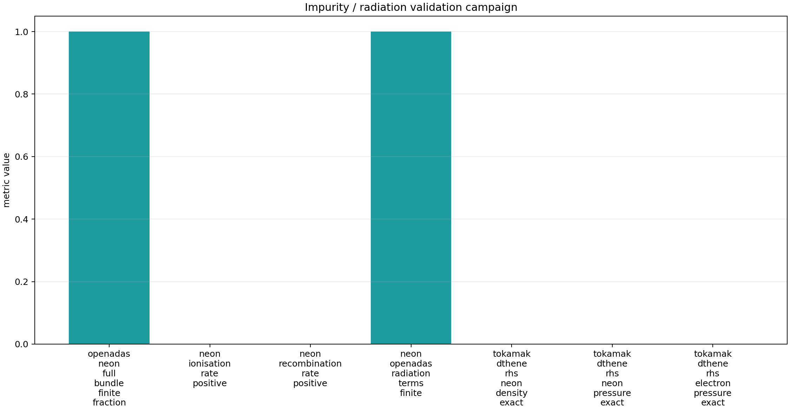

What this documents:

- the first explicit impurity/radiation validation bundle rather than only an audit placeholder;
- neon OpenADAS ionisation/recombination loading plus finite radiation-loss evaluation on the native path;
- exact direct tokamak `D/T/He/Ne` RHS closure on the committed `Nne+`, `Pne+`, and `Pe` compare surface;
- an honest claim boundary that still leaves controller-oriented temperature/detachment workflows open.

## Neutral Mixed Short-Window Benchmark Target

What this locks down:

- a compact reference-side transient target for the staged neutral branch before the native stiff solver is promoted through the public runner;
- center-probe histories for `Nh`, `Ph`, and `NVh` at the committed benchmark location `(x=5, y=3, z=5)`;
- the derived center temperature `Ph / Nh`, which stays close to the expected `0.1` throughout the short window;
- summary compact metrics rather than large raw arrays: final total `Nh` about `7.86197875e+02`, final total `Ph` about `7.86184063e+01`, and final momentum RMS about `5.56121767e-08`.

## Alfven-Wave Short-Window Benchmark

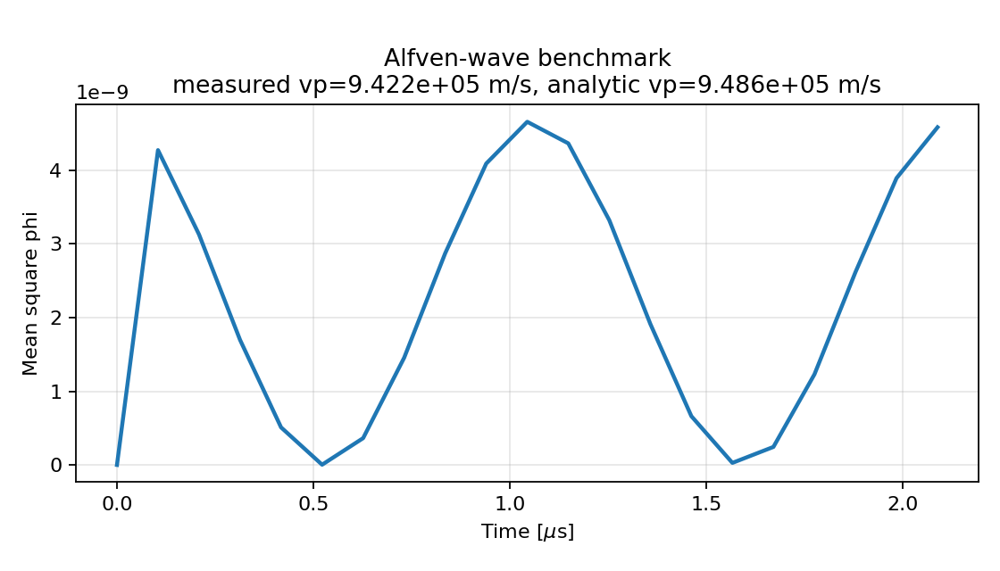

What this locks down:

- the first multi-output electromagnetic transient rung on the finite-electron-mass slab benchmark;
- benchmark-quality phase-speed extraction from the committed `nout=20` history;
- analytic-vs-measured validation on the same stored arrays used by the regression harness;
- the current documented benchmark numbers:
  - analytic phase speed about `9.48585409e+05 m/s`;
  - measured phase speed about `9.42218662e+05 m/s`;
  - relative phase-speed error about `6.71e-03`;
- native/reference parity on that same short-window history, published from the exact committed comparison artifact.

The same short-window rung now also drives the meeting-ready visual package in [docs/alfven_wave_meeting_demo.md](docs/alfven_wave_meeting_demo.md), which adds 2D and 3D movies plus a snapshot panel from a live native run.

## Regeneration

These figures are generated from the committed baseline arrays plus native case runs. The current gallery uses:

- `diffusion_short_window`
- `vorticity_short_window`
- `drift_wave_one_step`
- `drift_wave_short_window`
- `blob2d_short_window`
- `blob2d_one_step` saved-payload visualization
- `alfven_wave_short_window`
- `tokamak_turbulence_short_window` stitched full-domain geometry visualization

The next gallery pass should add:

- periodic 1D fluid short-window figures;
- native neutral transient parity figures once the stiff `neutral_mixed` path is benchmark-clean;
- benchmark and validation plots for additional integrated 2D production and broader EM cases as those stages land.
